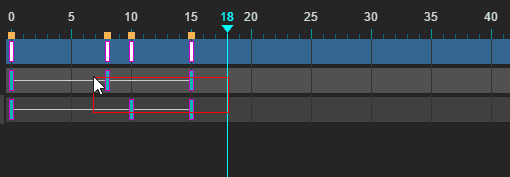

### 新特性

编辑器中的树组件拖动东西到树上方和下方时自动滚动

属性面板数字输入框支持键盘上下键修改值

动画面板增加Ctrl+C Ctrl+V复制黏贴帧

打开动画文件时自动检测是否有错误数据并删除错误数据

动画K帧快捷键改为K，方便快速K帧

资源面板增加多选某些资源，然后设置是否可打包

删除相对布局属性时(left right top bottom)保存当时的xy坐标

黏贴时删除var，改var值时检测到已存在相同值时删除当前改变的值

### 修复Bug

修复输入框ctrl+A不能全选文本框的问题

修复查找替换时，开着粒子页面会报错的问题

修复删除关键帧时没有正确刷新的问题

修复动画面板滚动不正常的问题

