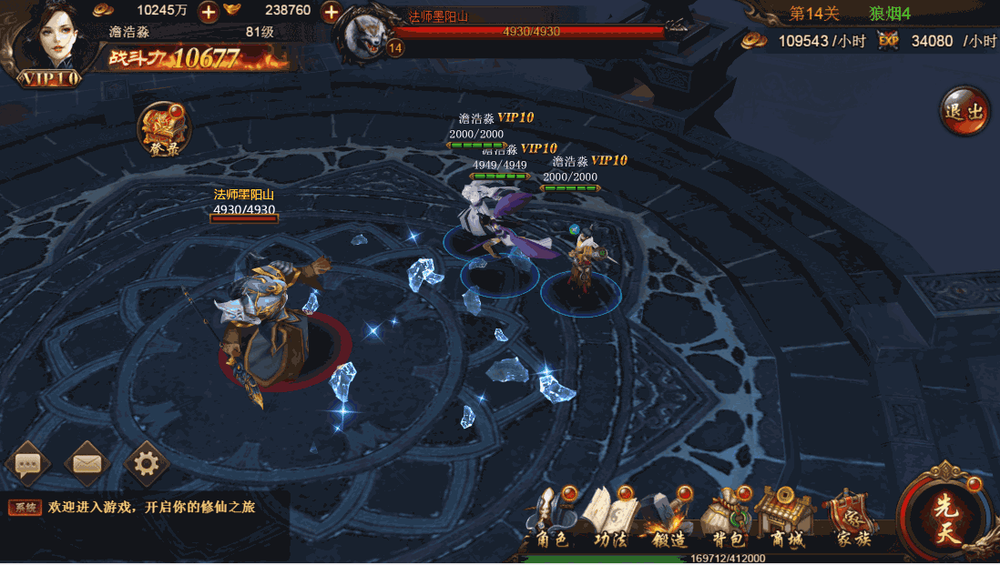
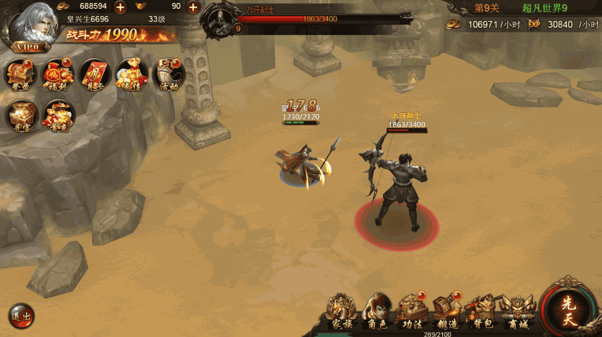

# 《雪鹰领主3D》昨日腾讯玩吧首发! HTML5进入3D游戏时代！

上月删档内测的HTML5 3D ARPG游戏《超凡之路》获得知名IP《雪鹰领主》的授权。这款由风云互动研运、起点白金大神“我吃西红柿”唯一正版授权的HTML5 3D 精品大作，于7月21日以新名称《雪鹰领主3D》在腾讯玩吧首发。

（图1）

**知名IP的HTML5 3D产品**

作为继《莽荒纪》之后“我吃西红柿”的又一力作《雪鹰领主》在起点中文网连载后，该作覆盖了近6000万点击的阅读用户，雄踞起点月票榜第3的位置。在IP孵化方面，《雪鹰领主》已推出同名页游、手游，同名漫画也已登陆全国最大漫画纸媒《知音漫客》，覆盖每月近千万的漫迷群，“雪鹰领主”的关键字百度搜索已破百万，同名影视、周边等均已开启合作规划，IP影响力可见一般！

（图2）

腾讯玩吧平台作为国内目前最主流的H5游戏渠道之一，此次与《雪鹰领主》强强联合首推HTML5 3D大作，受到了业内的广泛关注。

（图3）玩吧的新品榜单上，直接点击即可进入游戏

**超炫酷的画质与原生级的3D表现**

《雪鹰领主3D》采用Layabox旗下的LayaAir引擎研发制作，电影级别打造的3D立体感完美展现出小说中恢宏壮观的玄幻异世界。精细的原画、华丽的特效、结合爽快战斗打击感，流畅的原生级游戏性能表现，让玩家真切地“走”进小说、沉浸于游戏塑造的至尊视觉体验。在测试期间，其付费、留存、活跃度都可以和手游相媲美，展现其非凡的游戏品质和产品本身的号召力。

（动图4）

　　在玩法方面，《雪鹰领主3D》H5游戏以游戏剧情设计为着重点，大到剧情、场景，小到NPC等细节之处，都对小说作了最大程度的还原和再现，将备受雪鹰书迷推崇的“境界”概念作为手游最重要的成长方式。

（动图5）

**推动HTML5进入3D游戏时代**

2016年底Layabox引擎推出的全行业首款商业化的HTML5 3D产品《无尽骑士》在部分渠道小规模上线，其流畅的性能表现，以及完整的商业化程度，一度让行业瞩目。消息首次爆出后，不足半天转发过万。后虽因数据不佳而产品夭折，但行业中已经有大量的研发商认识到，HTML5也可以研发出APP原生级别的3D游戏。多款HTML5 3D游戏有望于近几月内陆续推出，正是缘于此。

《雪鹰领主3D》作为唯一携知名IP上线腾讯空间玩吧的3D游戏。其豪华的美术场景与炫酷的动作效果，远超行业首款的《无尽骑士》。再加上流畅的原生级性能表现。豪华场景+炫酷特效+流畅性能 + 知名IP的3D HTML5产品，将更受行业关注，或将再次引发一波3D产品的研发潮。

（动图6）

在LayaAir引擎的性能保障下，相信随着越来越多的3D研发厂商加入，3D爆款产品或许在不远的将来就会出现。至少在当下，《雪鹰领主3D》的推出，标志着3D HTML5游戏进入了一个新的里程碑，也在推动着HTML5进入了3D游戏时代。

