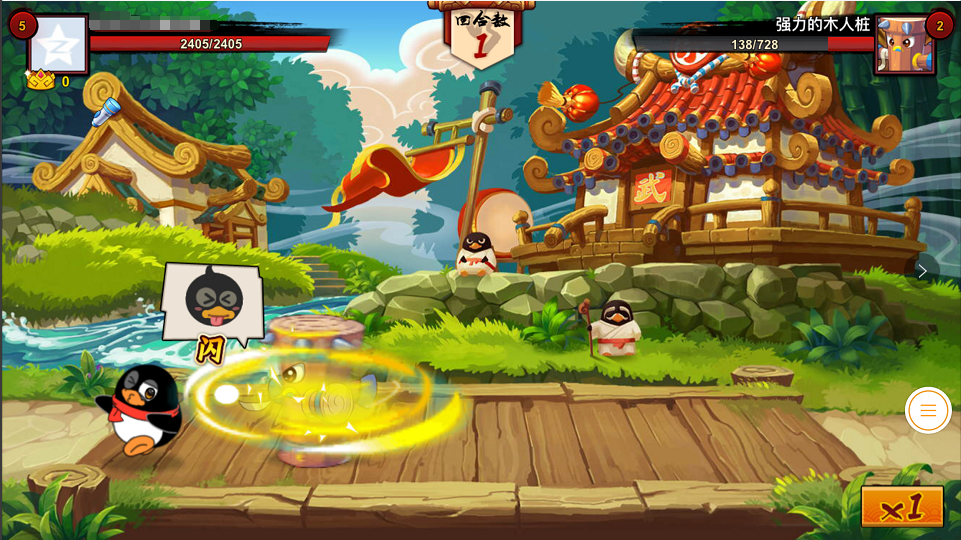

## 腾讯首款自研HTML5游戏《全民大乐斗》微信、手机QQ同步公测

​	8月3日，腾讯自研的格斗类HTML5游戏《全民大乐斗》在微信、手机QQ两大平台的安卓版本公测上线。该游戏采用LayaAir引擎，由腾讯魔镜工作室研发完成。作为腾讯旗下首款上线的自研HTML5回合制游戏，《全民大乐斗》的推出，标志着腾讯的自研团队已正式进入HTML5游戏领域。

（图1） 微信游戏《全民大乐斗H5》（仅安卓版可见）

### 腾讯自研团队正式涉足HTML5游戏

魔方工作室群是腾讯IEG（互动娱乐事业群）四大工作室群之一，多年潜心打造页游与手游两大产品线，拥有了页游《火影忍者ONLINE》、手游《仙剑奇侠传 》等多款知名产品。

魔镜工作室作为魔方工作室群中的核心工作室之一。手游《全民水浒》、《全民农场》，页游《纵横九州》、《QQ水浒》、《QQ农场》、《Q宠大乐斗》等知名产品均出自魔镜工作室。拥有着雄厚的研发实力。

（图2）《全民大乐斗》移植于页游IP《Q宠大乐斗》

尽管采用LayaAir引擎的《QQ农场》、《QQ花藤》等HTML5产品早已在手机QQ空间的玩吧平台上线。但均属于使用腾讯IP的合作产品。本次，魔镜工作室将DAU超过2000万的页游IP《Q宠大乐斗》移植到HTML5手游市场，标志着腾讯自研团队正式涉足了HTML5游戏领域。

### 微信与手机QQ的HTML5游戏入口

8月3日，《全民大乐斗H5》在安卓系统的微信与手机QQ同步上线公测。

微信的游戏频道中点开 “更多精品游戏”， 在 “免下载H5游戏” 的分类中，我们可以看到《全民大乐斗H5》，点击 “启动” 即可进入（iOS系统中暂时无法打开）。

（图3）微信游戏首款回合制H5游戏《全民大乐斗》入口

《全民大乐斗》手机QQ的入口，位于手机QQ游戏中心的H5分类中（如图4所示）。

（图4）手机QQ 首款回合制H5游戏《全民大乐斗》入口

与微信有所不同的是，通过好友分享的链接，《全民大乐斗》的iOS版手机QQ用户也可以正常进入游戏。

### HTML5游戏品质在不断提升

《全民大乐斗》画质精美，体验流畅，游戏的整体品质无疑是S级精品。腾讯自研团队的加入，势将助力HTML5游戏行业的品质提升。

（图5）《全民大乐斗》战斗场景截图

除了《全民大乐斗》，同样采用LayaAir引擎的知名IP大作《大天使之剑H5》也于8月3日测试上线。作为37游戏的首款自研HTML5产品，该游戏并不仅仅是瞄准HTML5市场，未来将采用HTML5与APP双端同发的策略，同时进军HTML5与APP游戏市场。值得一提的是，《大天使之剑H5》APP版本采用的是Layabox旗下LayaNative打包方案，直接将HTML5游戏打包成Native APP。

（图6）37游戏首款HTML5游戏《大天使之剑H5》

无论是7月底腾讯玩吧上线的LayaAir引擎3D产品，还是腾讯与37游戏自研的页游IP移植大作。APP品质的HTML5游戏精品频频出现，正大幅拉高着HTML5游戏行业的整体品质，也正改变着玩家对HTML5游戏的认知。

2017年，精品不断出现与沉淀的一年，HTML5游戏品质不断被夯实的一年。