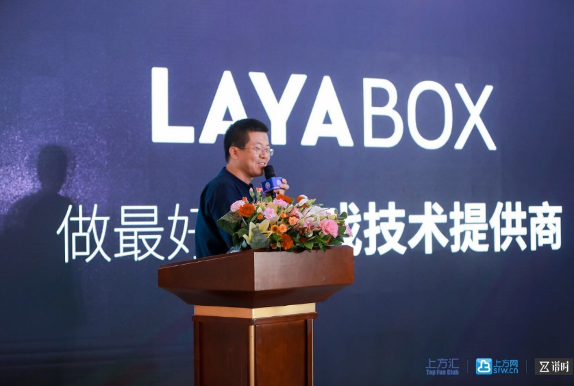
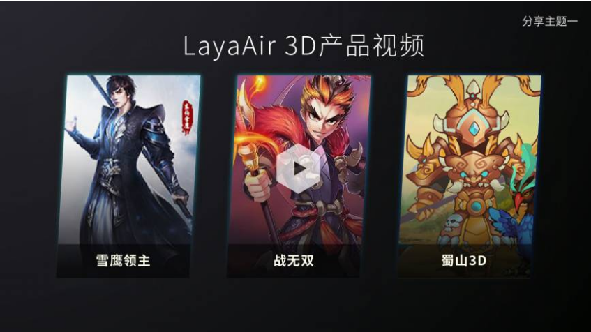

# Layabox谢成鸿出席TFC，公布智能优化方案可提升性能2倍！

2017第十五届TFC首度移师厦门，Layabox创始人谢成鸿应邀参加了由TFC与5玩游戏主办的第六届HTML5游戏高峰论坛，并以“做最好的游戏技术提供商”为主题进行了分享。

### Layabox企业定位

在会上，谢成鸿首次公开了Layabox的企业定位，专注游戏高端技术研发，提供游戏高端技术服务。简短的两句话清晰的勾勒出Layabox的战略重心，那就是会持续专注于高端的技术研发，打造最强性能引擎，打造易用性高的开发工具与产品框架，Layabox把最难做的技术承担起来，来降低更多产品研发团队的技术成本，并通过提供游戏高端的技术服务，更好的帮助产品研发团做好基础支撑，未来逐步以高端技术服务体现企业价值与实现企业盈利。

### LayaAir引擎，3D这片林子唯一熟了果子的树

LayaAir引擎不仅拥有大天使之剑、全民大乐斗、疯狂雪球、QQ花藤、QQ农场等等大量知名的2D游戏产品。还是3D市场里唯一拥有线上运营产品的3D引擎，目前已先后上线的3D产品为无尽骑士、雪鹰领主、蜀山，正在研发中的3D产品为驯龙骑士、英雄战场、捕鱼来了、战无双等。

### LayaNative助力多平台同步发行

10月22日，上线24天的《大天使之剑H5》宣告流水破亿。昨天在朋友圈被广泛传播，成为行业热点。而这款刷新行业月流水纪录的产品。正是采用LayaAir引擎，并使用LayaNative打包成APP微端包在全平台推广。目前在发布H5版本的同时推出安卓微端包，iOS微端包，已成为了游戏行业中的一种新的发行策略。

LayaNative早在2013年，就已经开始被应用了，那时候H5在手机浏览器的性能较差，不被游戏发行认可。所以《三国喵喵传》先后被页游发行代理，其后又以LayaNative技术打包安卓与iOS包，在台湾市场被代理发行。

历经多年积累与精心打造，LayaNative较多年前更加成熟，未来将助力行业页游渠道、手机H5渠道、APP渠道、买量渠道等全面市场同步发行。

### 智能优化让引擎性能提升数倍

一直以来Layabox以性能的优势打动了一批批的研发团队。然而追求性能极致的LayaAir引擎团队并不满足于此，仍在不断的进行优化。例如针对UI与游戏场景方面，LayaAir引擎团队又将推出了全新的智能优化方案。

在LayaAir1.0的版本里，性能优化需要手工减少sprite,减少drawcall、优化cacheAs等。尤其是cacheAs的优化需要区分不同的应用场景，如果"normal"与"bitmap"参数设置不当，反而会现在新的性能问题。

另外，在游戏UI、游戏场景等显示对象层次嵌套较多时，手动优化cacheAs设置无法对所有可优化的显示对象进行定位，或者是需反复测试才能筛选出可优化的显示模块进行优化。此时，性能优化需要具有丰富研发经验的高端人才，产品优化就具有了门槛。

当采用了LayaAir新的优化方案AutoFast，将不需要进行cacheAs的优化设置，直接通过一个全局的开关，就将达到智能与自动优化的目标。性能在不同的机型中测试，均提升2倍以上。而且大幅的减少了开发者的优化工作量。

除了AutoFast智能优化方案，未来推出的LayaAir2.0将采用webAssembly技术，该技术会提升引擎整体性能50%。HTML5的产品性能在引擎方的专注之中在大步前行。

### 结束语

正如本次演讲的主题，Layabox要做最好的游戏技术提供商，Layabox将持续以高端的技术为基础，为游戏团队提供大量底层技术、开发工具、产品框架、联合研发服务、高端技术支持服务等。为游戏产业的开发流程减少成本，加速产品上线，降低技术开发门槛而不断的努力着。

扫一扫二维码，关注Layabox公众号