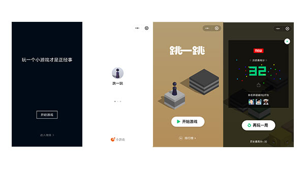
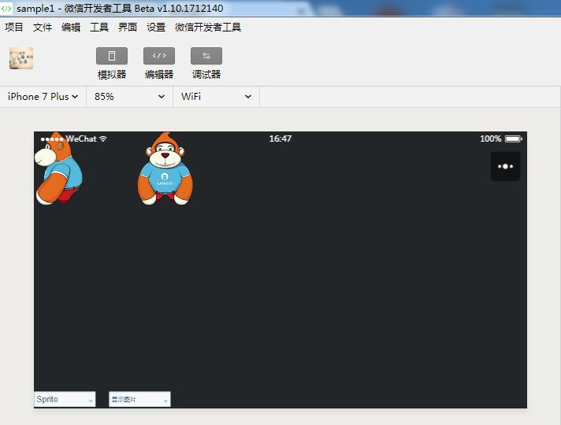

## “微信小游戏”平台今日发布，LayaAir引擎同步支持适配微信小游戏！

12月28日，微信小游戏在6.6.1的版本中上线。通过微信小程序入口的微信小游戏平台，可以看到首批推出的15款游戏产品，其中4款采用LayaAir引擎开发，通过Layabox提供的小程序适配库而发布的微信小游戏。

### 首屏主推的游戏运用了3D技术

更新微信6.6.1版本之后，首屏的界面和游戏不由的让小编想起了2013年微信首屏的HTML5小游戏《飞机大战》，同样的首屏推广，同样的社交排行，只不过这一次运用了3D技术，说明技术进步的同时，也表明了微信小游戏是支持3D的。最后小编可以预想到跳一跳会和飞机大战同样火爆。

LayaAir引擎除了2D强悍的性能优势外，一直在3D的支持方面投入了大量的精力，在HTML5大型3D游戏的开源引擎中处于行业领先地位。使用LayaAir引擎开发的《雪鹰领主3D》是当前HTML5行业中唯一正式运营的大型3D商业化产品。而对于微信小游戏的3D支持，LayaAir引擎开发的产品，可通过Layabox官方提供的小程序适配库，一键发布为微信小游戏产品。

### 微信小游戏支持的游戏类型

很多开发者在担心小游戏是否仅能支持玩法简单的小型游戏。这是一种错误的观点。由于微信小游戏采用了微信小程序的API，所以是微信小程序的分支，游戏的类型可以丰富多样，比如3D游戏，实时竞技游戏，RPG游戏，回合制游戏等等，虽然首批上线的产品中，主要是休闲类游戏和棋牌类游戏，但我们可以看到采用LayaAir引擎开发的《全民大乐斗》是一款高品质的大型回合制游戏。近期还会有大量的LayaAir引擎大型游戏相继在微信小游戏平台中推出。

**微信小游戏的入口与支付**

**1、微信关系链分享**

微信小游戏的重要入口就是好友分享，群分享等微信关系链。

**2、微信小程序入口**

除了关系链的分享外，最基础的入口就是小程序的入口了。如果是首次打开小游戏，那么需要先在微信小程序的入口进入，输入关键字“微信小游戏”，在搜索结果里点击小程序“微信小游戏”即可进入查看到全部的微信小游戏。

**3、微信列表顶部下拉入口**

通过下拉微信列表，可以显示近期玩过的微信小游戏。

**4、桌面入口**

安卓版本的微信，小游戏有添加到桌面的入口。（小编尝试添加到桌面时，实际未成功，不知是BUG，还是接口未正式开放）

**5、关于支付相关**

在小游戏的官方回答里表示，目前仅安卓端的小游戏在测试少量游戏商品内购，iOS暂不支持。

**LayaAir引擎支持小游戏一键发布**

对于LayaAri引擎的开发者，Layabox提供了小游戏的适配库，只需要引入适配库，初始化适配库，即可实现微信小游戏的一键发布，使用LayaAirIDE工具进行微信小游戏的开发。

1、AS3版本引入适配库的初始化方法：

>  MiniAdpter.init();

2、TypeScript与JavaScript版本引入适配库的初始化方法：

> Laya.MiniAdpter.init();

更详细的适配库使用教程，开发者可以查看官网文档。

 LayaAir引擎示例代码一键发布为小游戏的效果：

