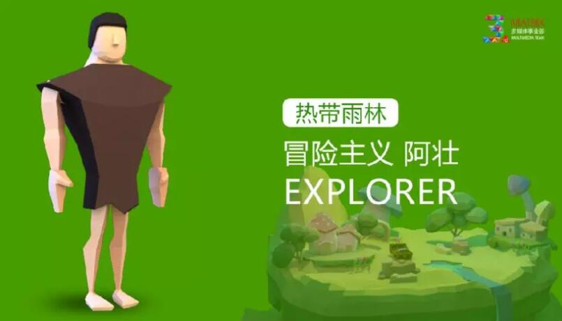
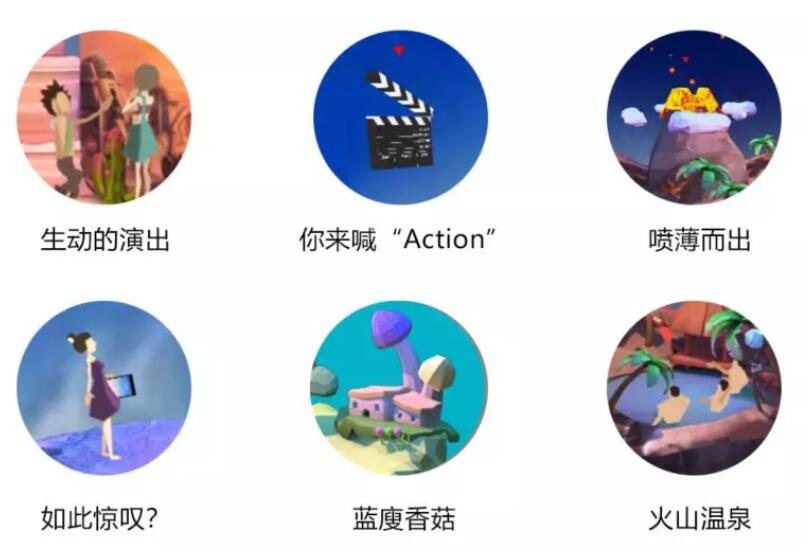

## 逆天了！3D网页展示居然可以这么屌

之前介绍过多款LayaAir引擎的3D炫酷游戏。今天，为大家介绍一款采用LayaAir引擎的3D网页展示产品《不可思议群岛》。

这是一个非游戏的HTML5网页，以三维的空间技术为基础，在不同的浮空小岛之间切换。通过点击GO，可以进入到每一个场景中，进行360度全角度观看小岛的风貌，还可以进行一些简单的互动操作。比如，戴上VR眼镜世界改变，点击火山会有喷发动作等等，让网页的展示有了一种游戏式交互体验。

直接长按识别图中的二维码，或者通过左下角的阅读原文可打开链接体验。

 

**《不可思议群岛》的创作起源与创作过程**

《不可思议群岛》是矩阵互动Matrix多媒体事业部成立三周年的部门庆作品，没有甲方的各种需求束缚，动起手来也就更大胆自由。

“在轻松欢快的气氛中给大家介绍一下我们”是这个作品一开始最单纯的动机。

既然要介绍还是得把几个业务板块说清楚，于是“群岛”的概念在风暴会中诞生了。

4个特色鲜明的世界分别代表四个业务板块，通过每个“岛”里的情景让人即直观了解又能产生联想。

▲ 黄色沙漠，绿色雨林，蓝色冰川，红色火山

接下来是风格设定。3周年庆，当然要热闹欢快一些，元素我们最终选择了简洁清新的面片简约风格，一是迎合气氛，二是考虑到手机浏览的效率。

人物是构成情景的必要元素，所以我们给每个场景都设计了性格独特的人物。

互动是重点，要黏住用户让大家有“把玩”的效果。我们决定放弃传统的三维序列和视频，用LayaAir 3D引擎作为内核，让所有环节都能实时互动。即时渲染的效果让用户几乎忘记了自己是在看一个H5网页，而是在玩一款三维游戏。

 

光有大场景的转换和360度查看显然是不够的，我们为每个“岛”都设计了一些小互动情节，让浏览更有乐趣。如戴上VR眼镜世界改变，点击火山会有喷发动作等等。

**关于矩阵互动Matrix**

矩阵互动Matrix是一家集品牌互动广告和网络全程营销的整合运服务商，专注于为品牌塑造顶尖的互联网形象，为企业营销策略提供互动解决方案。旗下多媒体事业部是一支专业且全面的技术创作团队，涵盖了影视后期，VR&AR，APP应用开发，舞台舞美包装等多个业务板块。