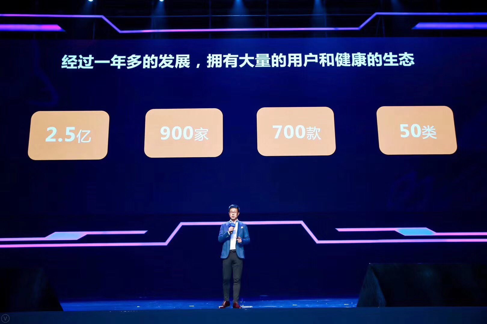

## Layabox助力开发者快速接入QQ轻游戏，畅享流量红利！

11月2日，2018年腾讯全球合作伙伴大会QQ分论坛在南京开讲，腾讯公司平台与内容事业群QQ支付联合产品部总经理贺飏分享了QQ轻游戏的最新动态。据悉，QQ轻游戏平台用户已突破2.5亿。平台接入超过700款游戏，覆盖50个以上游戏类型。

 

### 什么是QQ轻游戏？

对于QQ轻游戏这个名词，有一些开发者或许觉得有些陌生，其实这并不是手机QQ的新业务，是由2017年推出的“厘米游戏开放平台”及“玩一玩平台”升级而来，并且打通了手机QQ及QQ空间。所以很多已接入或已了解该平台的开发者，也会称之为玩一玩游戏。

### QQ轻游戏的主要入口

目前，QQ轻游戏的入口仅在安卓版本的手机QQ（简称手Q）。覆盖到多个手Q流量场景，其中包括分享消息、聊天窗口、快捷发起、厘米秀、QQ空间小游戏、游戏中心、QQ钱包等。

 

厘米秀与聊天窗口内的厘米游戏入口，需要开通厘米秀功能后才能看到。分享消息是一种裂变传播入口，这些是最初厘米游戏时代开始就一直存在的主要交互入口。游戏中心、QQ空间小游戏、QQ钱包中的入口是比较容易发现的开放入口。快捷发起，类似微信小游戏的顶部快捷导航入口，是玩过的QQ轻游戏列表，不过需要开发者在后台中进行设置。

### 未被充分挖掘的QQ轻游戏机会

QQ轻游戏平台有两种商业变现模式：内购和广告。目前平台的广告流水已经超过了游戏内购的总流水，其中80%的活跃游戏均接入了广告SDK，据某些已接入QQ轻游戏的开发者介绍，在同等级别的DAU下，QQ轻游戏广告收入要明显高于其它游戏平台。这或许与QQ视频广告对游戏并没有限额，以及更优于其它平台的分成政策有关。

另外，相对于微信小游戏的去中心化思路，手Q的轻游戏平台的走的是精品化平台思路，基于多样的手Q入口，游戏用户流量自然会更为集中和稳定一些。同时，QQ轻游戏也是非常鼓励和激励裂变的。例如：轻游戏平台实现了创新的红包广告形式：开发者可以通过B2C广告红包完成用户的吸引和积累。据悉，使用这种B2C红包功能的游戏中，有80%实现了ROI超过100%，有个别游戏的ROI超过300%。贺飏在现场分享时解释道：“比如说投入1万，游戏收入可以达到3万，事实证明通过这个广告合作的方式，B2C的红包本质上来说就是一个广告，这种广告的投入可以得到一个双赢。” 

目前，2.5亿的QQ轻游戏用户仅仅是安卓端，如果未来iOS版本的入口打开，那又会迎来一波爆发增长，所以早上架，早受益，QQ轻游戏仍是一个处于高速增长的渠道机会，等待着开发者的进一步挖掘。

### Layabox助力开发者接入QQ轻游戏平台

Layabox是率先支持厘米游戏和玩一玩游戏的引擎，在LayaAirIDE里也集成了玩一玩（现在的QQ轻游戏）的适配和发布。在IDE内就可以一键发布为玩一玩游戏。然而，QQ轻游戏在发布后的接入与调试门槛稍高一些。尽管一些优质CP购买了Layabox付费的VIP技术支持服务，协助其快速的上架，也会出现一些开发者因技术问题最终而与QQ轻游戏无缘。所以，Layabox基于在QQ轻游戏技术和商务上的优势，提出发行合作模式，帮助众多存在技术压力和困惑的开发者，快速解决技术与商务问题，畅享QQ轻游戏的流量机会。

如果有QQ轻游戏平台的协助上架需求，可以联系Layabox商务对接人。

  

​	扫一扫二维码，了解QQ轻游戏合作问题