## LayaAir引擎3D小游戏再曝光60款，小游戏引擎11月占比超93%

8月份。小编在众多的3D微信小游戏里精选了15款，以《[原来微信里有这么多好玩的3D小游戏了](http://mp.weixin.qq.com/s?__biz=MzAxMjI4NjA1OA==&mid=2650584197&idx=1&sn=f9f23eb6ca11eda7b2e2039854a042db&chksm=83bc3580b4cbbc963e0f735bc6bf494151b14f384c691de6f82710f90580decff796adf05f95&scene=21#wechat_redirect)》一文引爆行业。如今数月过去，小编在自己微信好友热玩的前1000款产品中，又发现了近200款3D游戏，虽然3D游戏的总量仍远低于2D游戏，但3D小游戏的增长速度却呈现出远超2D游戏的爆发式增长趋势。在这些3D小游戏里，绝大多数3D游戏均为LayaAir引擎产品，在小游戏的3D引擎占比中超过93%。下面小编从众多3D小游戏里去除推荐过的、以及重复和品质粗糙的产品，再推荐60款给游戏行业人及玩家体验。

> 以下提到的游戏均采用LayaAir引擎研发，如未提供小程序码的，可以搜索游戏名称进行体验。介绍顺序为小编随意排列，无任何排名依据。

#### 1、绝世武神3D

 

《绝世武神3D》游戏截图

**小编简评**：

《绝世武神3D》是拥有知名IP的3D ARPG游戏，3D场景唯美绝伦，山水纵跃之间又尽显仙侠之风范。挂机+手操的交互体验，让玩家不会感觉游戏太重，又能充分体验游戏的乐趣。让小编唯一觉得遗憾的是，与其它休闲小游戏相比，也许是要加载的内容多，加载时间相对较长一些。不过对于这种罕见的3D小游戏类型，还是值得等待的。

> 除了这种大型的ARPG 3D小游戏，QQ里也有了LayaAir引擎 3D MOBA类型的手Q轻游戏，可以在安卓版本的手机QQ里搜索 AU计划，进行试玩体验。由于不属于微信小游戏，这里就不单独推荐了。

#### 2、心动练习生

 

《心动练习生》游戏截图 

**小编简评**：

《心动练习生》是一款换装养成游戏，美术梦幻精美，游戏的主角是一个3D的虚拟性感少女，有换装、养成、赚钱等多条成长任务主线，玩家可以陪这个让人心动的女生吃饭、洗澡、娱乐、换衣……，还可以欣赏到其它玩家的形象秀，有心动的童鞋可以直接识别小程序码体验。

#### 3、3D战警

《3D战警》游戏截图  

**小编简评**：

《3D战警》是一款FPS游戏（第一人称射击类游戏），游戏默认给予了狙击视角，玩家可以通过点击游戏中的匪徒实现狙击射击，体验一枪爆头的快感。不过在游戏过程中会穿插人质，不能误射。该游戏还有关卡剧情的体验。是一款体验非常优秀的轻度FPS小游戏。

#### 4、王牌狙击OL

《王牌狙击OL》游戏截图 

**小编简评**：

《王牌狙击OL》是一款对战竞技的射击游戏，在游戏过程中的体验非常真实，与对手PK胜利后有较强的游戏快感。游戏中可以购买更换枪支、子弹、狙击镜、护手弓箭等，让射击过程更加稳定。该游戏是LayaAir相对早期的一款产品，早在8月份小编就想推荐，当时因服务器BUG而临时下架优化，本次推荐给广大的射击游戏爱好者体验。

#### 5、拇指射箭

《拇指射箭》游戏截图  

**小编简评**：

《拇指射箭》是一款对战竞技的射箭游戏，这款游戏的核心玩法与《王牌狙击OL》基本相同，除了枪与弓箭的直观感受区别外，《拇指射箭》还拥有闯关系统和与微信好友邀请对战的特色功能。所以也推荐给玩家体验试玩。

#### 6、萌宠坦克

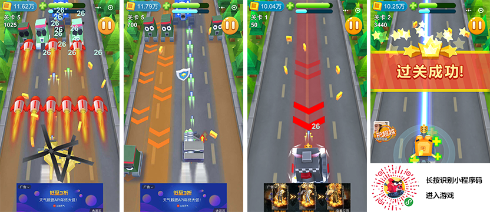 

《萌宠坦克》游戏截图 

**小编简评**：

《萌宠坦克》是一款射击类游戏，游戏画质精美，坦克主要为萌萌的拟人坦克，偶见直升机皮肤。该游戏虽然是穿着坦克的皮，实际还是飞行射击游戏的玩法，按屏幕移动射击与躲避敌方的射击弹幕。

#### 7、吃鸡之城3D

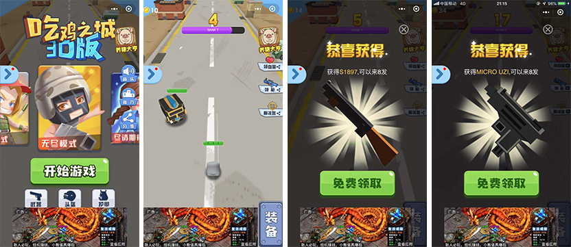

《吃鸡之城3D》游戏截图  

**小编简评**：

《吃鸡之城3D》是一款回合式闯关的射击游戏，该游戏内的美术并不惊艳，也许是因为视角的问题，不知是美术担心主角的枪看不到，还是为了方便射击瞄准，从枪管前延长出一个小白棍一样的东西。小编研究了许久，也没看明白。好在游戏的趣味性还是有的，只要调整好角度，射中敌人，一枪蹦飞后，就可以进入下一小关，否则会被敌人还击。

#### 8、吃鸡喵

《吃鸡喵》游戏截图   

**小编简评**：

《吃鸡喵》是一款基于物理动力的跳跃游戏，游戏名中的吃鸡二字和很热门的射击游戏没半分钱关系，是真的一个吃鸡的喵主子。游戏的主角喵，是通过玩家点击来不断跳跃的前进吃鸡，吃的鸡越多游戏得分就越多。在吃鸡的过程中，任何物体（包括云）都是可以用于借力跳跃的跳板。如果不小心跳到没有借力点的地方，那游戏就会终结。给小编的感觉是游戏简单，虽然有一定的可玩性，但是或许更适合学生和女性一些。

#### 9、全民头铁

 

《全民头铁》游戏截图   

**小编简评**：

《全民头铁》是一款点击反应的休闲游戏，游戏画风清新可爱，操作简单。全程只需要把握好点击的节奏，让游戏的主角前进并撞飞一个个的大怪兽和小怪兽。如果吃到宝箱后，还会随机获得道具，比如飞镖、长矛等，用来投掷击杀怪兽。

#### 10、狂野飞球OL

《狂野飞球OL》游戏截图    

**小编简评**：

《狂野飞球OL》是一款避障竞速的小球跑酷游戏，非常有魔性，极其考验玩家的手速与反应能力，并且小球之间的竞速有着赛车般的视觉冲击感。小编在8月份推荐的《球球冲刺》游戏也是属于这一类，其后又相继发现多款这种类似APP游戏《Balls Race》玩法的微信小游戏，一些体验不太好的就不提了，其中《疯狂球球冲冲冲》、《激情球球》、《疯狂的球球正版》也是非常不错的相似玩法的游戏。这里重点推荐《狂野飞球OL》的原因是，该游戏有一些微创新，除了基础的竞速与避障玩法外，不仅把当前小球的速度显示出来，用于提示玩家踏加速带进行加速，还把每次踩加速后的冲刺能量积累起来，当冲刺能量条满了之后，会自动激活一段时间的无敌模式（可以穿透障碍不死），进一步刺激玩家多踩加速带。

#### 11、球球跑酷赛车游戏

《球球跑酷赛车游戏》游戏截图     

**小编简评**：

《球球跑酷赛车游戏》也是一款避障竞速的小球跑酷游戏，虽然核心玩法看上去也借鉴了《Balls Race》，但从颜色的平滑过渡切换、远景的光效与雾效、操控反馈与3D镜头视觉的处理等细节体验甩开APP游戏《Balls Race》几条街。与其它类似游戏明显不同形状的路障以及仿公路地面的跑道皮肤等，让小编在体验过大量类《Balls Race》玩法的游戏后稍稍眼前一亮，可以说是品质较高的一款竞速游戏。

#### 12、疯狂的球球2

  

《疯狂的球球2》游戏截图     

**小编简评**：

《疯狂的球球2》的基础操作与之前推荐的两款游戏一样，也是一款避障的小球跑酷游戏，通过左右滑动进行障碍的躲避，但跑道是笔直的，没有弯曲和爬坡等感受。该游戏可以算是APP游戏《Catch Up》的玩法简化版，但游戏体验不弱于《Catch Up》，甚至降低了游戏难度，让小游戏玩家上手更舒服。

#### 13、跳跃吧球球

 

《跳跃吧球球》游戏截图      

**小编简评**：

《跳跃吧球球》也属于《Catch Up》的玩法简化版，但是和《疯狂的球球2》中采用的路障不同。虽然游戏整体的风格与体验到的感觉还是很像《Catch Up》，但是游戏中的存在加速带（黄色）与减速带（红色）是《Catch Up》没有的，并且跳板有了三维的提示，让跳跃的体验更友好一些。玩家可以体验一下。

#### 14、球球不要停

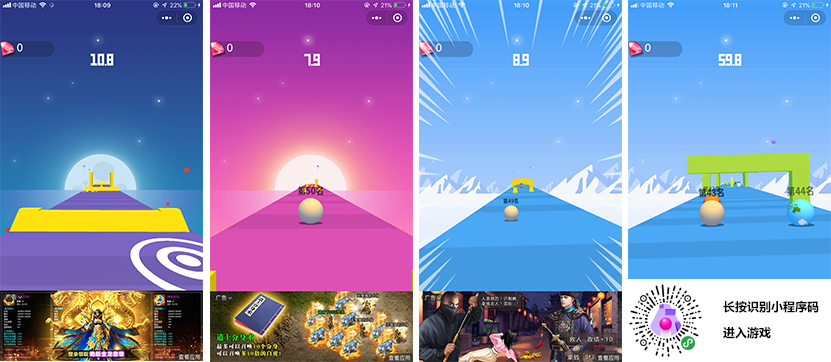 

《球球不要停》游戏截图     

**小编简评**：

《球球不要停》的核心玩法与之前推荐的几款游戏基本相同，但游戏的美术背景精美且多样，路障也较为丰富。加速冲刺，过坡、跳跃、避障等体验比较流畅。整体风格已经不会让小编再联想到某些APP游戏了。

#### 15、酷跑球球

《酷跑球球》游戏截图      

**小编简评**：

《酷跑球球》是一款避障的小球跑酷游戏，但是与之前推荐的游戏都不同，是在360度的时空穿梭式3D空洞奔跑。唯一不足的是，跑酷的主角球球的立体感并不强。

#### 16、搭木板

 

《搭木板》游戏截图        

**小编简评**：

《搭木板 》是一款休闲点击游戏，通过点击按住控制木板的长短，搭在对面的桥墩上，即可以通过，否则短了或者长了，都会掉下深渊。游戏原型或许是源自APP游戏《Plank》，《搭木板 》在小游戏中的表现已达到原生APP级别。可玩性高，推荐体验。

#### 17、梦想去旅行

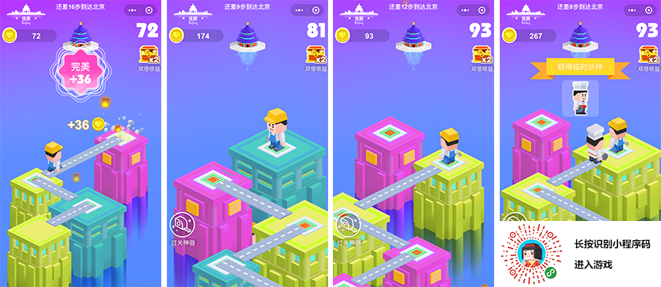 

《梦想去旅行》游戏截图         

**小编简评**：

借鉴《Plank》的游戏，在小游戏中特别的多，比如《超级救援》、《开路英雄》、《搭板子》、《板子西游》等等，每款游戏的表现都很不错，但创新性不太够 ，唯独《梦想去旅行》的差异性让小编眼光一亮。该游戏采用关卡式，以不同的城市标志性建筑为目标，在前行的过程中，实时提示离目标还有多少步。当达到目标后，可以欣赏到精美的三维立体建筑，让这款游戏陪你走遍全世界吧。

#### 18、节奏滚动球球 

 

《节奏滚动球球》游戏截图         

**小编简评**：

《节奏滚动球球 》是一款跑酷游戏，游戏中的角色是萌萌的宠物形象，在游戏中可以奔跑、跳跃、躲避。还有关卡与闯关难度调节，闯关过程的障碍还是比较有可玩性的。最后吐槽一下，游戏和球球没半毛钱关系。

#### 19、酷跑小鸡

 

《酷跑小鸡》游戏截图  

**小编简评**：

《酷跑小鸡》是5月份上线微信小游戏的一款3D跑酷类型游戏，在3D跑酷游戏中属于比较早的一批。因为相对于猪猪侠等精品跑酷，该游戏较为简单，所以8月份小编就没有推荐。前一阵据研发透露给我们的数据发现，这款仅一个人开发，没有分享按钮，没有广告，甚至是纯英文界面的3D小游戏，时隔半年居然还活着，日活跃用户仍然有几千人，比很多新上的小游戏都强不少。所以本次小编决定推荐给大家体验。

#### 20、酷跑英雄

  

《酷跑英雄》游戏截图  

**小编简评**：

《酷跑英雄》是一款跑酷游戏，小游戏的全名为《酷酷跑英雄游戏跑酷老奶奶游戏》，让小编不解的是为什么要和老奶奶扯上关系，游戏中小编跑了好久，也没找到老奶奶。但是，游戏品质还是不错的，美术和手感都挺好。

#### 21、喜羊羊快跑正版

  

《喜羊羊快跑正版》游戏截图  

**小编简评**：

《喜羊羊快跑正版》是使用了喜羊羊与灰太狼IP与美术的跑酷游戏。采用的灰太狼追逐喜羊羊的剧情。游戏制作精美，角色形象认知度高。属于跑酷中的精品。推荐大家体验。

#### 22、功夫青蛙

 

《功夫青蛙》游戏截图

**小编简评**：

《功夫青蛙》是一款休闲物理跳跃游戏。控制好青蛙下坠的方向，避免碰到危险区，存活时间越久得分越多。自从欢乐球球火了之后，类似游戏小编玩过的就十几款之多，其中不乏有不少美术非常精美且各有特色的产品，比如萌萌下楼、欢乐大冒险、高台球球、天天欢乐球、球球一跳到底等等。因为《功夫青蛙》有小程序码，所以推荐给大家直接识别小程序码体验，其它的游戏可以通过搜索名字体验。

#### 23、球球蹦蹦蹦

 

《球球蹦蹦蹦》游戏截图

**小编简评**：

《球球蹦蹦蹦》是一款休闲物理跳跃游戏。相对于功夫青蛙等平视角下坠跳跃的游戏，《球球蹦蹦蹦》采用的是深井下坠的俯视角度。下坠的视觉体验更加惊险刺激，是一款表现非常不错的小游戏精品。

#### 24、3D球球

《3D球球》游戏截图 

**小编简评**：

《3D球球》是一款休闲物理跳跃游戏，也是通过跳跃下坠与下坠时躲避禁碰区，或者是砸破碎冰区进行不断的下坠得分。视角体验独特，并且拥有特色的跳跃打击音乐效果与破冰效果体验。推荐体验试玩！

#### 25、球球坠落

 

《球球坠落》游戏截图 

**小编简评**：

《球球坠落》是一款休闲物理跳跃游戏。游戏的美术、音乐、文案细节等都非常赞，玩了一会才发现，其实核心玩法就是之前介绍的功夫青蛙类似游戏的去掉柱子的版本。但没有让小编感觉到在玩同质化的游戏，在下坠跳跃的过程中，背景色会不断的变幻，并且从用色的搭配与变幻细节处理的都很赞。推荐体验试玩！

#### 26、萌萌方块H5

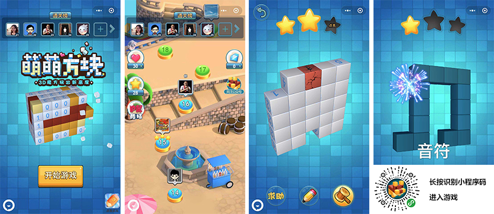

 《萌萌方块H5》游戏截图 

**小编简评**：

《萌萌方块H5》是一款3D立体的消除类益智微信小游戏。玩家需要通过不同类型的数字提示,不断消除无用的方块，最终找到隐藏在深处神秘礼物。小编玩了无数的无脑游戏之后，在遇到该游戏之后，要引导了好多关，才明白怎么玩。所以该游戏对智商还是有点要求的，想挑战一下自己的玩家可以来体验一把。

#### 27、超级高尔夫

 

 《超级高尔夫》游戏截图  

**小编简评**：

《超级高尔夫》是一款高尔夫题材的休闲竞技游戏，玩家通过点击调整角度控制球的方向并将高尔夫球击打出去获得游戏金钱，然后通过升级力量、速度、弹力，将高尔夫球击打的更远，也可以获得更多的游戏金钱。当玩家打出完美一击的时候（指针在红色中心位置），还有高尔夫球进洞的逼真玩法，可玩性不错。

#### 28、天天斗舞

  《天天斗舞》游戏截图   

**小编简评**：

《天天斗舞》是一款音乐节奏类游戏，有单人模式与有多人对战模式。通过手指与音乐节奏的配合，让手指和游戏中的角色一起舞蹈起来。这个游戏对小编来说有一定难度，但是比较有新意。

#### 29、黑洞也疯狂

 

 《黑洞也疯狂》游戏截图   

**小编简评**：

《黑洞也疯狂》是一款iO对战游戏。小编在8月份曾推荐过《黑洞大乱斗》，之后也玩过很多款黑洞吞噬类的游戏。与其它黑洞游戏不同的是，《黑洞也疯狂》脱离了城市内的吞噬场景，采用了海湾与海岛的场景，从吞噬体验上讲，该游戏也非常流畅，不像某个别的黑洞游戏那样，总是碰到吞噬不了的情况。《黑洞也疯狂》畅快的吞噬体验让小编感觉到时间过的特别快，还有很多没有吞完就结束了。

#### 30、黑洞大暴走

 

**小编简评**：

《黑洞大暴走》是一款IO对战游戏。这款黑洞游戏虽然还有黑洞的吞噬玩法。但是已经找不到黑洞的感觉了，游戏中采用的牧场的场景，画风清新精美，玩法方面并没有像其它黑泂游戏那样，是掉入到一个黑洞中，而是采用的外星飞碟吸入到飞碟中。吞噬的体验也非常流畅。

#### 31、龙卷风乱斗

  

《龙卷风乱斗》游戏截图 

**小编简评**：

《龙卷风乱斗》同样是一款吞噬类iO对战游戏。独特的龙卷风吞噬体验，破坏感真实有趣。无论是画面表现还是游戏交互体验，小编都认为很赞，该游戏绝对属于标杆级，没有体验过的有必要体验一下。

#### 32、吃鸡碰碰车

  

《吃鸡碰碰车》游戏截图 

**小编简评**：

童年中游乐场中的碰碰车，也在小游戏中火爆起来，小编玩了几十款2D与3D的碰碰游戏，优秀的3D碰碰游戏很多，《吃鸡碰碰车》相对于其它碰碰车游戏，采用了真联网对战、随机地图、游戏地型丰富多样等特色亮点。可玩性较高。

#### 33、最强碰一碰OL

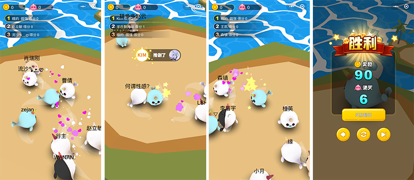  

《最强碰一碰OL》游戏截图 

**小编简评**：

《最强碰一碰OL》作为一款碰碰车玩法的休闲小游戏，从形象到配音都非常的可爱。尤其是美术有一定的特色。推荐给喜欢可爱萌宠风格的玩家。

#### 34、欢乐碰碰球

  

《欢乐碰碰球》游戏截图 

**小编简评**：

相于非常多的碰碰对撞游戏，如果没有独特的亮点，则很难长期留住玩家，《欢乐碰碰球》不仅美术精致，游戏对战过程中可以发送交互表情，更为亮点的是有着大逃杀的类似玩法。达到限定的时间后，赛场的面积会进行缩小。让生存的压力变的更大，冲突更加激烈。

#### 35、陀螺大乱斗

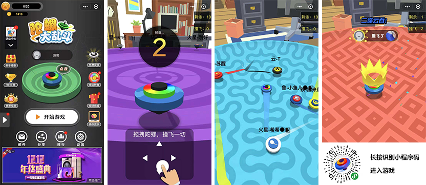  

《陀螺大乱斗》游戏截图 

**小编简评**：

在体验了众多碰碰对撞的游戏，小编认为《陀螺大乱斗》是最有特色的对撞游戏之一，与其它游戏直线对撞不同，该游戏的运动速度更快，方向的灵敏度更高，所以在游戏中可以采用陀螺的曲线式运动轨迹进行对撞，玩家结合曲线的运动规律会更好的赢得比赛。

#### 36、猩猩爬楼

  

《猩猩爬楼》游戏截图 

**小编简评**：

洪水来袭，一定要紧紧抓牢才有生还的希望！这款《猩猩爬楼》是一款攀爬的3D休闲游戏，在生存的压力之下，稍有失误，就会被洪水淹没。玩家通过点击，需要把握好每一次的手掌触碰楼梯的机会，有一定可玩性。

#### 37、小鸡历险记

  

《小鸡历险记》游戏截图 

**小编简评**：

《小鸡历险记》采用了乐高风格的3D斜视角游戏画面，点击是直行，左滑或右滑是分别向左或向右前行。通过把握过马路的时机，考验玩家的反应能力与时机把握能力，如果小鸡长时间不直行则会被老鹰抓走。

#### 38、旋转涂色

   

《旋转涂色》游戏截图 

**小编简评**：

《旋转涂色》的玩法是拿小球扔正在旋转的圆环，扔中的地方会染上颜色，而染上色的地方是不能再打中第二次的，不然就会Game Over。由于圆环的旋转是变速的而不是匀速的，有时还会停顿或者反向。所以，要克制住惯性的操作很重要。随时游戏的进展，难度也在不断提升，眼疾手快的反应力也是制胜的关键要素。

洪水来袭，一定要紧紧抓牢才有生还的希望！这款《猩猩爬楼》是一个攀爬的休闲游戏，在生存的压力之下，稍有失误，就会被洪水淹没。可玩性高。

#### 39、城市漂移

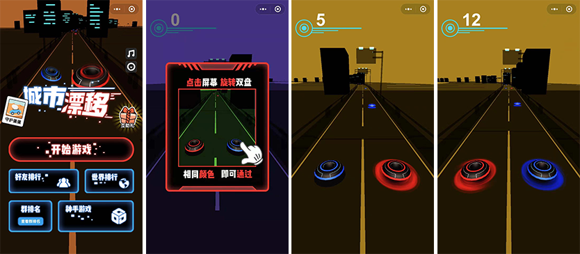  

《城市漂移》游戏截图 

**小编简评**：

《城市漂移》是一款非常考验玩家反应力的敏捷类游戏，只有双环的颜色与路障的颜色一致才可以顺利通过，玩家每次点击红蓝会互换位置。通过不断的切换双环保障顺利通行，时刻考验着玩家的预判反应能力。小编推荐试玩体验。

#### 40、跳动的球球

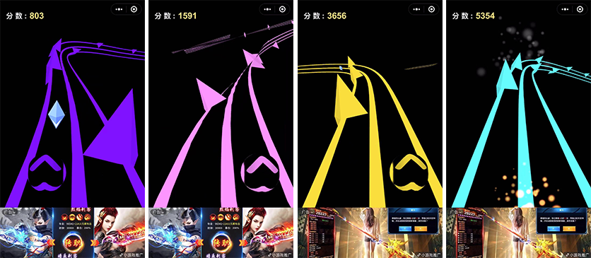  

《跳动的球球》游戏截图 

**小编简评**：

《跳动的球球》的核心操作与《城市漂移》类似，通过点击切换球的运动轨道来避免与山体样式的路障相撞。在小球运动与避障过程中，轨道蜿蜒曲折的变化，让小编有一种过山车的既视感。除了游戏中的颜色为小编所不喜，整体体验都非常赞，游戏的3D立体感受也是众多3D游戏里的最强之一。

#### 41、3D球球打砖块

   

《3D球球打砖块》游戏截图 

**小编简评**：

《3D球球打砖块》是一款用小球消除砖块的休闲射击游戏，玩法简单，玩家只需要避开高楼前的保护装置，射中砖块搭建的高楼，即可以进行消除，游戏考验着玩家对时机把握能力，但是，小编能一口气闯十几关，仍没有感觉到压力，是不是关卡设计的过于简单了呢？

#### 42、阶梯超人

 

《阶梯超人》游戏截图 

**小编简评**：

《阶梯超人》也是一款考验玩家预判反应能力的休闲游戏，游戏中的小人会一直不断的前行，玩家需要提前观察地型和预判风险，通过点击改变小人的前进方向而选择正确的行走路线。游戏是个好游戏，只是对小编来说，这个游戏难度有些高，行走速度有些快，还没来的及观察或者反应没跟上，路线就走错了，没有挽回的机会。挫折感较强。对于观察与预判能力较强的玩家可以来挑战一下。

#### 43、三维蹦蹦跳

  

《三维蹦蹦跳》游戏截图 

**小编简评**：

《三维蹦蹦跳》有着纪念碑谷式的美术风格，虽然看上去也有多条路径，但是每个关键路口会给予一个路障进行提示，所以不需要太多的预判能力，玩的是反应能力，不断掉落的空中板块逼迫着玩家要不断的前行，游戏体验很赞。

#### 44、天天叠一叠

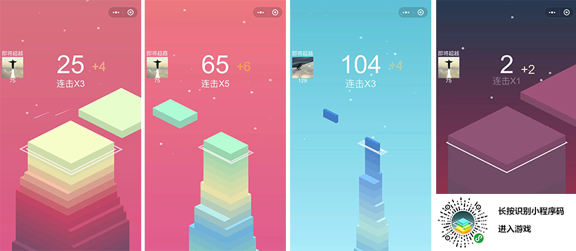  

《天天叠一叠》游戏截图 

**小编简评**：

《天天叠一叠》是一款画风优美的堆砌类小游戏，玩家控制方块不断的堆积获得更高的楼层，如果方块超过下方基座的部分则会被裁切下去。最后会越切越小，不过8连击（连续8次不被裁切）后，方块可以变大，而且每次连击还有特色的钢琴音效，总之，这是一款比较有趣味的放松休闲小游戏。

#### 45、彩色跑酷

  

《彩色跑酷》游戏截图 

**小编简评**：

《彩色跑酷》与之前的小球竞速避障游戏虽然有共性，都是球类角色与相近的元素皮肤，也都是通过左右滑动手机控制小球的移动。但是有明显的差异，更侧重于跑酷的避障体验。撞击同色球得分，碰撞同色条纹球后提高基础分数，撞击不同色球死亡。如果撞击变色板后球球可以变色，撞击金币后可以收集金币，撞击磁铁后可以在一段时间内自动吸收金币，金币可以用于解锁新的主题。是一种比较有意思的跑酷小游戏类型。

#### 46、球球飞车

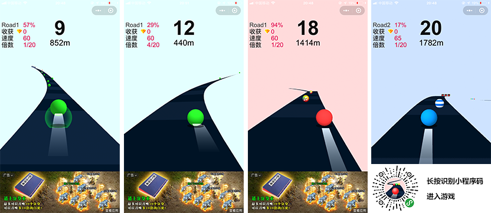  

《球球飞车》游戏截图 

**小编简评**：

《球球飞车》与《彩色跑酷》核心玩法基本一致，所不同的是，虽然没有磁铁与金币的玩法，但是《球球飞车》增加了音乐球，连续的撞击可以发出一段动听的音乐节拍，比较有特色，另外还有空中飞跃的飞车视觉效果。

#### 47、飞跃球球3D

   

《飞跃球球3D》游戏截图 

**小编简评**：

《飞跃球球3D》核心玩法与《球球飞车》类似，但是美术表现与游戏体验是小编见过的同类型3D游戏最好的，没有之一。绝对是APP精品级别的表现，强烈推荐试玩。

#### 48、热血球球大冒险

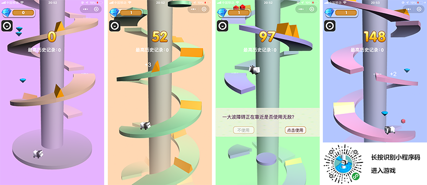  

《热血球球大冒险》游戏截图 

**小编简评**：

《热血球球大冒险》的主角熊猫通过玩家点击或长按点击，不断的跳跃进行闯关爬升，这类型的游戏，小编在8月份曾推荐过，其后也玩过多款类似产品，但是这款游戏不仅把小球变成了可爱的熊猫等各种萌宠，整个游戏的美术尤其是光效等细节都做的比较不错，游戏的完整体验也很好，值得试玩体验。

#### 49、萌宠一起冲冲冲

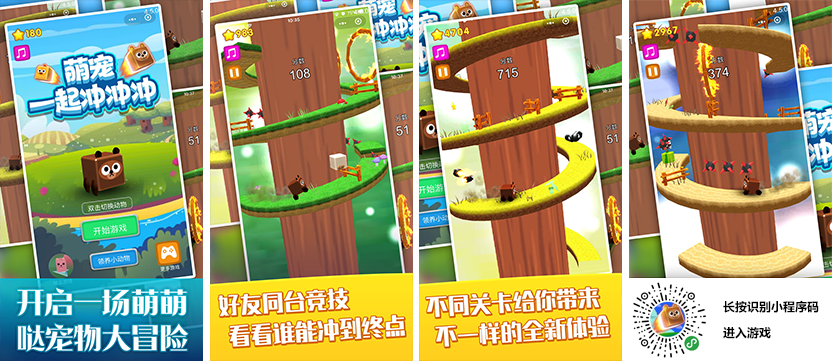  

《萌宠一起冲冲冲》游戏截图 

**小编简评**：

《萌宠一起冲冲冲》与《热血球球大冒险》的玩法基本一致，但是游戏美术尤为精美，除了栏杆的障碍外，还增加了空中刺球，空中飞弹，火圈等等。但是让小编吐槽的是超精美的3D美术，搭配的UI风格却非常简陋，感觉与整体游戏风格有一些不太协调。冲着游戏本身，推荐试玩体验。

#### 50、音乐超跑

  

《音乐超跑》游戏截图 

**小编简评**：

劲爆的电子音节奏下，进行避障跑酷。《音乐超跑》是一款左右滑动收集节奏和上滑跳跃躲避障碍的电音节奏跑酷游戏。有初级场、中级场、高级场等多种对战玩法。小编玩过类似的APP游戏，该游戏在细节体验上还是有一些差距的。不过对于电音游戏的爱好者还是值得体验。

#### 51、动感羽毛球

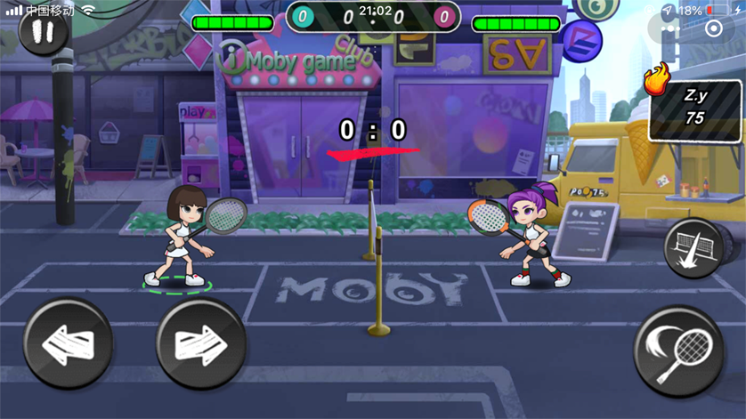  

《动感羽毛球》游戏截图 

**小编简评**：

《动感羽毛球》是一款非常优质的羽毛球对战游戏。游戏采用了3D引擎与2D混合的模式。操作界面主要分为四个按键。左面的左右箭头是控制人物前后移动的。右下方的拍键是挥拍的，在挥拍键的上方还有一个用来扣杀的按键。掌握好这些技能就可以畅快的体验在线羽毛球对打了。

#### 52、多维俄罗斯方块

  

《多维俄罗斯方块》游戏截图 

**小编简评**：

经典的俄罗斯方块游戏已经有3D的多维版本了，《多维俄罗斯方块》不仅是以3D的形式去展示俄罗斯方块，通过旋转底座，让下落的角度也是呈多维的方式进行叠加或者消除。并且每次下落都会有不同的钢琴音作为堆砌的音效伴奏。

#### 53、雷霆飞机大战

  

《雷霆飞机大战》游戏截图 

**小编简评**：

《雷霆飞机大战》是一款采用3D引擎的飞机空战游戏，街机风格，无尽的弹幕尽显激烈的空战。虽然爆破等效果很激烈，不过控制飞机的过程中，屏幕晃动的小编都快晕了。希望开发者对这块能再优化一下。

#### 54、全民疯狂飞机大战

  

《全民疯狂飞机大战》游戏截图 

**小编简评**：

《全民疯狂飞机大战》与上一款推荐的飞机大战是同一个开发者的作品，但是这款游戏的美术与体验，小编感觉到很舒服，作为一款优质的飞机空战游戏，推荐给大家体验试玩。

#### 55、球不能停

  

《球不能停》游戏截图 

**小编简评**：

《球不能停》是一款特别容易上手的小游戏，玩家只需要按住屏幕左右滑动。把足球落到球场上即可得分，如果落到中心点上，还会有额外积分获得。看上去简单的一款小游戏，还是要有一些技巧性的，推荐体验试玩。

#### 56、最强变变变

  

《最强变变变》游戏截图 

**小编简评**：

合成类的游戏实在是太多了。但是3D表现的合成游戏却不是太多，《最强变变变》正是一款3D表现的合成类的游戏。玩法简单，相同的精灵通过拖拽到另一个精灵上，即可完成合并变成另一级别的精灵，更多玩法小编就不介绍了，喜欢合成游戏的玩家可以体验一下3D版本。

#### 57、圈圈大乱斗

  

《圈圈大乱斗》游戏截图 

**小编简评**：

《圈圈大乱斗》是一款3D圈地对战的IO游戏，像素美术风格。原型是某款知名的海外APP游戏。小游戏中也有多款类似产品。有喜欢IO对战游戏的可以体验。

#### 58、小球别掉

  

《小球别掉》游戏截图 

**小编简评**：

《小球别掉》是一款简单上手的休闲小游戏，游戏中会有一个沿路滚动的小球，然而路途中会不断出现等待玩家修复的断层。修复的方式就是在小球通过前，通过左右滑动进行复位。如果小球经过时还没有完成复位，游戏就会结束。

#### 59、全民飞人

  

《全民飞人》游戏截图 

**小编简评**：

《全民飞人》是一款飞行与跑酷结合的游戏，在一定的距离内，有很多圆圈和金砖。游戏的玩法就是在这段距离内，尽可能多的钻圈和获得金砖。这样才可以获得更好的排行。

#### 60、指上篮球

  

《指上篮球》游戏截图 

**小编简评**：

《指上篮球》是一款模拟投篮的休闲小游戏，玩家扮演的不是投手而是球篮，玩的过程玩家要面对各种刁钻的投篮方向，变幻莫测。游戏看上去比较简单，还是有一些可玩性的。推荐大家体验。

### 写在最后

3D小游戏的数量在爆发式增涨，但是精品的原创性作品却并不是太多。小编本次试玩了近两百款3D产品，除了大量的重复性产品外，APP游戏的仿制与抄袭现象与较为常见，希望下次小编再推荐的时候，多一些3D原创精品。