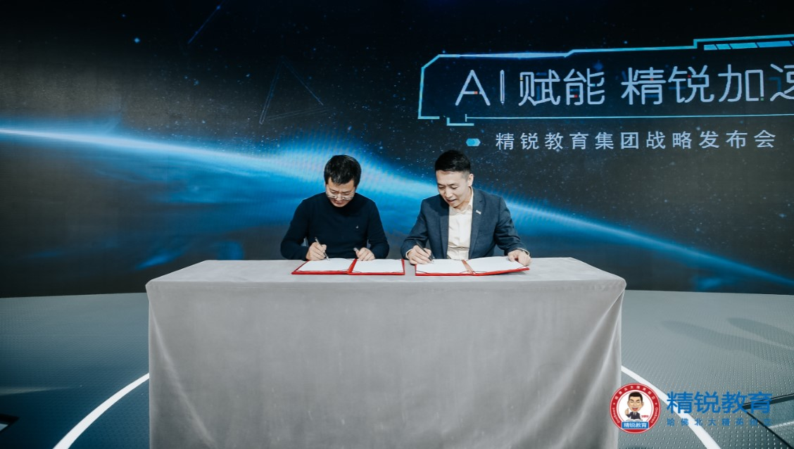

## Layabox推出无编程3D制作工具LayaMaker，携手精锐教育集团进军新领域！

update :  2019-04-26

 	

今日，Layabox与教育领域领军企业精锐教育UUabc签署战略合作协议，携旗下产品LayaMaker宣布正式进军教育行业互动教学领域。Layabox将以精锐教育集团为重点服务对象，双方在包括教育平台搭建、互动课件制作、培训等方面进行全方面深入的合作，以期通过各自优势，提升互动教学体验，重新定义在线教育商业模式。

 

 Layabox与精锐教育现场签约战略合作协议

众所周知，随着移动互联网的发展，线上教育形式日新月异，产品更新迭代迅速，学习的强互动性、高趣味性是教育机构、教师及学生的面临的迫切需要。LayaMaker项目正是在这一背景下，由Layabox孵化而成。得益于Layabox多年技术优势积累以及在3D引擎领域的绝对领先地位，LayaMaker从一开始就具备了无可比拟的特点：

#### 1、无需编程，改变内容生产模式

通过三次重大重构，50万+行次代码迭代及各年龄层志愿者协助，LayaMaker实现了易用性的颠覆性突破，毋需掌握编程技能，只要有策划或创意能力，零编程基础即可快速制作生产精美灵动的3D交互场景教学内容。一劳永逸的解决教育机构目前在于优质内容的创作生产等环节的高门槛痛点，去除动态交互内容创意对编程人员的依赖，彻底改变了行业的内容生产模式。

#### 2、全平台发布，降低获客成本

LayaMaker平台本身和发布的产品可同时支持PC、移动APP以及小游戏平台运行，用户可随时随地制作和运行内容，不受时间及设备的限制。同时，依托云服务优势，可直接以小程序的方式在微信、百度、小米等各大主流分发渠道中流畅运行，通过移动互联网的社交关系裂变，革新了教育机构的推广方式，产品获客效率提升十倍以上，同时，由于内容的革新，寓教于乐的方式，提升了客户转化率，进一步降低获客成本。在流量红利丧失的后互联网时代，真正解决教育机构的核心痛点。

#### 3、工具即社区

LayaMaker不仅是一个工具，同时也是集交流、协作、作品交易推广于一身的社区平台，无论是产品素材（模型、角色、道具）和教育内容（教程、直播等）的获取、还是远程联合开发团队的建立，直到产品的分发推广，都可以在这个平台快速完成，形成完美的内容产销闭环。

LayaMaker平台的诞生，对在线教育企业具有的突破性革新意义，它对教育未来的影响，绝不亚于世纪初的Flash。

与精锐教育集团的战略合作，是Layabox切入在线教育领域的第一步，在此基础上，未来将与更多的教育企业合作，助力互动教学领域的增长。这也是LayaBox从游戏引擎提供商进阶为 “游戏引擎+互动内容解决方案” 提供商的关键一步，在未来，LayaBox将进一步扩大LayaMaker的应用领域，为教育、游戏、短视频、广告等传统行业提供更多优秀的解决方案。

 

移动互联网时代，内容为王，兼具直观表现力、优秀互动性等特点的内容形式，将是产业发展大势所趋，LayaBox和其LayaMaker平台将成为新内容形态萌芽及发展繁荣的摇篮及推手，助力产业构筑新时代的产品特性及商业生态。

移动互联网时代，内容为王，兼具直观表现力、优秀互动性等特点的内容形式，将是产业发展大势所趋，LayaBox和其LayaMaker平台将成为新内容形态萌芽及发展繁荣的摇篮及推手，助力产业构筑新时代的产品特性及商业生态。