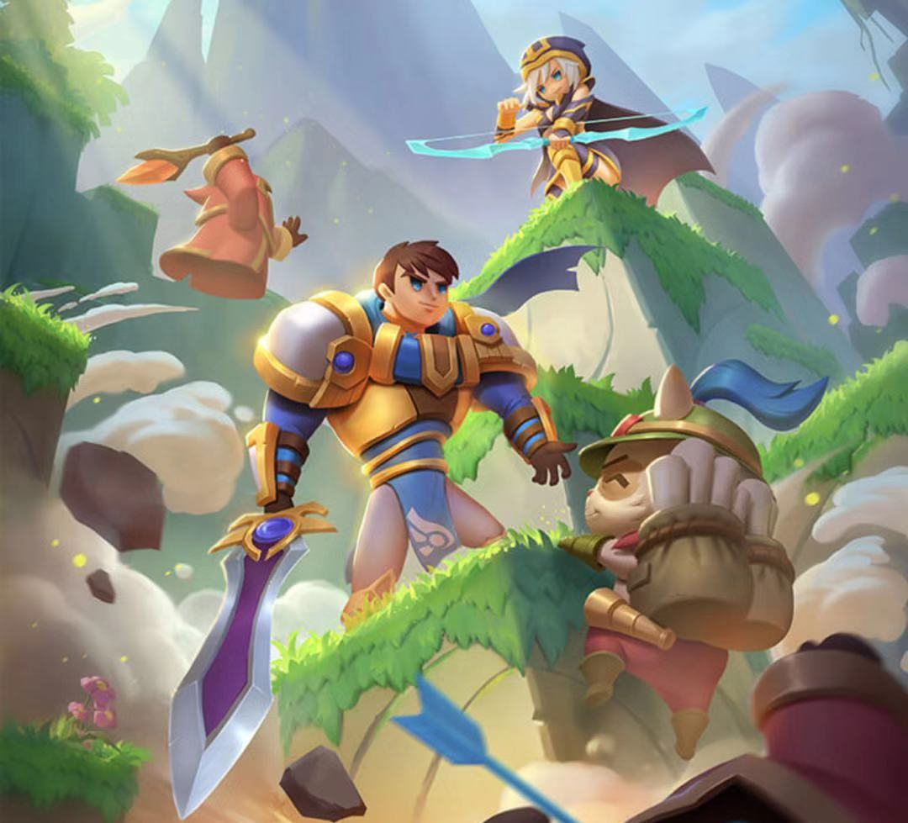
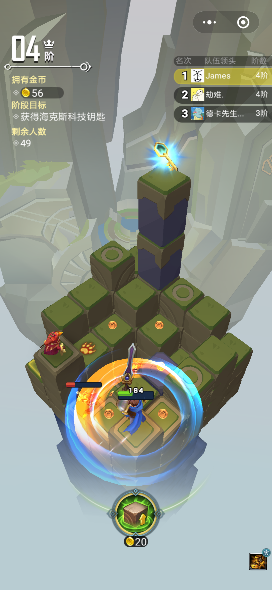

## LayaAir案例：网龙出品LOL(英雄联盟)3D小游戏《决战巨神峰》！

Date: 2019-9-28

还记得年少时与同伴彻夜开黑的日子吗？

2009年10月，LOL(英雄联盟)正式上线。时光飞逝，一晃十年过去了。

 

在这即将迎来十周年之际，网龙重磅推出这个寄托着一代人青春与信仰的英雄联盟IP微信小游戏《决战巨神峰》，正是恰到好处。

昨天，基于LayaAir引擎开发的3D微信小游戏《决战巨神峰》已开启删档测试。

9月30日将关闭服务器，并删档，还没体验？犹豫什么，快去抢先体验吧。

需要提醒的是，《决战巨神峰》与传统的LOL玩法有所不同，在微信小游戏的版本里，采用的是休闲爬塔式游戏玩法。

目前有【单人冒险】【好友爬塔】两种模式：单人冒险能够体验简单闯关的乐趣；好友爬塔则可以与线上玩家同时匹配竞技，还可邀请你的微信好友一起组队，体验竞争存活的激烈比赛。

**玩家小秘籍：**

1、滑动屏幕，可以控制角色的前后左右移动。

2、攻击是自动的，从高处落下，还可以从小兵头顶发起攻击。

3、在战斗的过程中，要注意方块光圈的位置，那里是落石点，被砸死就太不值得了。

4、测试阶段，可能会有产品技术BUG，问题可以反馈到公众号“LOL小游戏先锋团”。

废话不多说了，直接上截图，然后上小游戏码。

 

 

小程序码来了

 

微信扫一扫小程序码进入游戏

**LayaAir引擎其它精品案例：**

[LayaAir引擎3D捏脸换装游戏案例《淘宝人生》与《心动练习生》](http://mp.weixin.qq.com/s?__biz=MzAxMjI4NjA1OA==&mid=2650584802&idx=1&sn=05536d73f1fa21fc0b2700e67d125836&chksm=83bc37e7b4cbbef117d036d56c1864564d58d6a11dc38a2027d9e58c7a5bf6195bf63e934475&scene=21#wechat_redirect)

**推荐阅读：**

[应对苹果iOS新规，Layabox再次成功过审HTML5的APP包，同时推出iOS过审协助服务](http://mp.weixin.qq.com/s?__biz=MzAxMjI4NjA1OA==&mid=2650584788&idx=1&sn=4e199fbd4f412ac6c0e8e2ee671e2970&chksm=83bc37d1b4cbbec751b6b886ca59f4fe955f1522729c20b759dbad8f7b839cc54d49b129786e&scene=21#wechat_redirect)

[LayaAir开始在GitHub实时提交了,2.3版支持任意多光源渲染, 3D效果华丽提升！3D导出插件支持Unity2018了！](http://mp.weixin.qq.com/s?__biz=MzAxMjI4NjA1OA==&mid=2650584789&idx=1&sn=a90819e9fff70565c2c86053bbf13855&chksm=83bc37d0b4cbbec6b24ba8a84165e565a2633e58342b520ed24c5f6c9c26a7b6ccfd5800ec2b&scene=21#wechat_redirect)

[重磅：LayaAir2.2将引擎源码全面切换至TypeScript，支持WebGL2.0，并增加大量3D实用功能](http://mp.weixin.qq.com/s?__biz=MzAxMjI4NjA1OA==&mid=2650584703&idx=1&sn=57f46519d954afc8305a320aec4840fe&chksm=83bc377ab4cbbe6c3ad13626b961364d62a2a173aca2715a20b6551de35b3bb2217febd2ec9f&scene=21#wechat_redirect)

