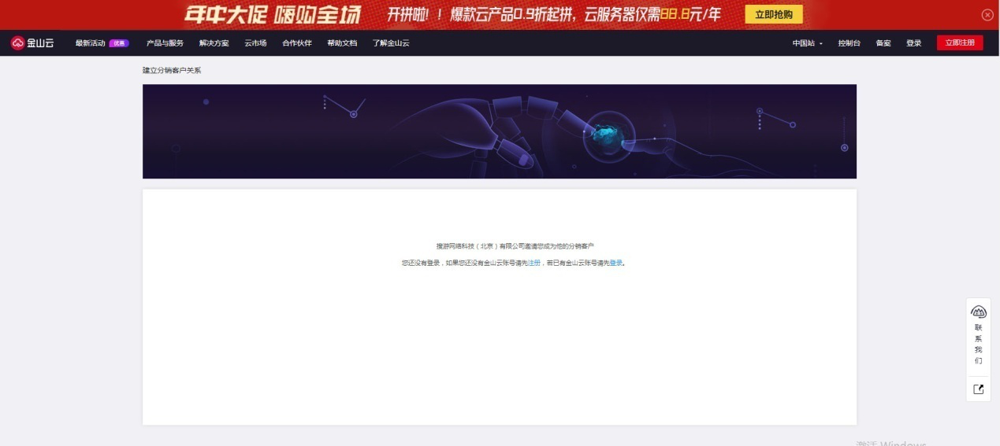
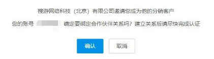

## Layabox联手金山云，推出8折优惠大礼包！

> *2020-08-12*

金山云，创立于2012年，中国最大的独立云服务商，雷军旗下云计算独立子公司。业务范围遍及全球100多个国家和地区。成立7年来，金山云始终坚持以客户为中心的服务理念，提供安全、可靠、稳定、高品质的云计算服务。

目前，金山云估值已达到23.73亿美元，成为国内估值最高的独立云服务商；并于2020年在纳斯达克上市。当前，金山云已经在北京、上海、广州、杭 州、苏州、天津等国内地区，以及俄罗斯、新加坡、美国等国际区域设有绿色节能数据中心及运营机构。未来，金山云将持续开展国际化战略，通过构建一张覆盖全球的云计算网络。

### 8折优惠，让利给开发者

价格与成本，一直是开发者比较关心的话题，然而单体的开发者往往是没有议价权的，只能等到做活动的日子，被动享受优惠。这正是零售价与代理价的差别。

为了帮开发者争取到最大的优惠，Layabox与金山云达成代理合作关系，并且直接把代理方的利润转让给开发者，开发者通过Layabox提供的购买通道进入，随时购买都可以享受8折优惠。让开发者每天可以享受到比做活动还优惠的福利礼包。

对于可以享受8折优惠福利的大礼包，包括如下：

| 8折优惠福利大礼包清单           |
| ------------------------------- |
| 云服务器/VM_GROUP               |
| 云硬盘/EBS_GROUP                |
| 弹性IP/EIP_GROUP                |
| 内容分发网络/CDN_GROUP          |
| 关系型数据库/RDS_GROUP          |
| 云数据库Redis/REDIS_GROUP       |
| 云物理主机/REAL_VM_GROUP        |
| 云数据库MongoDB/MONGODB_GROUP   |
| GPU物理服务器/EPCGPU            |
| 对象存储/KS3_GROUP              |
| GPU云服务器/GPUVM_GROUP         |
| 云数据库Memcached/Memcached     |
| 分布式数据库服务/DRDS_GROUP     |
| 文件存储/KFS_GROUP              |
| 云数据库PostgreSQL/PG_GROUP     |
| 云数据库SQL Server/SS_GROUP     |
| 消息队列RabbitMQ/RabbitMQ_GROUP |
| 文件存储KPFS/KPFS_GROUP         |

### 享受8折优惠的操作方式

#### 第一步：

##### 复制以下链接在浏览器中打开。

链接:
http://uc.console.ksyun.com/pro/sp/#/inviteCustomer?code=b85b22a14a63a17812f50ffcb72f5925&isfrom=agent

打开后，会看到类似下图的界面。登录或者注册。如果没有帐号的请先去注册，有帐号的直接登录即可。

 

#### 第二步：

登陆后会自动跳出确认帐号与Layabox的公司（搜游）绑定合作伙伴关系的绑定界面，点击确认即可。

 

#### 第三步：

等待Layabox后台工作人员审核通过，或者直接添加Layabox后台工作人员微信沟通。微信二维码如下： 

 