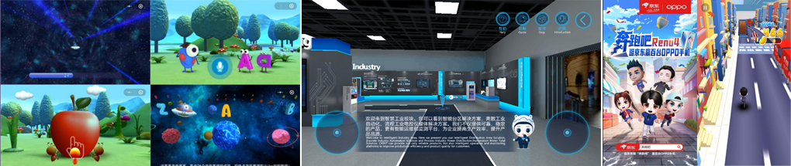
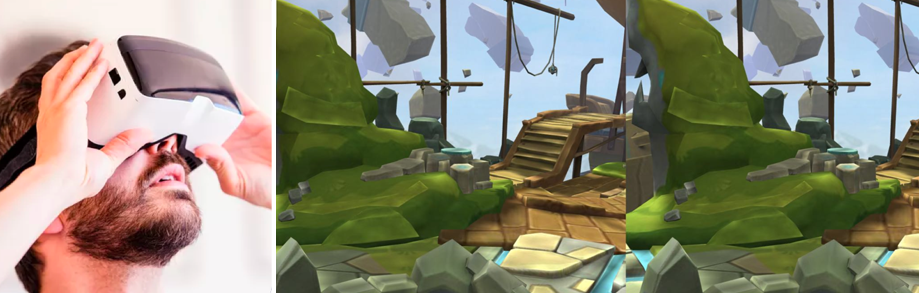
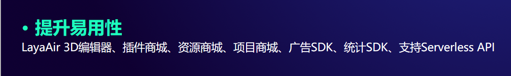
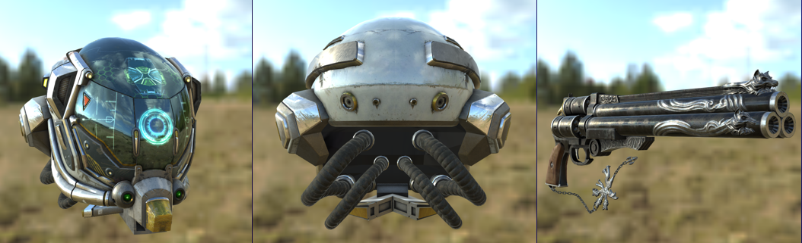

## LayaAir引擎的未来规划

*2020-09-27*

9月25日上午，以“科技·创新·未来”为主题的2020 BIGC北京国际游戏创新大会在北京海淀正式开幕。9月26日上午的游戏引擎主题会议中，Layabox的合伙人李明以《LayaAir引擎的现在与未来》为主题，从游戏行业的几大趋势为切入点，预判开发者未来对游戏引擎需求，并以此提出LayaAir引擎未来的规划。本篇面向开发者，选取引擎未来规划的分享部分，同步给LayaAir引擎的广大开发者。

 

### **全平台游戏引擎**

一次开发，APP与小游戏同时上架，已经形成趋势。但受JavaScript运行语言的制约，采用JS打包成APP的性能与原生APP引擎的C++相比还有一些不足。休闲游戏类型还好，当重度游戏发布APP版本的体验和表现想超越小游戏版本，完全达到3A级APP游戏品质时，还是有一定的语言级瓶颈。例如，当前小游戏平台的任何一款引擎都无法完全还原APP级别的《王者荣耀》。

  

图片来自网络

因此，LayaAir引擎3.0版本，不再满足于小游戏、APP、web版本的多平台同时发布方案。将通过技术方案（具体方案暂时保密）解决语言级性能硬伤，努力让LayaAir引擎无论在哪个平台都可以发挥出平台本身的极致性能。**让3.0引擎在APP平台完全可以实现《王者荣耀》这种级别的大型重度游戏。**在小游戏平台推出精减版核心玩法体验包，让小游戏与HTML5平台成为APP推广和引流的一种方式。

Layabox李明在对游戏研发的商务拜访沟通中发现，采用LayaAir引擎做重度3D游戏的越来越多，对引擎的原生性能与跨平台要求也越来越高。例如，有的研发提出了上架Steam等PC桌面平台的需求。对此，LayaAir在3.0版本有计划进行支持。

 

图片来自网络

在平台发布的横向领域发展上，LayaAir引擎未来会分阶段真正实现多平台向全平台的过渡，除小游戏平台、APP、web版的同时发布外，已有计划支持发布PC桌面版，满足上架Steam等平台的需求。

### **全领域3D引擎**

LayaAir引擎的开发者虽然大多数在从事游戏领域，引擎的API也主要是为游戏领域服务。然而事实上，很多其它的产业正在融合游戏的表现和体验。例如，互动营销广告、电商引流小游戏、游戏式教学课件、实体三维模拟（3D线上展馆、线上看房，虚拟购物等）等等。

 

LayaAir引擎跨界游戏案例

针对其它领域的需求，LayaAir引擎未来会更加重视起来，快速丰富相关的API（例如支持好3D UI），尤其是基于3D的VR与AR需求，不仅是游戏领域的未来需求，也是其它领域的通用需求，已经列入LayaAir 3.0 重点支持的功能之一。

LayaAir 3.0支持 XR（AR\VR）

### **3D工具与易用性**

易用性是LayaAir引擎3.0以及未来版本关注的重心之一，基于小游戏产业的快速发展，LayaAir 2.x阶段为了满足3D产品的各种研发需求，一直处于3D引擎功能的加速迭代阶段，暂时把3D编辑器的优先级降低。

LayaAir引擎未来将**重构2D编辑器，****新增3D编辑器，将易用性与用户体验反馈作为引擎团队考核目标。增加引擎插件商店、项目资源商店、项目Demo商店等周边功能服务**，为开发者提升开发效率而努力。

### **次世代3D引擎**

次世代3D效果往往可以代表引擎可以实现的高度，也是在竞争越来越激烈的游戏市场中，精品游戏拉开差异化的门槛与研发实力的象征，更是在全平台同时发行的品质保障。

早在LayaAir 2.0推出的时候，次世代3D引擎的目标就已提出。其后丰富了PBR、任意多光源等渲染效果。也推出了炫酷的示例DMEO。

LayaAir引擎官网中的3D示例Demo

在未来，次世代3D引擎的目标，将是LayaAir引擎未来的长线目标，引擎团队会始终在这个目标上进行努力，不断丰富次世代3D引擎渲染效果。

 

近期，为了丰富LayaAir 3D引擎的次世代渲染效果，正在研发和即将研发的功能包括：透明物体的阴影，体积雾，⾮真实渲染，屏幕空间的扰动，折射、反射、散射等，以及后期处理中的景深 ，运动模糊，光耀等。

### **引擎文档、示例、社区**

除了引擎本身的建设外，LayaAir未来会更加重视周边生态的建设。丰富引擎文档、增强引擎示例的效果与功能展示、加快社区BUG反馈的跟进速度。为开发者良好的引擎使用体验而不断努力。

***END\***

**引擎案例分享：**

- [3D研发经验分享：50多款3D小游戏的炫稷游戏创始人程银斌分享3D研发经验！](http://mp.weixin.qq.com/s?__biz=MzAxMjI4NjA1OA==&mid=2650585172&idx=1&sn=c84c82c2cdd53e3c7bc4ed33573ca12b&chksm=83bc3951b4cbb047a9a21c09ff1a38659f209582c6be3a162c234a2209b285dad07f49fafb6c&scene=21#wechat_redirect)
- [3D技术分享：有着30多款3D小游戏产品的长沙嗨鹿互动科技资深研发工程师分享3D游戏研发经验](http://mp.weixin.qq.com/s?__biz=MzAxMjI4NjA1OA==&mid=2650585139&idx=1&sn=3eb4e287acb4a1fb607c66461baa051a&chksm=83bc3936b4cbb0209608722e71cbf380dade69042bdef79ea97a1912723bf259c90773dee049&scene=21#wechat_redirect)
- [132款3D跑酷极限运动主题的微信小游戏分享](http://mp.weixin.qq.com/s?__biz=MzAxMjI4NjA1OA==&mid=2650585084&idx=1&sn=28382291ae801a033225d2ee22163877&chksm=83bc36f9b4cbbfef1ffdcf2c281d33b7279d8cde713357c60f1843d5149aec45bb014e77c96f&scene=21#wechat_redirect)
- [LayaAir引擎78款3D射击主题微信小游戏分享，看看玩过几款！](http://mp.weixin.qq.com/s?__biz=MzAxMjI4NjA1OA==&mid=2650585062&idx=1&sn=4c9315865c6208916e902f302af72955&chksm=83bc36e3b4cbbff5e2be1b9e158aebfc73032efa689effe56602d2ae7ff7c9ba75aaa8696060&scene=21#wechat_redirect)

**推荐阅读：**

- [3D场景编辑导出-LayaAir引擎Unity插件使用详解](http://mp.weixin.qq.com/s?__biz=MzAxMjI4NjA1OA==&mid=2650585289&idx=1&sn=13e2bcf469aef2ba4b326f68061d5b63&chksm=83bc39ccb4cbb0dab8517bd4e9c8a1786cb69ce9c77d86ac81ea23061f9a2af3627bf7b95fe9&scene=21#wechat_redirect)
- [有效解决3D游戏边缘锯齿现象及全面理解LayaAir引擎游戏屏幕适配！](http://mp.weixin.qq.com/s?__biz=MzAxMjI4NjA1OA==&mid=2650585095&idx=1&sn=75df17da3eafc11503b2b1978e4db3d5&chksm=83bc3902b4cbb0141e4cd327938ef069aed4bde965d8943cb67c2334f95a234576bd8530b4dd&scene=21#wechat_redirect)
- [如何使用及参与维护Github的LayaAir引擎源码](http://mp.weixin.qq.com/s?__biz=MzAxMjI4NjA1OA==&mid=2650584916&idx=1&sn=1ef321cda0b922f98b1d7a8558a3f261&chksm=83bc3651b4cbbf47652ccb188c8ca8b22cf6b8889703493b3ab359634392953ba8123d6a124a&scene=21#wechat_redirect)
- [VSCode高效开发工作流配置指南](http://mp.weixin.qq.com/s?__biz=MzAxMjI4NjA1OA==&mid=2650584910&idx=1&sn=add4fece5eac96786b9e2870a0d04b5c&chksm=83bc364bb4cbbf5d4583aa8cc9c21de77fec2bd0730c02dff31b75e769b4be2abdfbda482b44&scene=21#wechat_redirect)
- [科普：零基础了解3D游戏开发](http://mp.weixin.qq.com/s?__biz=MzAxMjI4NjA1OA==&mid=2650584858&idx=1&sn=1eb3bd594e4bcca7ce3aa8fae99bdece&chksm=83bc361fb4cbbf099726f7773f07dde28bf765aa4c33349704e2d89fd650ca8071302e42dbb2&scene=21#wechat_redirect)
- [应对苹果iOS新规，Layabox再次成功过审HTML5的APP包，同时推出iOS过审协助服务](http://mp.weixin.qq.com/s?__biz=MzAxMjI4NjA1OA==&mid=2650584788&idx=1&sn=4e199fbd4f412ac6c0e8e2ee671e2970&chksm=83bc37d1b4cbbec751b6b886ca59f4fe955f1522729c20b759dbad8f7b839cc54d49b129786e&scene=21#wechat_redirect)
- [Layabox推出低价位共享技术服务活动！](http://mp.weixin.qq.com/s?__biz=MzAxMjI4NjA1OA==&mid=2650585101&idx=1&sn=8db213062e9ef9dfbc79ef0b409b6713&chksm=83bc3908b4cbb01ec3b24944722fa36c04c3902595e94496daceabda243a06f77e0fb26414e2&scene=21#wechat_redirect)

**引擎版本更新说明：**

- [LayaAir2.8版本新增3D粒子裁剪、预烘焙骨骼动画、视频贴图等3D功能，支持发布字节（抖音、今日头条）小游戏](http://mp.weixin.qq.com/s?__biz=MzAxMjI4NjA1OA==&mid=2650585213&idx=1&sn=5bc5c148aef9c6e27e899b1b82b3f776&chksm=83bc3978b4cbb06ea4581ee7cfc4e3d7da4bc41557ca52f395f438a77c066d2345607b8fa1cf&scene=21#wechat_redirect)
- [LayaAir2.7物理引擎大幅升级并新增cannon物理引擎支持，强化3D光影效果，新增vivo平台引擎共享插件，强化3D插件](http://mp.weixin.qq.com/s?__biz=MzAxMjI4NjA1OA==&mid=2650585147&idx=1&sn=5b7edf08ea719fbe4cfc71b85d604fcd&chksm=83bc393eb4cbb02896ba137a96b3848500459cbd1b309de40db5c31b256222fcdd51804bd93d&scene=21#wechat_redirect)
- [Layabox率先完成bilibili小游戏的适配与IDE发布，LayaAir 2.6.1今日发版！](http://mp.weixin.qq.com/s?__biz=MzAxMjI4NjA1OA==&mid=2650585122&idx=1&sn=6abf9d59bdb7c99f39fcfa027c7b2aea&chksm=83bc3927b4cbb031ad5d4c57c1409d440abeb681611986776c37c57ff7605f252d84e20bce98&scene=21#wechat_redirect)
- [重磅：3D光影已经完善，LayaAir2.6.0重构了阴影系统！](http://mp.weixin.qq.com/s?__biz=MzAxMjI4NjA1OA==&mid=2650585089&idx=1&sn=c4263fbbab054ec49b30f81cac579229&chksm=83bc3904b4cbb0128725221efd55b4f41daddeca0e3537d73f62540ac64729b4820ca0adc55f&scene=21#wechat_redirect)
- [LayaAir次世代引擎再进一步， 2.5版本重构并完善了PBR引擎模块，新增支付宝小游戏适配及发布！](http://mp.weixin.qq.com/s?__biz=MzAxMjI4NjA1OA==&mid=2650585023&idx=1&sn=7a6b94432eb6c5bad8f356fe64363f86&chksm=83bc36bab4cbbfacae32c467500a77201a5822b84b97aeeb2e3bef29927ff7a0997991191b1c&scene=21#wechat_redirect)
- [LayaAir2.4的3D物理引擎库体积减少近50%、编码模块不再内嵌到LayaAirIDE，支持微信引擎插件](http://mp.weixin.qq.com/s?__biz=MzAxMjI4NjA1OA==&mid=2650584885&idx=1&sn=1d7c8c60daf1ee190d9c2afaee26915f&chksm=83bc3630b4cbbf2671eba943c0a7f930be36c9104f3f161be1b734da66d3021c44af00803abe&scene=21#wechat_redirect)。
- [LayaAir2.3支持任意多光源渲染, 引擎](http://mp.weixin.qq.com/s?__biz=MzAxMjI4NjA1OA==&mid=2650584789&idx=1&sn=a90819e9fff70565c2c86053bbf13855&chksm=83bc37d0b4cbbec6b24ba8a84165e565a2633e58342b520ed24c5f6c9c26a7b6ccfd5800ec2b&scene=21#wechat_redirect)[开始在GitHub实时提交维护了](http://mp.weixin.qq.com/s?__biz=MzAxMjI4NjA1OA==&mid=2650584789&idx=1&sn=a90819e9fff70565c2c86053bbf13855&chksm=83bc37d0b4cbbec6b24ba8a84165e565a2633e58342b520ed24c5f6c9c26a7b6ccfd5800ec2b&scene=21#wechat_redirect)！3D导出插件支持Unity2018了！
- [LayaAir2.2引擎源码全面切换至TypeScript，支持WebGL2.0](http://mp.weixin.qq.com/s?__biz=MzAxMjI4NjA1OA==&mid=2650584703&idx=1&sn=57f46519d954afc8305a320aec4840fe&chksm=83bc377ab4cbbe6c3ad13626b961364d62a2a173aca2715a20b6551de35b3bb2217febd2ec9f&scene=21#wechat_redirect)
- [LayaAir 2.1 已废除Canvas API兼容！](http://mp.weixin.qq.com/s?__biz=MzAxMjI4NjA1OA==&mid=2650584637&idx=1&sn=7b8d2ad451808c636fcfd7815505713a&chksm=83bc3738b4cbbe2e3fee942ec018d56360fb4ffcb0eca926eba8537394f8d83dc4cd85cd9552&scene=21#wechat_redirect)