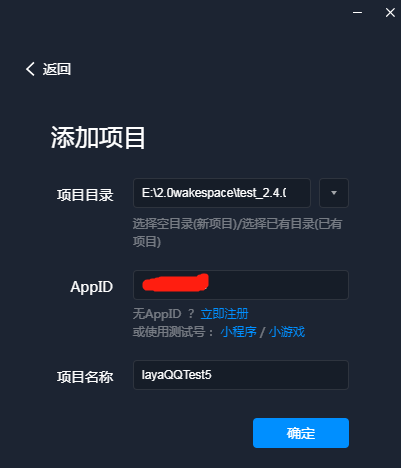
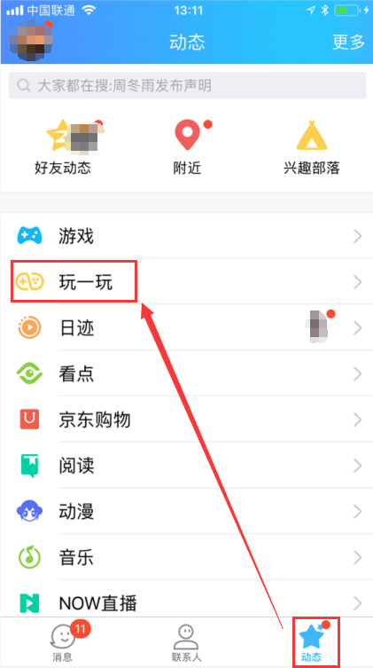
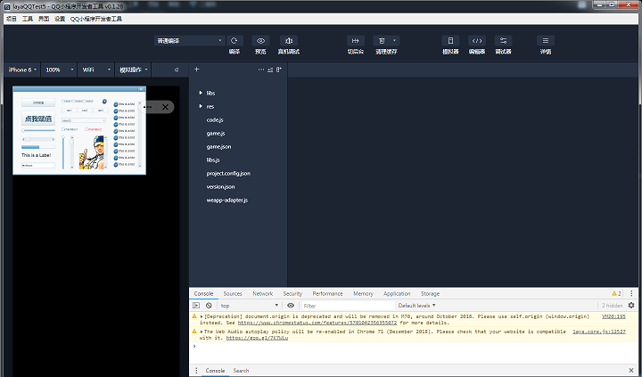

# QQ玩一玩基础介绍与游戏发布

微信小游戏火爆了“全世界”，但是了解QQ玩一玩的并不多。本篇将进行一些基础的介绍。

### 1、重社交传播的玩法特性

QQ玩一玩的前身是手机QQ的厘米游戏平台，游戏运行采用的是自研的Runtime底层引擎Bricks，从当前的游戏定位来看，有着明显的重社交传播的玩法特性。

有着拥有8亿生态流量的手机QQ支撑。QQ玩一玩依赖于手机QQ的强社交关系，基本上50个种子用户就可以做到5万的DAU。据已上线厘米游戏的研发商处了解到。上线后仅凭借种子用户的社交关系，快速累积到数千万的用户和数百万的日活。

### 2、两大重量级入口 

1.11日手机QQ上开启【QQ玩一玩】的灰度入口，也就是说只有幸运的玩家才可以看到。什么时候入口打开，所有QQ用户都可以看到呢。据内部消息是大概三四月份。我们先通过能看到灰度入口的幸运玩家，了解一下入口的基本情况。

在入口方面，**玩一玩**的入口与APP**游戏**中心入口同级，这个入口的级别在手机QQ里也是足够给力了。

 

另外，就是好友会话时的 **+** 号入口进入。这可是社交传播的重要入口。

 

### 3、玩一玩支持HTML5游戏吗

玩一玩游戏平台是采用手机QQ自研的Runtime引擎Bricks来运行。通过提供引擎级API，在上层供JavaScript接口调用。虽然通过JS可以直接使用，但是由于这些接口目前并不兼容HTML5，所以无法在浏览器中运行。并且当前只能在MAC系统下进行调试。

由于对H5游戏开发者有一些不太好友的地方。Layabox早在2017年8月份率先完成了对Bricks引擎的全面支持，其后也一直在与Bricks引擎团队积极沟通，共同推进Bricks引擎的完善与优化。所以，LayaAir引擎的开发者，可以放心的使用LayaAir引擎与IDE工具开发玩一玩游戏，在HTML5的浏览器环境下进行日常的开发调试，产品完成后，通过替换为Bricks引擎适配库的方式，即可在Bricks引擎环境下调试最终版本。

目前已经上线玩一玩的全民大乐斗和一些即将上线的腾讯自研与代理产品，都是采用LayaAir引擎直接开发，最终通过替换Bricks引擎适配库的方式，完成的整个研发工作流，实现全平台上线的目标。

### 4、开发玩一玩游戏，需要做哪些准备工作

- **引擎与开发工具**

先准备LayaAir引擎和IDE，可视化的UI开发，这是必备。当前玩一玩的Bricks引擎只提供到引擎接口级，开发工具目前还没推出。

- **认证开发者**

准备好一个公司公用的开发者QQ，这是管理游戏的唯一凭证。然后登录玩一玩游戏开发平台（[http://hudong.qq.com/](http://hudong.qq.com/)），认证成为开发者。不过要开放认证流程大概要等到春节前后。在此之前，只能走商务关系，申请成为开发者，开通服务号，拿到AppID。

### 5、采用LayaAir引擎开发玩一玩游戏，到底有没有差异。

玩一玩游戏当前的版本，LayaAir引擎全面支持，比如引擎的核心包、动画包（包括spine与DragonBones骨骼动画、图集动画、时间轴动画等），UI包，甚至是Bricks引擎的帧同步方案，LayaAir引擎都给予支持。

在游戏资源包这块，玩一玩游戏也是采用的和微信小游戏类似的本地包+网络动态加载的方案。不过相较于微信小游戏只能是4M的本地包，玩一玩游戏最大允许10M，也就是说，现在所有HTML5的前期加载内容都可以直接放到本地包内，因为现有的HTML5游戏首屏加载内容基本没有超过10M的，这对于HTML5游戏快速移植为玩一玩游戏也是个好消息。

### 6、开发、发布工作流程注意事项

- #### 开发流程

在开发流程中，开发与日常调试，直接使用LayaAir引擎的开发工作流就可以了。

但是，使用AS3开发的小伙伴需要特别注意，在开发玩一玩游戏的时候，由于发布时会将引擎库替换为支持Bricks引擎的适配库，所以，任何自己写的代码必须放在src目录，哪怕是自己额外增加的引用库。也必须放在src目录中，否则IDE的发布工具将在替换适配库的过程中出错。

- #### 发布流程

在项目发布方面，通过IDE内置的玩一玩游戏发布功能，无论是新项目，还是老项目，都可以一键直接发布到Bricks引擎的Xcode工程内，自动适配为玩一玩游戏。

 

> 由于Bricks引擎调试环境只支持MAC系统，如果是windows环境，IDE只能发布到空目录中，手工copy发布目录中的全部文件到MAC系统下的Bricks引擎的Xcode工程内。

- #### 调试前的Xcode工程内修改

将项目文件与引擎适配库发布到Bricks引擎的Xcode工程内，并不能直接调试。因为要先在main.js入口中增加适配库文件与项目入口文件的引用。

适配库JS有两个，一个是layaforqq.js，这是支持Bricks引擎版本的必用适配库。另一个是domparserinone.js，如果用到了位图字体就引入，否则可以不引用。

TS与JS版本除了引擎适配库之外，通常还会有一个IDE导出的UI代码JS，和一个项目JS。如下图所示：

AS3的版本，除了引擎适配库之外，只有一个JS文件，如下图所示：

做完以上的一切，就可以进行Bricks引擎环境下的调试了。具体的调试方法，可以查看Bricks引擎的官方调试文档：

[http://hudong.qq.com/docs/engine/introduce/safari_debug.html](http://hudong.qq.com/docs/engine/introduce/safari_debug.html)