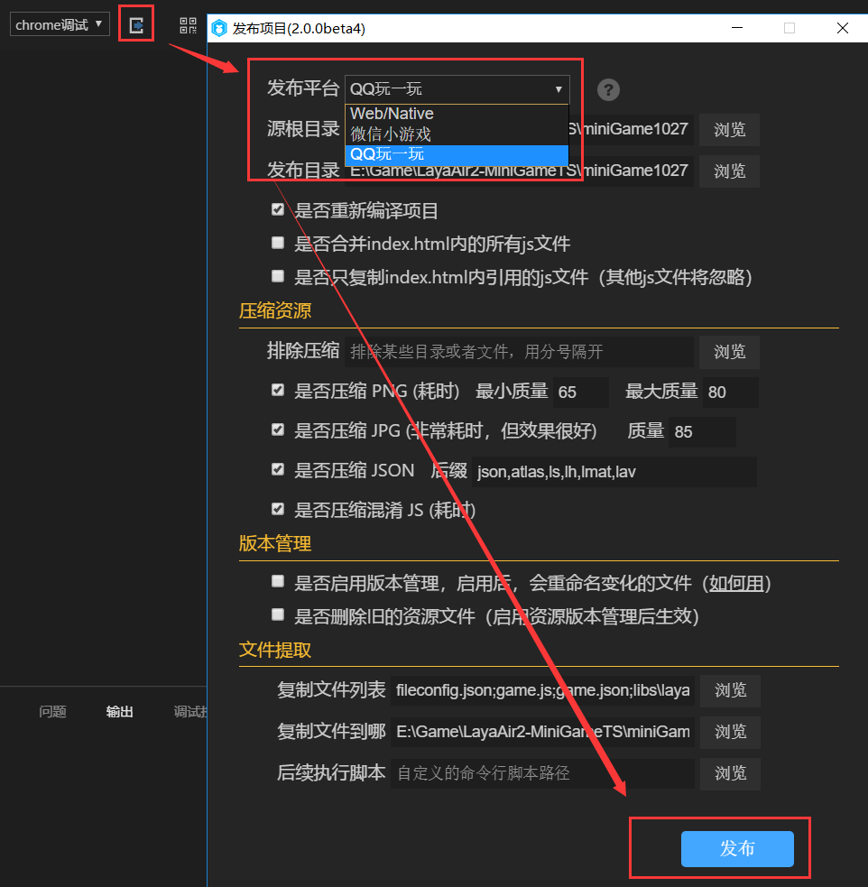

# QQ轻游戏基础介绍与游戏发布

### 什么是QQ轻游戏？

对于QQ轻游戏这个名词，有一些开发者或许觉得有些陌生，其实这并不是手机QQ的新业务，是由2017年推出的“厘米游戏开放平台”及“玩一玩平台”升级而来，并且打通了手机QQ及QQ空间。所以很多已接入或已了解该平台的开发者，也会称之为玩一玩游戏。

### QQ轻游戏的主要入口

目前，QQ轻游戏的入口仅在安卓版本的手机QQ（简称手Q），平台用户已突破2.5亿。平台接入超过700款游戏，覆盖50个以上游戏类型。同时还覆盖到多个手Q流量场景，其中包括分享消息、聊天窗口、快捷发起、厘米秀、QQ空间小游戏、游戏中心、QQ钱包等。

 

厘米秀与聊天窗口内的厘米游戏入口，需要开通厘米秀功能后才能看到。分享消息是一种裂变传播入口，这些是最初厘米游戏时代开始就一直存在的主要交互入口。游戏中心、QQ空间小游戏、QQ钱包中的入口是比较容易发现的开放入口。快捷发起，类似微信小游戏的顶部快捷导航入口，是玩过的QQ轻游戏列表，不过需要开发者在后台中进行设置。

### QQ轻游戏支持HTML5游戏吗？

QQ轻游戏游戏平台是采用手机QQ自研的Runtime引擎Bricks来运行。通过提供引擎级API，在上层供JavaScript接口调用。虽然通过JS可以直接使用，但是由于这些接口目前并不兼容HTML5，所以无法在浏览器中运行。但是，Layabox早在2017年8月份率先完成了对Bricks引擎的全面支持，其后也一直在与Bricks引擎团队积极沟通，共同推进Bricks引擎的完善与优化。所以，LayaAir引擎的开发者，可以直接使用LayaAirIDE工具开发并发布为QQ轻游戏。

> 目前QQ轻游戏已经有大量的LayaAir引擎线上产品，但技术接入过程中QQ玩一玩的门槛相对于其它平台要稍高一些，如果有问题可以按本文中的联系方式，联系Layabox官方进行商业合作解决。

### 未被充分挖掘的QQ轻游戏机会

QQ轻游戏平台有两种商业变现模式：内购和广告。目前平台的广告流水已经超过了游戏内购的总流水，其中80%的活跃游戏均接入了广告SDK，据某些已接入QQ轻游戏的开发者介绍，在同等级别的DAU下，QQ轻游戏广告收入要明显高于其它游戏平台。这或许与QQ视频广告对游戏并没有限额，以及更优于其它平台的分成政策有关。

另外，相对于微信小游戏的去中心化思路，手Q的轻游戏平台的走的是精品化平台思路，基于多样的手Q入口，游戏用户流量自然会更为集中和稳定一些。同时，QQ轻游戏也是非常鼓励和激励裂变的。例如：轻游戏平台实现了创新的红包广告形式：开发者可以通过B2C广告红包完成用户的吸引和积累。据悉，使用这种B2C红包功能的游戏中，有80%实现了ROI超过100%，有个别游戏的ROI超过300%(比如说红包广告投入1万，游戏收入可以达到3万)。

目前，2.5亿的QQ轻游戏用户仅仅是安卓端，如果未来iOS版本的入口打开，那又会迎来一波爆发增长，所以早上架，早受益，QQ轻游戏仍是一个处于高速增长的渠道机会，等待着开发者的进一步挖掘。

### Layabox助力开发者接入QQ轻游戏平台

目前QQ轻游戏采用的是精品化平台路线，所以游戏提交需要通过商务审核。并且在接入过程中也有较高的门槛。所以，Layabox基于在QQ轻游戏技术和商务上的优势，提出发行合作模式，帮助众多存在技术压力和上架困惑的开发者，快速解决技术与商务问题，畅享QQ轻游戏的流量机会。

 

(扫一扫，添加商务合作微信)

### 6、开发、发布工作流程

- #### 开发流程

在开发流程中，开发与日常调试，直接使用LayaAir引擎的开发工作流就可以了。

- #### 发布流程

在项目发布方面，通过IDE内置的玩一玩游戏发布功能，无论是新项目，还是老项目，都可以一键直接发布到Bricks引擎的Xcode工程内，自动适配为玩一玩游戏。

 

- #### Xcode工程内调试

发布完玩一玩版本后，其它的工作就属于QQ轻游戏的调试与对接流程 了，具体的调试方法，可以查看Bricks引擎的官方调试文档：

[http://hudong.qq.com/docs/engine/debug/intro.html](http://hudong.qq.com/docs/engine/debug/intro.html)

#### 友情提醒：

由于QQ轻游戏的底层还处于完善中，如果开发者在对接的过程中有遇到问题，没有获得即时的解决，欢迎用微信扫码添加Layabox引擎商业合作的负责人。获得VIP商业技术支持服务（一次性付费，或者按发行分成合作）。

 

(商务合作微信)