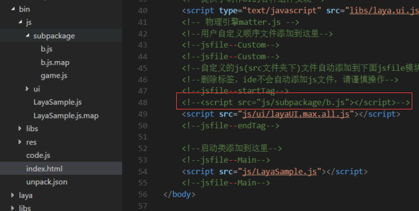

# 微信小游戏分包实战

> author: charley

对于一些大型游戏而言，微信小游戏的4M初始包远远不够用，因为光JS就会超过4M，所以在2.1的小游戏基础库推出之前，只能是不断的砍功能，一直砍到JS小于4M。(如果有新手不了解这是为什么？那先去了解一些基础之后，再来看本文。)小游戏基础库从2.1版本开始支持通过分包的形式，将上传的包体扩大到8M，那如何进行分包呢？

**本篇不仅会介绍分包的方式，还针对微信小游戏在分包过程中遇到常见问题，通过实例DEMO，进行相关的介绍，帮助开发者理解小游戏的分包方式与注意事项。**


### 一、真的需要分包吗？

如果对分包流程或者是window域不太熟悉的开发者，分包会面临一些问题。另外，我们在打算分包之前，一定要分析一下自己的项目是真的有分包需求吗？其实对于当前大多数的产品而言，可以不用分包就可以上线小游戏产品。

#### 1、是否使用过UI加载或者分离模式？

LayaAir引擎的开发者，UI大多都是通过LayaAirIDE制作。

在F9的UI模式选项，以及项目管理器，右击每一个UI页面设置默认属性时的导出类型选项，都可以看到内嵌模式、加载模式、分离模式，三个选项。

 

**默认是内嵌模式**，这种模式下，导出UI的页面时，会将配置信息等内容导出为项目的代码文件。最终发布成小游戏的时候就是js文件。从而占用了一些宝贵的小游戏本地包体积。所以**，减少小游戏的包体大小，可以将导出UI的模式改变为加载模式或者分离模式。**这两种模式都会将页面配置信息等导出为json文件，json文件可以通过URL远程动态加载使用，而不会占用本地包空间。

> **Tips:**
>
> 1、加载模式与分离模式的区别是，加载模式是将所有的UI页面导出为一个json文件，分离模式是每一个UI页面导出为一个独立的json。
>
> 2、需要注意的是，加载模式与分离模式因为导出的是json，需要写代码加载后才可以使用。内嵌模式不需要。

总之，加载模式与分离模式可以减少包体JS的大小。如果能通过这种方式解决的，也许不必用分包来解决。具体情况视项目而定。

#### **2、删除不必要的JS代码**

在没有分包的情况下，在HTML页里引用的JS都会合并到一个js文件里（code.js），除非是在项目中对js另有引用。否则，不在HTML页内的其它js可以直接删除掉，比如一些没有用到的引擎库js。可以在项目目录下就直接删除，这样发布的时候也不会再出现了。

#### 3、压缩与混淆

通过压缩混淆后的js代码，包体会明显减少很多。如果JS没超4M，可以不用分。资源等内容，完全可以走URL动态加载使用，在首次加载后，会存在物理缓存内，不超过50M的常用缓存内容，下次打开无需加载。


### 二、学习小游戏官方分包文档

在实战分包之前，官方的文档没看过的，一定要先仔细看一看。这非常有用，无论能理解到多少，先尽量看懂文档要点，才能更好的理解分包。链接如下，请先看过后再进行后面的步骤。

[https://developers.weixin.qq.com/minigame/dev/tutorial/base/subpackages.html](https://developers.weixin.qq.com/minigame/dev/tutorial/base/subpackages.html)


### 三、微信小游戏官方的分包方式

虽然很多开发者已经看过官方的分包文档，这里还是捡重点的再过一下。

#### 1、在game.json中配置分包名与分包路径的字段

```json
{
  ...
  "subpackages": [
    {
      "name": "stage1",
      "root": "stage1/" // 可以指定一个目录，目录根目录下的 game.js 会作为入口文件，目录下所有资源将会统一打包
    }, {
      "name": "stage2",
      "root": "stage2.js" // 也可以指定一个 JS 文件
    }
  ]
  ...
}
```

subpackages里，可以有多个name与root，每一组代表一个分包，单个分包，不能超过4M，全部游戏的初始包体不超过8M即可。

大家先看一下分包配置的结构与注释说明，初步理解一下。如果仍然不理解的，可以结合后面实战的配置再进行理解。

#### 2、小游戏官方的分包加载示例代码

小游戏官方提供了 [wx.loadSubpackage()](https://developers.weixin.qq.com/minigame/dev/document/subpackages/wx.loadSubpackage.html) API 来触发分包的下载，调用 wx.loadSubpackage 后，将触发分包的下载与加载，在加载完成后，通过 wx.loadSubpackage 的 success 回调来通知加载完成。示例代码如下：

```javascript
const loadTask = wx.loadSubpackage({
  name: 'stage1', // name 可以填 name 或者 root
  success: function(res) {
    // 分包加载成功后通过 success 回调
  },
  fail: function(res) {
    // 分包加载失败通过 fail 回调
  }
})
```

加载成功的同时，wx.loadSubpackage 会返回一个 [LoadSubpackageTask](https://developers.weixin.qq.com/minigame/dev/document/subpackages/LoadSubpackageTask.html)，可以通过 LoadSubpackageTask 获取当前下载进度。示例代码如下：

```javascript
loadTask.onProgressUpdate(res => {
  console.log('下载进度', res.progress)
  console.log('已经下载的数据长度', res.totalBytesWritten)
  console.log('预期需要下载的数据总长度', res.totalBytesExpectedToWrite)
})
```

本篇文档主要是讲分包方法与开发者经常遇到的window域导致的分包问题。下载进度较为容易理解，且未碰到开发者反馈相关问题，所以未在实战代码中提及，如果有遇到这块问题的，可以在社区中提出。


### 四、下载示例项目

我为大家准备了两个比较简单的示例项目，下载解压后，defaultDemo目录下为分包之前的示例项目，subPackageDemo目录下为分包后的示例项目。开发者可以在阅读本文档的同时，用分包前和分包后项目对比差异，帮助理解小游戏分包。

下载地址为：[https://github.com/layabox/layaair-doc/raw/master/project/TS/TS_subPackage_Demo.zip](https://github.com/layabox/layaair-doc/raw/master/project/TS/TS_subPackage_Demo.zip)


### 五、实战分包要点

#### 1、微信开发者工具与发布项目注意

实战分包的第一步，务必是在微信开发者工具中创建好小游戏项目。因为一旦分包后，采用的是小游戏的加载模式，浏览器里就跑不通了，整个调试流程全在微信开发者工具里完成。所以，下载好为大家准备的示例项目，先打开defaultDemo目录下的示例，发布出一个小游戏版本。把基础调试流程跑通。

> Tips: 这里需要注意的是，下载的项目，因为曾经发布过，默认记录的是曾经发布过的目录，所以发布的时候一定要改成本地实际目录。

#### 2、基础库版本

一定要检查一下微信开发者工具的调试基础库是什么版本的，否则跟着本文操作，使用的是不支持分包的版本，调试就会出问题。

开发者工具使用 1.02.1806120 及以上版本。

基础库使用2.1.0 及以上版本。

本篇文档使用的是2.2.0。如图1所示：

 

（图2）

#### 3、分包目录的相关操作

##### 修改game.json

在分包之前，我们需要做好分包目录的规划，并在game.json中进行体现。

在这里，我们就简单的设置一个分包目录b。大家可以先将defaultDemo下的示例项目内的game.json改为以下代码：

```json
{
  "deviceOrientation": "landscape",
  "showStatusBar": false,
  "networkTimeout": {
    "request": 10000,
    "connectSocket": 10000,
    "uploadFile": 10000,
    "downloadFile": 10000
  },
  "subpackages": [
    {
      "name": "subpackage",
      "root": "js/subpackage/"
    }
  ]
}
```

规划和设置完小游戏的分包目录后。我们去创建分包目录与文件。

##### 注意root路径

TS项目`src`目录下的项目代码在编译和发布的时候，如果在`bin/index.html`里有引用。会与引擎库一起统一合并到code.js里。不在`bin/index.html`里引用则直接复制到`js`目录下。所以`root`的路径不要漏掉js。如图3所示。

 

(图3)

##### 一个重要的编译"坑"

分包的时候TS项目还存在一个IDE编译导致的坑，那就是TS项目每次编译会生成新的js到bin目录下。然而每次生成之后，也会自动把生成的js引用也更新到index.html里。然而，刚刚提到index.html里引用到的都会合并到code.js里，恰恰分包的代码，我们是不希望合到code.js里。所以每次编译后，发布小游戏之前。一定要打开index.html里看一下，分包的js是否被引用了。如果被引用了，一定要注释掉。如图4所示。

 

（图4）

> Tips: 以后的版本，如有时间会考虑IDE来解决，解决前请大家一定要注意。并在发布的时候避免因引用导致分包失败。

如果对这种每次发布检查的体验不太爽。建议开发者，对于分包的内容，新建一个项目。相当于主包一个项目，每一个分包一个项目。在主包内加载好其它分包，使用window域来交互。

> 关于加载与window域可以继续查看本文的相关介绍。


##### 创建game.js

尽管root中可以指定具体js文件为入口，但是考虑到分包内可能会有多个js，所以本文档示例中还是采用了目录的默认入口game.js。

game.js我们直接到bin目录下，编译后的分包目录里创建就好了。game.js里引入分包js路径，如下所示。

```javascript
require('b.js');
```


#### 4、开始分包编码

上一步创建完分包目录与分包文件，那么可以开始进行分包编码了。

首先在原则上，既然要做分包，那么**主包与分包的逻辑关联性要尽可能越少越好**。

当然，有的开发者也不可避免的会需要一些主包与分包相互调用的关联需求。所以我给大家准备的简单示例里，就是将原本在一个主包里的逻辑，拆出一部分放到分包里。

打开defaultDemo目录下示例项目，我们只保留通用的UI显示方法showUI，图集加载后的回调onLoaded里，我们保留初次显示UI的逻辑。将按钮监听，以及页面切换等逻辑放到b.ts里。

分出的b.ts代码如下所示：

```javascript
/**
* 分包 
*/
module subpackage{

	export class b{
        private GameMain:any;
        private ui:any;
		constructor(){
             //监听按钮btnA的点击事件，触发后处理
            this.GameMain.newUI.btnA.on(Laya.Event.CLICK, this, this.showB);
		}

            //显示B页
        private showB():void
        {
            this.GameMain.showUI(this.ui.bUI,this.GameMain.newUI)

            //监听按钮btnB的点击事件，触发后处理
            this.GameMain.newUI.btnB.on(Laya.Event.CLICK, this, this.showA);
        }

        //显示A页
        private showA():void
        {
           this.GameMain.showUI(this.ui.aUI,this.GameMain.newUI)
        
            //监听按钮btnA的点击事件，触发后处理
            this.GameMain.newUI.btnA.on(Laya.Event.CLICK, this, this.showB);
        }
	}

}
//实例化
new subpackage.b();
```

代码分出后，我们不要忘了在主包内调用微信小游戏官方提供的分包加载与回调通知方法。在示例项目中，我们直接在图集加载的回调里，加载分包。然后在加载成功后输出`success`的log。示例代码如下：

```javascript
//图集加载后回调
private onLoaded():void
{
    this.showUI(ui.aUI);
    
	//小游戏官方的分包加载方式
    const loadTask = wx.loadSubpackage({
        name: 'subpackage', // name 可以填 name 或者 root
        success: function(res) {
            // 分包加载成功后通过 success 回调
            console.log("success");
        },
        fail: function(res) {
            // 分包加载失败通过 fail 回调
            console.log("fail");
        }
    });       
}
```

这个时候，按小游戏官方的文档，理论上，分包的流程应该已经结束，我们可以发布小游戏代码，在微信开发者工具中看一看效果。

不用意外，肯定会有报错，我们可以继续看文档。

#### 5、window域

在浏览器里，默认就都在window域里。而小游戏并不是，所以小游戏多个js之间的调用就会出问题，所以为解决这个问题，IDE发布的时候，会将所有项目js与引擎一起整合到code.js里，如今分包的方案，又将会面临window域这个问题。所以，主包与分包有调用需求时，那必须要先将被调用的函数或者变量要先放到window域里。然后在使用的时候前面也要带上window这个关键字。下面我们就用示例项目进行实战体验。

首先我们在主包中，把分包中用到的ui类以及主包的类都放到window域里，这样，分包可以在需要使用的时候，直接从window里取出即可，如下所示。

```javascript
//把需要被分包中使用的放到window域里
window["ui"] = ui;
window["GameMain"] = new GameMain();
```

在分包b.ts中我们要取出window中ui与GameMain类。可添加下面代码：

```javascript
//从window域里取出
this.ui = window["ui"];
this.GameMain = window["GameMain"];
```

> 具体的实战中，开发者可以对比分包前与分包后的两个示例项目。   

同理，如果主包中使用到分包的类，也要先放到window域中，然后使用window关键字取出。具体的使用就是这么简单。通过对window域的了解。分包遇到的window相关问题就可以得到解决。

### 六、开发者实战建议

开发者可以先把我给的示例项目，进行分包尝试，如果遇到问题，可以看看本篇文档，以及对比我给的两个示例项目的区别。先在微信小游戏里跑通。真正的理解分包之后，再进行自由的实战小游戏分包。如果遇到问题请把问题发到社区，并在问题中上传示例DEMO项目，群里可以@ 管理员 charley 并提供链接。

后续如果有发现开发者在分包有面临新的问题，我会再完善更新本篇文档。


## 本文赞赏

如果您觉得本文对您有帮助，欢迎扫码赞赏作者，您的激励是我们写出更多优质文档的动力。

