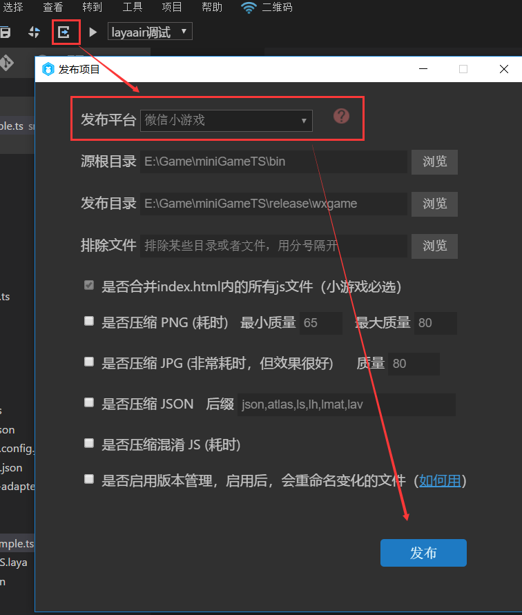
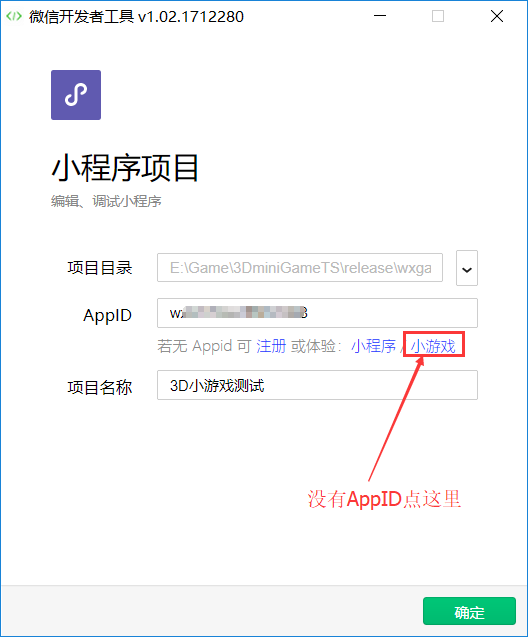
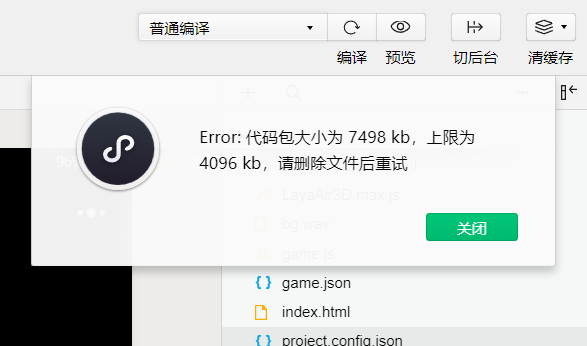
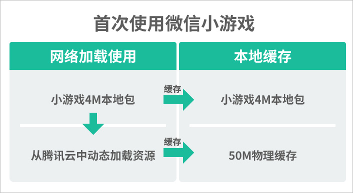
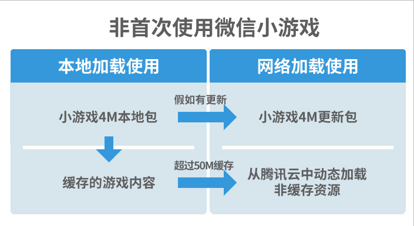
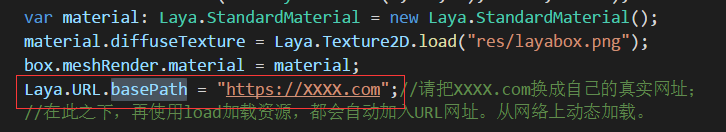

# 用3D项目演示老项目如何适配微信小游戏

基于有部分开发者在3D小游戏方面也有开发需求，以及老项目适配需求，本篇将为大家介绍3D示例项目创建、老项目的适配详解等，完整的小游戏开发流程。

#### 必读提示：

> 1、在LayaAir IDE的1.7.15beta版本开始，将支持创建微信小游戏3D示例项目。
>
> 2、阅读本文前，请先阅读《创建微信小游戏》，更多配置环境的基础内容本篇不再重复介绍。
>
> 3、本篇中的小游戏适配流程，也适用于老版本IDE创建和开发的项目。


### 第一步：创建一个3D示例项目（已有3D旧项目可跳过本步骤）

先打开LayaAirIDE，进入新建项目界面。选择LayaAir 3D示例项目。

> Tips:本步骤是为了演示旧项目适配流程，故意创建一个普通的3D示例项目。如果是想创建小游戏3D示例项目，可以选择**微信小游戏3D示例**。

 

输入项目名称，路径，选择好语言类型与引擎版本。

点击创建，即完成了一个3D项目的创建。


### 第二步：适配微信小游戏

#### 1、小游戏适配的前提准备

- 引擎IDE要使用当前最新的1.7.15beta版，因为从这个版本开始，才支持老项目一键发布。
- 如果是小于1.7.14beta版的引擎，需要更新到至少是1.7.14beta或最新的版本

#### 2、 引用小游戏适配库

从1.7.15beta开始，创建示例项目时，TS与JS会自动引入小游戏适配库JS`“libs/laya.wxmini.js”`，如下图所示。

 

如果是TS或JS老项目，需要开发者在`bin/index.html`中手动加入这段代码。

```html
<!--提供了微信小游戏的适配-->
<script type="text/javascript" src="libs/laya.wxmini.js"></script>
```

> **Tips**:如果是AS项目，需要开发者在入口类中手动加入这段代码，引入适配库。
>
> ```java
> import laya.wx.mini.MiniAdpter;
> ```

#### 3、初始化小游戏适配库

老项目由于在建立的时候，并没有在项目入口对适配库进行初始化，所以，为了保障成功发布微信小游戏版本，我们必须要在游戏入口内进行适配库的初始化。

然后在初始化引擎前，初始化小游戏适配，代码如下：

```typescript
//初始化小游戏适配库
Laya.MiniAdpter.init();
```

 

> 如果是AS3项目，在初始化引擎前，初始化小游戏适配的代码如下：
>
> ```java
> //微信小游戏适配
> MiniAdpter.init();
> ```

>  

#### 4、编译适配代码

完成适配代码的添加，点击编译或运行调试按钮（F5），没有报错提示的话，可以看到一个三维的立方体。

 

关闭运行调试弹出的窗口，下面我们就按老项目如何适配的流程继续为大家介绍。

> Tips:适配完一定要点编译或调试，否则适配代码不会生效。


### 第三步，创建微信小游戏项目

#### 1、在LayaAirIDE内发布小游戏项目

点击发布按钮，在弹出的发布项目界面里，选择发布`微信小游戏`平台。然后点击发布，即完成了微个小游戏的发布。

 

#### 2、微信开发者工具 内 创建微信小游戏项目

打开微信开发者工具，选择小程序项目，在项目创建的界面里。项目目录设置为3D示例项目的小游戏发布目录（默认为release/wxgame）。

  

AppID这一栏，如果有企业的小程序开发者ID就填写，没有的话,就点击ID输入框下的小游戏。如下图所示。

 

**Tips**：

> 1、如果没看到小游戏的字样，请按之前文档中链接重新下开发者工具，一定是下错了。
>
> 2、如果是不是企业的AppID，不要填写，个人AppID暂时不支持开发微信小游戏项目。

完成项目创建后，会进入小游戏开发界面。默认情况下，模拟器是打开的，如果看到和LayaAirIDE效果一致就没问题了。如下图所示。（除非是项目配置错了，一般是不会有问题的。）

 

> Tips：模拟器的顶部状态条，在真机环境上是没有的，真机上的小游戏是全屏显示。所以不用管，如果觉得影响了性能统计面板，可以在项目代码中，把统计面板的位置向下调一下。


### 第四步，了解日常开发与调试流程

#### 1、了解微信小游戏的资源加载机制

有很多开发者对微信小游戏的资源加载机制并不了解。在发现超过4M就不能真机测试的时候，感到困惑，超过4M的游戏怎么处理呢？

 

下面就先为开发者介绍一下微信小游戏的资源加载机制。

##### 首次加载 

#####  

在用户首次打开微信小游戏的时候，微信会自动把开发者上传的4M本地包下载到本地，并缓存起来。然后其它的游戏资源只能由开发者从腾讯云上去动态加载。

这时候，需要注意的是，微信小游戏给每一个游戏提供了50M的物理缓存空间，如果是小于50M的游戏，那直接把游戏全部缓存下来。第二次进入游戏，那就和打开原生APP没区别了。

##### 非首次加载

 

非首次加载的话，微信小游戏会先检测4M包有没有更新，如果没有更新，就直接打开游戏。

对于缓存里已有的内容，那和原生游戏一样直接就打开了。如果超过50M，肯定是需要开发者手工管理缓存。把一些常用的放到缓存里。不常用的替换下来，或者直接就从网络中动态加载。玩家的体验也和原生游戏差别不大。

> Tips：微信小游戏只支持从腾讯云里动态加载资源。

#### 2、本地加载目录设置与适配

由于微信小游戏有4M包的限制，微信开发者工具创建的目录下，大于4M的，在模拟器内调试是没问题的，但是真机调试，是拒绝上传的。所以我们开发者在适配老项目的时候，必须要区分好本地资源目录与网络动态加载的目录。在本地目录内，只放一些预加载必用的JS和图片资源。

需要提醒注意的是微信小游戏不允许动态加载创建JS，所以，JS必须要放在4M包里，也就是说JS加上基础配置文件必须要小于4M，项目适配时如果超过4M，要进行优化控制。

**超过4M怎么加载呢？**

在之前介绍过，微信小游戏支持从腾讯云中动态加载资源，所以，我们要在4M的本地文件加载之后，使用LayaAir引擎提供的`URL.basePath`方法为代码中的本地路径前加入URL路径，从而去加载网络上的动态资源。

添加的代码如下：

```typescript
Laya.URL.basePath = "https://XXXX.com";//请把XXXX.com换成自己的真实网址；
//在此之下，再使用load加载资源，都会自动加入URL网址。从网络上动态加载。
```

使用LayaAir引擎的loa加载资源时，去使用网络地址动态加载，

 

如果是内网地址开发，那怎么动态网络加载呢，在微信小项目的项目设置里，勾选不校验安全域名这个选项，否则，必须为HTTPS的安全域名。当然，正式上线还是必须要用HTTPS的。

在设置不校验之后，然后确保内网地址可正常访问，再把资源复制到对应的加载目录，供小游戏网络动态加载。

 

**这样就结束了吗？并没有！**

按刚刚的写法，`res/layabox.png`明明已经上传到微信小游戏的本地目录，但是如果在使用`URL.basePath`之后，再次加载`res/layabox.png`并不会从本地加载使用，而是从网络动态加载使用。这并不是我们要的结果。

所以，引擎针对使用`URL.basePath`之后，如何再次使用本地加载，进行了**特殊目录的处理**。

**只要是包含了wxlocal之个目录名，引擎会自动将该目录视为本地目录**，即便使用了URL.basePath，对于包含了wxlocal目录名的目录，都不会从网络动态加载，只会从本地加载，所以wxlocal必须要放到微信小游戏项目内，作为4M上传的一部分。

目前的LayaAirIDE还没有自动生成wxlocal目录，经过与引擎同事沟通后，下个版本在小游戏示例项目中会自动创建wxlocal目录，小游戏项目里除了根目录那些必用的入口文件和项目配置文件与适配文件外，其它的预加载资源建议都放到wxlocal目录内。这样，下个版本里，再发布微信小游戏时，就只复制带有本地特殊目录关键字的目录（wxlocal）。避免全部复制小游戏项目内，导致无法直接预览，还要把多余的删掉，从网络加载。

当然，对于老项目适配，还是需要开发者自己手动建立一个`wxlocal`目录，用于存储除了根目录的入口JS与配置文件之外的小游戏4M预加载内容。

#### 3、实时调试的建议

在和开发者沟通中，也遇到不少的开发者存在这样的需求：就是先不使用真机调试，每次项目编译完之后，直接在开发者工具中调试，如何处理？

由于4M本地包的限制，所以我们真机调试的正式发布项目，一定要严格遵循这个规范。

假如每次编译后只是想开发工具下调试，而不是真机调试。那每次编译都调用**项目发布**功能其实没有必要，而且项目发布的速度并不快。

这种情况下，开发者可以在微信开发者工具内再创建一个仅用于调试的临时项目。这个项目创建的时候，可以将开发者工具的项目目录设置为IDE编译后的目录bin（AS3是bin/h5）,如下图所示。
 

下面，我们在示例项目中增加一段代码，让示例中的三维立方体转起来 。体验一下实时调试的流程。

修改示例项目的入口程序LayaAir3D.as。

在最后一段的代码后增加

```javascript
//旋转方向与角度设置
var vect:Laya.Vector3 = new Laya.Vector3(1,1,0);
//每10毫秒旋转一次
Laya.timer.loop(10,null,function(){
  box.transform.rotate(vect,true,false);
});
```

然后，在LayaAirIDE中点编译（这一步不可跳过），

再打开微信开发者工具，我们可以看到转起来的立方体，如下图所示：

 

在这种情况下，我们点预览按钮，通过微信扫码，可以直接在微信中进行真机体验和测试。

具体的调试方法和chrome浏览器中一样，就不细讲了。

欢迎开发者前往开发者社区提出疑问。引擎团队会根据开发者的反馈，不断给予IDE与引擎的优化！

社区网址：https://ask.layabox.com/