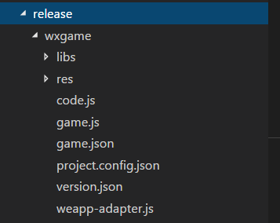

# 微信小游戏开发进阶

### 一、LayaAirIDE中的小游戏目录结构介绍

 

#### 1、资源目录规划

res目录内是资源目录，LayaAirIDE里的res目录下是游戏项目中用到的资源。

这里重点提一下，微信小游戏允许每个游戏有4M本地物理容量，用于游戏前期加载，超过4M的小游戏项目是拒绝上传的。所以，一旦你的整个项目（资源和JS的总和）超过4M，非本地4M包的内容，就要从外网加载资源。

截图上的目录结构是IDE生成和创建的，少了一个layaNativeDir（后续版本应该会补上）。这里要重点说明一下，LayaAir引擎在底层对4M本地包目录进行了处理，当使用引擎的加载方法Laya.loader.load()加载资源时，layaNativeDir目录下的内容会直接从本地使用，其它目录下才会从网络动态加载。所以，我们需要手动创建一个layaNativeDir目录，用于存放小游戏4M包内的资源。

需要提醒开发者的是，开发测试时，如果要使用外网动态资源，需要勾选不校验安全域名（如下图所示）。

 

因为4M的限制。所以，游戏项目内，开发者需要规划好哪些是需要前期加载上传的内容，哪些是需要从外网加载的内容。建议把内容较大并且更新频率高的，都放到外网动态加载，要上传的项目包内，仅包括初始化加载必须的，和很少要改动的内容即可。尤其是大型游戏项目，可能JS加起来就2M多，那么仅剩的空间，只能用于Loading页的背景图资源。

> Tips：4M的本地包内容无法动态更新或删除。每次修改必须要重新上传发布。

#### 2、小游戏应用程序主文件

示例中的LayaUISample.max.js是LayaAirIDE创建的项目文件，也是小游戏应用程序的主文件，TS或JS项目如果开发时有多个项目文件的，需要合并成为一个JS文件作为小游戏应用程序的主文件。

#### 3、小游戏项目文件

game.js、game.json、project.config.json、weapp-adapter.js 都是微信小游戏的项目文件，只有创建小游戏项目的时候LayaAirIDE才会创建。

### 二、一些踩过的“坑”

#### 1、管理项目，只能创建、切换和删除。

在微信开发者工具里，项目一旦建立，没有编辑修改项目信息的地方。如果想修改项目信息，不用费力气去找这个功能了，直接删除项目重新创建即可。因为工具里的删除只会删除项目信息相关的内容，项目本身不会被删除。

在**项目**菜单里点击**查看所有项目**可以查看到当前存在的项目列表，直接点击项目，可以实现切换，点击加号创建按钮可以创建一个新项目。

如果想删除项目，点击管理项目可进入项目批量删除的界面。

 

**2、读本地文件必须是ASCII编码**

之前提到每个游戏有4M本地物理存储空间，这里需要特别注意的，如果需要读取本地物理空间内的配置文件，比如json文件。由于浏览器加载文件编码没有限制，引擎没有预留编码设置接口。而小游戏里读本地资源会校验编码，所以，当小游戏本地文件的编码格式不是ASCII，那就会报错。如果有配置文件存在4M的本地包内。目前必须要改为ASCII编码，后续引擎版本计划支持编码读取设置。

> Tips：本地程序文件之间的引用（比如require或import）或者才是从网络中动态加载读取，都没有编码的校验限制。

**3、不支持loader预加载声音使用**

用LayaAir引擎开发小游戏时，要注意，不支持通过loader预加载声音文件的使用方式，声音播放直接用SoundManger音频管理类即可。