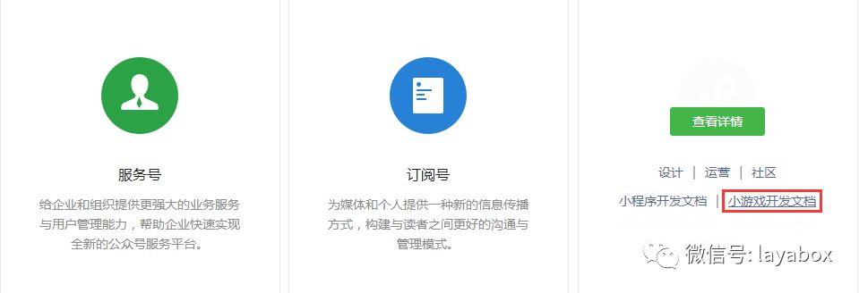
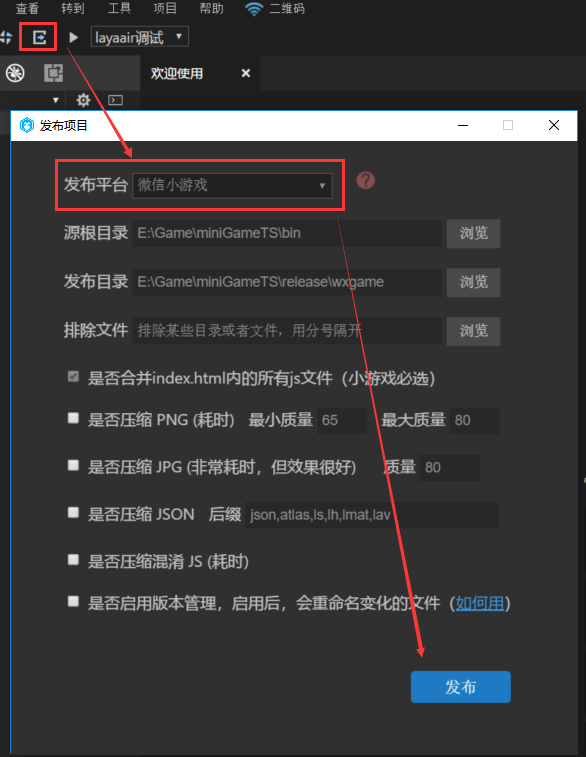
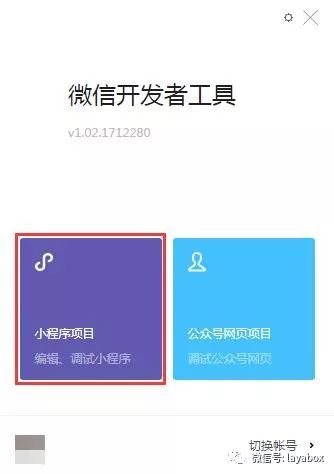
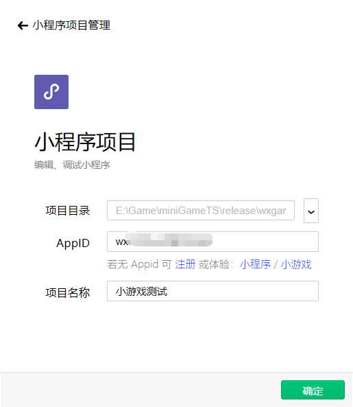

# 创建一个微信小游戏

### 一、准备好开发环境

#### 1、下载并安装LayaAirIDE集成开发环境

LayaAirIDE是LayaAir引擎的集成开发环境，集成了LayaAir引擎与示例项目，UI、动画等可视化编辑，项目代码编写与管理等开发工具。**开发者可以直接采用LayaAirIDE创建微信小游戏的示例项目。**

**官网下载地址** ：[http://ldc.layabox.com/layadownload/?type=layaairide](http://ldc.layabox.com/layadownload/?type=layaairide)

> Tips：LayaAirIDE 1.7.14版本才开始集成微信小游戏开发

#### 2、下载并安装微信小游戏开发工具

微信小游戏开发工具是小游戏开发与测试的环境，由于LayaAir引擎的开发者完全可以使用LayaAirIDE进行项目开发，那么安装这个小游戏开发工具主要是用于小游戏项目编译、预览、真机测试与调试、上传发布等。

在小游戏开发文档的首页里，通过导航链接前往开发者工具下载页面 ，去下载开发工具。

 

**开发工具下载地址**：
https://mp.weixin.qq.com/debug/wxagame/dev/devtools/download.html

#### 3、创建一个小程序的企业开发者帐号，获得开发者ID(AppID)

尽管没有AppID也可以开发调试，但是功能会受到限制。所以在开发之前，最好先去创建一个小程序的企业开发者帐号。

注册地址：https://mp.weixin.qq.com/cgi-bin/registermidpage?action=index&lang=zh_CN

 

> Tips:微信小游戏暂时还不支持个人注册（未来会开放给个人注册），如果是个人开发者只能创建小程序项目，无法创建小游戏项目。所以，个人开发者如果想体验，先不要输入AppID，直接点击输入框下的 **小游戏** 字样进行体验。

### 

### 二、用LayaAirIDE创建和发布微信小游戏项目

#### 1、用LayaAirIDE创建小游戏示例项目

打开LayaAirIDE，新建项目。选择”微信小游戏示例“，设置项目名称、项目路径、开发语言类型、引擎版本。就可以创建小游戏项目了，如下图所示。

> Tips：本示例暂以ActionScript3开发语言为例，后面会讲一下TS和JS项目与AS3项目的区别。

#### 2、查看示例项目效果

创建完项目之后，我们可以直接点一下调试按钮（如下图所示）。就可以看到我们的示例什么样子。

> Tips：这一步除了编译js，主要为了让大家记住我们的示例什么样子，后面，如果小游戏效果也是这样的就没错了。

#### 3、发布为微信小游戏

点击项目发布按钮，在弹出的发布项目界面里，选择发布平台为微信小游戏。然后如果目录不想改变，直接点发布即可。

 

**Tips** ：

> 点击发布平台右侧的问号图标，可以查看各选项的介绍说明。

### 三、用微信开发者工具创建小游戏项目

#### 1、开发者帐号登录，选择项目类型

打开”微信web开发者工具“，用开发者的微信扫码登录。然后选择**小程序项目**点击进入项目设置。

 

#### 2、设置小程序项目

在小程序项目设置面板里，`项目目录`可以选择LayaAirIDE刚刚发布小游戏的目录。

 

AppID在小程序开发者帐号里获得（如下图所示）。如果没有，可以点击AppID输入框下的小游戏进行体验，但是功能会受到限制。

 

**需要特别注意**的是小游戏暂时不支持个人注册，如果是个人开发者，那输入AppID后只能进入小程序的开发，进不了小游戏的开发。所以个人开发者如果要体验，不要输入AppID，点击输入框下的小游戏进行体验。如果你看不到小游戏几个字，那你下的版本一定是错的，不支持小游戏。要重新按本篇文档中提供的地址重新下载。

#### 3、微信开发者工具的编译

完成小游戏项目的创建后，点击编译，即可在工具内预览效果和调试，我们可以看到模式器中的效果与LayaAirIDE中的调试效果是一致的。

 

#### 4、真机测试与调试

由于LayaAirIDE里也可以调试项目效果，基本上两边的效果不会有不一一致的情况。所以这里最重要的是点击**预览**功能，通过手机微信扫码，在微信内进行真机测试与调试。

 

用微信扫码后，就启动了小程序项目，点击右上角的浮窗按钮，可以打开调试和打开性能监控面板。

开启真机调试与性能监控面板后，如下图所示。

 

至此，一个完整的小游戏开发流程就结束了。是不是很简单。采用LayaAirIDE开发的小游戏项目，基本上是无缝用于微信小游戏项目。