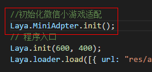
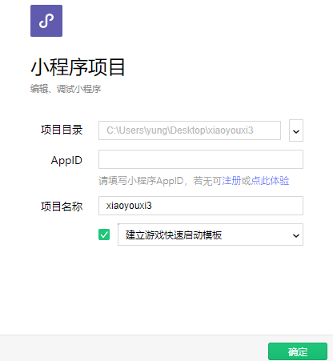
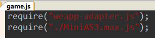
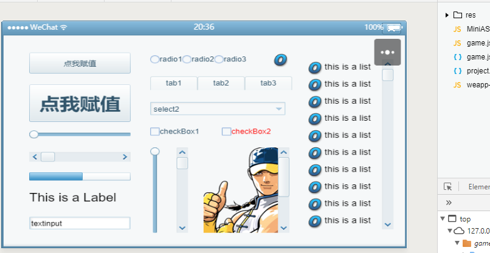
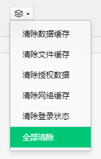

# LayaAir微信小游戏适配教程

​	微信小游戏来了，LayaAir引擎已经做好了底层适配，**之前使用LayaAir开发的项目，只需初始化一下适配程序，无需更改其他项目代码，无缝适配微信小游戏**，快速开启小游戏之路。

​	需要注意的是，**微信小游戏运行环境并不是浏览器**，而是用C++加V8打造的runtime。接口兼容大部分Canvas和Webgl，但也有不兼容的地方：

​	不支持DOM，Bom API

​	只有一个画布

​	不支持eval

​	网络要使用安全域名

​	代码包不能超过4M

​	支持文件缓存，但不能超过50M

​	不支持XML(LayaAir引擎提供了适配方案)

​	更多细节请参考官方文档（地址：https://mp.weixin.qq.com/debug/wxadoc/dev/api/）

​	LayaAir引擎适配了这些差异细节，开发者无需特别关注，只需正常用LayaAir引擎开发，然后发布为小游戏即可。

## 老项目适配流程：

**AS3项目：**

1. 替换AS3引擎类库（如果是1.7.13及以上版本，只需单独复制 wx类库）（最新类库下载地址：https://ldc.layabox.com/layadownload/?type=layaair-LayaAir）

 

2. 在Laya.init之前，调用MiniAdpter.init()初始化适配程序，搞定！

 

**JS,TS项目：**

1. 下载最新类库，引用laya.wxmini.js下载地址：https://ldc.layabox.com/layadownload/?type=layaair-LayaAir)

2. 在Laya.init之前，调用Laya.MiniAdpter.init()初始化适配程序，搞定！

 

## 新项目开发

使用IDE新建小游戏项目即可

## 测试小游戏

LayaAir开发的应用，可以通过一下方式测试（微信小游戏开发工具可能还未完全开放）： 

1. 下载微信web开发者工具，选择小程序项目

 

2. 新建一个小程序项目

 

 

3. 删除原来的所有文件

4. Copy应用和小游戏配置文件（暂时是Copy，预计微信新版工具会自动生成）

 

文件结构如下：
**res** 是游戏使用到的一些资源，本地资源目录，小程序允许每个游戏有4M的容量包，我们可以把预加载的loading图片放到本地，大部分资源需要从外网加载，然后可以将加载的文件写入到本地存起来，第二次启动时调用
**game.js**是小游戏启动入口文件（微信官方提供的）

 

**game.json**是项目配置文件，可以配置游戏的横竖屏、网络请求参数等（微信提供） 

 

**MiniAS3.max.js**为应用程序，【注意】如果是ts和js项目，最好使用工具把所有js合成一个js，否则可能会出现引用错误

**project.config.json**为项目文件（微信官方提供的）

**weapp-adapter.js**是小游戏库（微信官方提供的） 

 

运行效果如下：

 

**如果有时显示不出来，可以试试清除缓存**

 

 