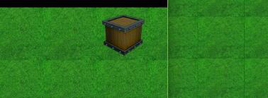

# WebGL stitching pictures generated gap problem

**In the LayaAir engine, if the rendering mode is WebGL, there will be a lot of stitching around border picture. As shown in the following figure**

</br>(Picture 1)

### The reason for the gap:

1）Half-pixel problem in the 3D world; WebGL is the use of graphics hardware accelerated rendering, rendering a texture through the UV and image pixel value of the bit alignment method, and addressing methods in WebGL. (This article is no longer too much to explain half pixel data, check google for further more details)

2）When 2D resources are scaled, this gap will be more apparent due to the accuracy issues.

### Image processing in the engine:

There are two ways to pack the atlas in the LayaAir engine. One is to export the resources directly in the UI edit mode, and the other is to use the atlas packing tool in the toolbar to pack it. But both of the two functions do the same thing. When the thumbnail is merged into the atlas, the protection edge is added, as shown in the following figure:

</br>(Picture 2)

**（The green part represents the most marginal pixel）**

The position of merging into a large picture is 100, 100. When merging into the big picture, the most edge pixels will be automatically expanded, but when they are really drawn, they will take a 100100 position. This can avoid the gap, as shown in the following figure:

</br>(Picture 3)

**（The blue part is the extended edge, and the pixel value of the edge is the edge value of the copy Figure 2.）**

### How does the map of the stitching be modified?

Through the above explanation principle, we should all understand. But many scenes are stitched together by third-party tools, such as using Tiled-Map:

**Tiled-Map does not do such a protective edge, how to deal with it ? **

The easiest way is to reduce the sampling time of a pixel value, such as the scene element with 64*64 grid size, then draw the code as follows:

```typescript
drawImage(image,sx,sy,sw,sh,dx,dy,dw,dh);
```

It was originally written in the following way:

```typescript
drawImage(image,128,256,64,64,100,100,64,64);//这种写法就可能会出现缝隙
```

Now it needs to be changed to:

```typescript
drawImage(image,128+1,256+1,64-1,64-1,100,100,64,64);
```

When the sampling resources to reduce the circle,  but when drawing, 64 too large as it is drawn. Most of this approach can not be seen (most games are handled this way).

But if you want a better effect, you need to make some effort under the art, for example, when drawing a picture element, you have already drawn the protection side edge.


