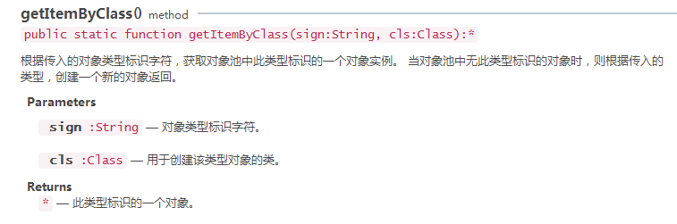

# Memory optimization methods

### 1. Optimizing memory by object pool

Object pooling optimization is one of the most important optimization methods in game development and also one of the most important factors affecting game performance.

There are many objects in the game that are constantly created and removed, such as the role of attack bullets, the creation and removal of special effects, NPC's destruction and refresh, etc., in the process of creating a very consumption performance, especially in the case of a large number .

The object pooling technique is a good solution to the above problem. When the object is removed, the object pool is returned to the object pool, and the object is extracted directly from the object pool when the new object is needed.

The advantage is that it reduces the overhead of instantiating objects and allows objects to be reused, reducing the chances of new memory allocation and garbage collector running.

**note**：When the object is removed, it is not erased from the memory immediately. Only when the memory is insufficient is the garbage collection mechanism emptied. When the object is empty, the memory is consumed, which may cause a stuck phenomenon.**After using the object pool, the garbage object of the program is reduced, and the running speed and stability of the program are effectively improved**。

#### 1.1 The object pool class of the LayaAir engine

The LayaAir engine provides object pooling [laya.utils.Pool](http://layaair.ldc.layabox.com/api/index.html?category=Core&class=laya.utils.Pool). For storage and reuse of objects, more commonly used is`Object pool creation` Method `getItemByClass()` VS `Recycled object pool` with `recover()` method. As shown in Figure 1-1 and Figure 1-2.

  

(Figure 1-1) object pool creation method


  

(Figure 1-2) the method of recovering to the object pool that puts the object back into the object pool.


#### 1.2 Example using object pool optimization

The following code demonstrates the use of the object pool method to create 100 snowflakes every 100 frames. When the snowflake moves beyond the boundary or the scale is less than 0, the stage is removed and the Pool.recover() method is called, so that the specified object is recovered into the object pool.

```javascript
package
{
	import laya.display.Sprite;
	import laya.display.Stage;
	import laya.ui.Image;
	import laya.utils.Pool;
	import laya.webgl.WebGL;
	
	public class PoolTest
	{
		//创建新对象的时间
		private var createTime:int=0;
		
		public function PoolTest()
		{
			//初始化引擎
			Laya.init(1136, 640,WebGL);
			//等比缩放
			Laya.stage.scaleMode = Stage.SCALE_SHOWALL;
			//背景颜色
			Laya.stage.bgColor = "#232628";
			//帧循环
			Laya.timer.frameLoop(1,this,onFrame);
		}
		
		private function onFrame():void
		{
			//如果创建对象时间为100帧间隔后
			if(createTime>=100)
			{
				//每200帧间隔创建30个雪花
				for(var i:int=0;i<100;i++)
				{
                  
                    //img:Image=new Image(); //不使用对象池的写法                  
					//通过对象池创建图片，如对象池中无相应的对象，则根据Image类型执行new Image()创建
					var img:Image=Pool.getItemByClass("img",Image);
                  
					//通过锚点设置轴心点
					img.anchorX=img.anchorY=0.5;
					//图片的资源
					img.skin="res/snow0.png"
					//在舞台上方随机位置创建
					img.x=Math.random()*1136;
					img.y=Math.random()*-150;
					
					//对象池中的图片被缩放了，需重新设置其缩放属性。
                  	//如果对象中还有其他属性被改变了，
					img.scaleX=img.scaleY=1;
					//加载到舞台
					Laya.stage.addChild(img);
					
					//到100帧后创建完对象后时间归0
					createTime=0;
				}
			}else
			{
				//更新创建时间
				createTime++;
			}
			
			//检测每个舞台中的图片对象，并进行位置更新。
            //且判断其是否超出边界或缩放小于0，如果是则移除，并回收到对象池
			for(var j:int=0;j<Laya.stage.numChildren;j++)
			{
				//获取舞台中的图片对象
				var img1:Image=Laya.stage.getChildAt(j) as Image;
				
				//位置更新
				img1.y++;
				//缩放更新
				img1.scaleX-=0.001;
				img1.scaleY-=0.001;
				//图片旋转
				img1.rotation++;
				//超出边界或缩放小于0
				if(img1.y>640+20||img1.scaleX<=0)
				{
					//从舞台中移除
					Laya.stage.removeChild(img1);
                  
                    //img1.destroy(); //不使用对象池的编写方式,直接用destroy清空             
					//回收到对象池
					Pool.recover("img",img1);
				}
			}
		}
	}
}
```

The above description of the code are in the comments, please view in detail.

 

### 2. Use Handler.create

In the development process, Handler is often used to perform asynchronous callbacks. Handler.create uses built-in object pool management, so when using Handler objects, Handler.create can be used to create callback processors. The following code uses Handler.create to create a resource-loaded callback handler:

```javascript
Laya.loader.load(urls, Handler.create(this, onAssetLoaded));
```

In the game, we often load resources in batches according to the game logic and stages. The first stage batch loading resources, resource loading, trigger Handler.create (complete) event callback method created by object pool recovery; when the game is at some point need to load the second batch of resources, (Handler.create) will be the first retrieval processor in the same object callback method in the pool, if you find a direct method using the object pool, which saves the memory overhead.

#### Pay attention to using Handler.create

<br/>（Picture 2-1）

In some special cases, we need to pay attention to use of `Hanlder.create()`. We carefully look at the `Hanlder.create()` method in figure 2-1.

> Create a Handler from the object pool, which is executed by default and immediately recovered.

That is, you need to set the `once` parameter in the `Hanlder.create()` method to `false` if you need to trigger this callback method more than once. Or `new Handler()` way to create.

For example, we need to load resources in the game start interface, the progress of loading resources need to be displayed, the following encoding is wrong.

```javascript
Laya.loader.load(urls, Handler.create(this, onAssetLoaded), Handler.create(this, onLoading));
```

In the code above, the callback method returned by `Handler.create(this, onLoading)` handles the progress loading progress event and is recuperated by the object pool after the callback is executed. So progress loading progress events trigger only once over, but in fact the resources has not been loaded,  is still loading, so this code does not meet our expectations.

The correct way ：
```java
Laya.loader.load(urls, Handler.create(this, onAssetLoaded), Handler.create(this, onLoading, null, false));
```
or also :
```
Laya.loader.load(urls, Handler.create(this, onAssetLoaded), new Handler(this, onLoading));
```
**Tips**：What can't be confused here is that `Handler()`  is not using the object pool, and `Handler.create()` uses the object pool by default. About Handler can not be confused.

**Handler() API reference is shown in Figure 2-2**：

<br/>（Picture 2-2）


### 3. Release memory

The garbage collector cannot be started at JavaScript runtime. To ensure that an object can be recovered, all references to the object need to be deleted. The `destory()` method provided by Sprite will help set the internal reference to null.

For example, the following code ensures that objects can be used as garbage collection:

```javascript
//创建一个Sprite实例
var sp:Sprite = new Sprite();
//将sp内部引用设置为null
sp.destroy();
```


When the object is set to null,  it will not be deleted from memory immediately. The garbage collector will only run if the system thinks the memory is low enough. Memory allocation (rather than object deletion) triggers garbage collection.

Garbage collection may take up a lot of CPU and affect performance. By reusing objects, try limiting the use of garbage collection. In addition, set the reference to null as much as possible so that the garbage collector uses less time to find the object. Sometimes (for example, two objects refer to each other), you cannot set two references at the same time as null. The garbage collector scans the objects that cannot be accessed and clears it, which consumes more performance than reference counting.


### 4. Unloading resource

Games will always load a lot of resources, these resources should be uninstalled after the completion of the use, otherwise it has been left in memory.

The following example demonstrates the status of the resource before and after the resource is uninstalled by loading the resources:

```javascript
var assets:Array = [];
assets.push("res/apes/monkey0.png");
assets.push("res/apes/monkey1.png");
assets.push("res/apes/monkey2.png");
assets.push("res/apes/monkey3.png");
  
Laya.loader.load(assets, Handler.create(this, onAssetsLoaded));
  
private function onAssetsLoaded():void
{
    for(var i:int = 0, len:int = assets.length; i < len; ++i)
    {
        var asset:Image = assets[i];
      	//查看log，清理前资源一直在内存中
        console.log(Laya.loader.getRes(asset));
      	//调用清理方法
        Laya.loader.clearRes(asset);
      	//查看log，清理后，资源被卸载
        console.log(Laya.loader.getRes(asset));
    }
}
```


### 5. About filters, masks


Try to minimize the effect of filters. When filters (BlurFilter and GlowFilter) are applied to display objects, the runtime creates two bitmaps in memory. The size of each bitmap is the same as that of the display object. The first bitmap is created as a raster version of the display object, and then used to generate another bitmap of the application filter:

​	   <br/>
​	（Picture 3）

Two bitmaps in memory when applying filters

When you modify a filter's property or display an object, two bitmaps in memory are updated to create a generated bitmap. These two bitmaps may take up a lot of memory. In addition, this process involves CPU computing, which will degrade performance when dynamically updated.

 

ColorFiter needs to calculate each pixel under Canvas rendering, and GPU consumption under WebGL is negligible.

The best thing to do is to use the bitmap created by the image creation tool to simulate the filter as much as possible. Avoiding creating dynamic bitmaps at runtime can help reduce CPU or GPU loads. In particular, an image that has been applied and will not be modified.


