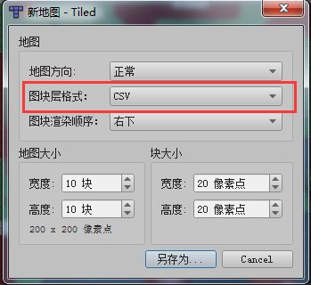
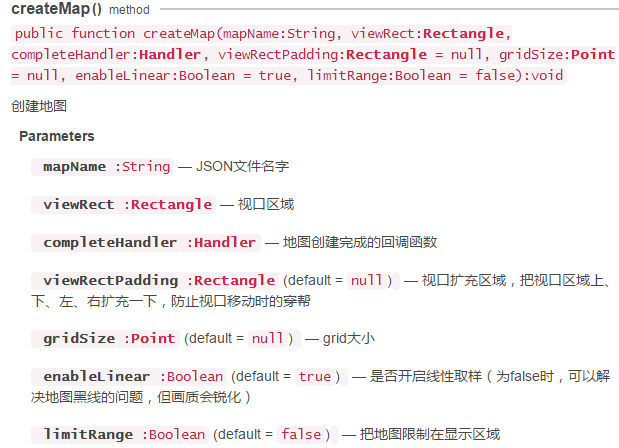
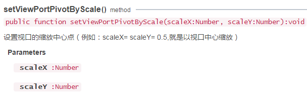

# Analyze Tiled Map with LayaAir engine

Tiled Map Editor is a free map editor for editing 2D game maps. The LayaAir engine supports parsing of maps exported by Tiled Map. This article describes how to use Tiled Map Editor to export maps in LayaAir engine development.

> Note: This article is for developers who are familiar with and use the Tiled Map map tool. This article describes how Tiled Map Editor exported maps are used in the LayaAir engine project. Find out about third-party tutorials themselves on the Tiled Map Editor's own content.
>
> Part of this document was added to LayaAir Engine 1.7.7 and updated to 1.7.7 or higher before reading this article.


## 1. Export Tiled Map map

### 1.1 Tiled Map Editor Download and install

Open the official home page（[http://www.mapeditor.org/](http://www.mapeditor.org/)）After that, click the `DownLoad at itch.io`Button to enter the download link（[https://thorbjorn.itch.io/tiled](https://thorbjorn.itch.io/tiled)）. If the official website revision, but also can be downloaded directly from the page [http://www.mapeditor.org/download.html](http://www.mapeditor.org/download.html) Find the download link.

Find the corresponding system version link, download and install (*This article uses the version of Tiled 1.0.1*)。

**Tips**：

*Open the download will pop-up sponsor the software paid page, if you do not want to pay, you can click -No thanks, just take me to the downloads- Will take you to a free download link*


### 1.2 	New and export Tiled Map map format.

#### 1.2.1 Tile layer format requirements

The LayaAir engine does not support the graph block layer format of the Tiled Map map for Base64. So, when `create`  a new map, it must be in `CSV format`, as shown in figure 1.

 

（Picture 1）

If you create the wrong selection, you can change the `Tile layer format` to CSV or XML in the property pane, as shown in Figure 2, and the Base64 related format does not support.

 

(Picture 2)

#### 1.2.2  Export to JSON format

When exporting, we have to choose the format of json. In this case, we open the example map orthogonal-outside.tmx of Tiled Map directly（*Under the examples directory of the Tiled Map map installation directory*）And then it's called  orthogonal.json，Save to project directory（In this case `Project root directory \bin\h5\res\TiledMap\`）, As shown in figure 3.

 

(Picture3)

### 1.3 Modify atlas path

Open the `orthogonal.json`, we just saved, search the keyword `"image"`, and we'll find the default image path in the Tiled installation directory. As shown in figure 4.

 

(figure 4) the path is definitely not available in the Tiled installation directory, so we need to copy this image (*buch-outdoor.png*) into the project directory, at the same level as the `orthogonal.json` we saved, as shown in figure 5.

 

(Picture 5)

Then modify the `image` path in orthogonal.json to the relative path `"image":"buch-outdoor.png",`

The end of the preparation phase, the next step into the coding phase...


## 2. The LayaAir engine uses the Tiled Map map

### 2.1 Creating TiledMap maps

#### 2.1.1 createMap API explained

The createMap method in the laya.map.TiledMap class creates a TiledMap map. The basic parameter instructions are shown in figure 6.

 

(Picture 6)

#### 2.1.2 Create map examples

```java
package
{
	import laya.map.TiledMap;
	import laya.maths.Rectangle;
	import laya.utils.Browser;
	import laya.webgl.WebGL;

	public class TiledMapDemo
	{

		private var tMap:TiledMap;
		public function TiledMapDemo()
		{
			//初始化舞台
			Laya.init(Browser.width, Browser.height, WebGL);
			//创建TiledMap实例
			tMap = new TiledMap();
			//创建Rectangle实例，视口区域
			var viewRect:Rectangle = new Rectangle(0, 0, Browser.width, Browser.height);
			//创建TiledMap地图
			tMap.createMap("res/TiledMap/orthogonal.json",viewRect);
		}
	}
}
```

Compile and run the code, and the effect is shown in Figure 7, which shows that the map has been created successfully.

 

(Picture 7)

### 2.2 Control map

To control the map, you must first load the map's JSON, and then control it in the callback method. The following examples will be used to understand the relevant usage.

#### 2.2.1 Map scaling

`scale` property in the `laya.map.TiledMap` class controls the scale of the map. We used the previous example to add callbacks in the createMap method, and then scale the map using the `scale` property.

Example code is as follows:

```typescript
package
{
	import laya.map.TiledMap;
	import laya.maths.Rectangle;
	import laya.utils.Browser;
	import laya.utils.Handler;
	import laya.webgl.WebGL;

	public class TiledMapDemo
	{
		private var tMap:TiledMap;
		public function TiledMapDemo()
		{
			//初始化舞台
			Laya.init(Browser.width, Browser.height, WebGL);
			
			//创建TiledMap实例
			tMap = new TiledMap();
			//创建Rectangle实例，视口区域
			var viewRect:Rectangle = new Rectangle(0, 0, Browser.width, Browser.height);
			
			//创建TiledMap地图，加载orthogonal.json后，执行回调方法onMapLoaded()
			tMap.createMap("res/TiledMap/orthogonal.json",viewRect, Handler.create(this,onMapLoaded));
		}
  
		private function onMapLoaded():void
		{
			//将原地图放大2倍
			tMap.scale = 2;
		}
	}
}
```

The running effect is shown in figure 8.

 

(Picture 8)

#### 2.2.2  Setting the center of map scaling

Obviously, the effect in Figure 8 is not what we want. After magnification. Some of them don't show up. This is the center point of the default zoom is caused in the central region of the viewport.

#### Viewport region with the default zoom center point

In the viewport region create map method (*createMap*) set second parameters,

```java
//创建Rectangle实例，视口区域
var viewRect:Rectangle = new Rectangle(0, 0, Browser.width, Browser.height);
//创建TiledMap地图，加载orthogonal.json后，执行回调方法onMapLoaded()
tMap.createMap("res/TiledMap/orthogonal.json",viewRect, Handler.create(this,onMapLoaded));
```

By looking at the code, we found the viewport is set to the browser the physical aspect（ `Browser.width, Browser.heigh`）. The setViewPortPivotByScale default value is 0.5 for the control scaling method. Then the center point is shown in figure 9-1.

 

(Picture 9-1)

When the map is magnified two times（`tMap.scale = 2;`） because it is in the center of X and Y axis of the zoom viewport region, so after amplification, will produce the effect of figure 9-2.

 

(Picture 9-2)

Next, we further understand the central point of the scale property by moving graph 9-3, from 0.1 to 2 times the scale change effect of the original scale.

 

(Picture 9-3)

#### Using setViewPortPivotByScale method to set zoom center point

The default zoom center effect is introduced in the previous paper. How do you set and change the center of the zoom?. In the `laya.map.TiledMap` class `setViewPortPivotByScale()`, center point method can set the viewport. The API basic instructions are shown in figure 10.

 

（Picture 10）

`setViewPortPivotByScale()` first parameter scaleX of the method is the scaling coordinate of the X axis, and scaleY is the scaling coordinate of the X axis.

For example:

```java
tMap.setViewPortPivotByScale(0.1,0.5);
```

**Code description**：

Assuming the viewport size for 800*600

- scaleX value`0.1` The coordinate of the center point of the X axis is 80 （800*0.1）

- scaleY value `0.5` The coordinates of the center point of the Y axis are 300 （600*0.5）

When the code is run with the X axis 80, y coordinates of the center point 300 is the axis of the viewport zoom.


#### The zoom center is set to the upper left corner of the viewport

When the zoom center point setViewPortPivotByScale is set to `0,0` to the upper left corner of the viewport. Continue with the previous example and encode as follows:

```java
package
{
	import laya.map.TiledMap;
	import laya.maths.Rectangle;
	import laya.utils.Browser;
	import laya.utils.Handler;
	import laya.webgl.WebGL;
	
	public class TiledMapDemo
	{
		private var tMap:TiledMap;
		public function TiledMapDemo()
		{
			//初始化舞台
			Laya.init(Browser.width, Browser.height, WebGL);
			//创建TiledMap实例
			tMap = new TiledMap();
			//创建Rectangle实例，视口区域
			var viewRect:Rectangle = new Rectangle(0, 0, Browser.width, Browser.height);
			//创建TiledMap地图，加载orthogonal.json后，执行回调方法onMapLoaded()
			tMap.createMap("res/TiledMap/orthogonal.json",viewRect, Handler.create(this,onMapLoaded));
		}
		
		private function onMapLoaded():void
		{
			//设置缩放中心点为视口的左上角
			tMap.setViewPortPivotByScale(0,0);
			//将原地图放大2倍
			tMap.scale = 2;
		}
	}
}
```

将缩放中心点设置在视口的左上角，再放大2倍时，我们在iPhone6设备上可以铺排全屏，没有黑边。效果如图11所示。

 

(图11)


### 2.3 Drag map

When the map is magnified, it cannot be fully displayed. Then you need to drag the map to see all of them.

Drag map, in addition to the method described in the previous, but also need to use `moveViewPort()`(mobile viewport) method and `changeViewPort()` (Change the viewport size) method. The basic descriptions of the two API are shown in figures 12-1 and 12-2.

 

（Picture 12-1）


 

（Picture 12-2）

Look directly at the code below and see how these two methods are used.

```java
package
{
	import laya.events.Event;
	import laya.map.TiledMap;
	import laya.maths.Rectangle;
	import laya.utils.Browser;
	import laya.utils.Handler;
	import laya.webgl.WebGL;

	public class TiledMapDemo
	{

		private var tMap:TiledMap;
		private var scaleValue:Number = 0;
		private var MapX:Number = 0;
		private var MapY:Number = 0;
		private var mLastMouseX:Number;
		private var mLastMouseY:Number;
		public function TiledMapDemo()
		{
			//初始化舞台
			Laya.init(Browser.width, Browser.height, WebGL);
			//创建TiledMap实例
			tMap = new TiledMap();
			
			//创建Rectangle实例，视口区域
			var viewRect:Rectangle = new Rectangle(0, 0, Browser.width, Browser.height);
			//创建TiledMap地图，加载orthogonal.json后，执行回调方法onMapLoaded()
			tMap.createMap("res/TiledMap/orthogonal.json",viewRect, Handler.create(this,onMapLoaded));
		}


		private function onMapLoaded():void
		{
			//设置缩放中心点为视口的左上角
			tMap.setViewPortPivotByScale(0,0);
			//将原地图放大3倍          
			tMap.scale = 3;
			
			Laya.stage.on(Event.RESIZE,this, this.resize);
			Laya.stage.on(Event.MOUSE_DOWN, this, this.mouseDown);
			Laya.stage.on(Event.MOUSE_UP, this, this.mouseUp);
			resize();
		}
		
		/**
		 * 移动地图视口
		 */
		private function mouseMove():void
		{
			var moveX:Number = MapX - (Laya.stage.mouseX - mLastMouseX);
			var moveY:Number = MapY - (Laya.stage.mouseY - mLastMouseY)
			//移动地图视口
			tMap.moveViewPort(moveX, moveY);
		}
		
		
		private function mouseUp():void
		{
			MapX = MapX - (Laya.stage.mouseX - mLastMouseX);
			MapY = MapY - (Laya.stage.mouseY - mLastMouseY);
			Laya.stage.off(Event.MOUSE_MOVE, this, this.mouseMove);
		}
		
		private function mouseDown():void
		{
			mLastMouseX = Laya.stage.mouseX;
			mLastMouseY = Laya.stage.mouseY;
			Laya.stage.on(Event.MOUSE_MOVE, this, this.mouseMove);
		}		
		

		/**
		 *  改变视口大小
		 *  重设地图视口区域
		 */	
		private function resize():void
		{
			//改变视口大小
			tMap.changeViewPort(MapX, MapY, Browser.width, Browser.height);
		}
	}
}
```

The performance of the code is shown in figure 13.

 

(Picture 13)


## 3. Tiled Map usage optimization

### 3.1 Destroy map

When Tiled Map is no longer used, the destroy () method is needed to destroy and recover the occupied memory.

For example:

```java
tMap.destroy();
```


### 3.2 Cache related

#### 3.2.1 Turn on and off automatic caching

When the LayaAir engine uses TiledMap, it will automatically cache the non animated blocks, and the default cache type is normal.

```java
//自动缓存没有动画的地块
tMap.autoCache = true;
//自动缓存的类型,地图较大时建议使用normal
tMap.autoCacheType = "normal";
//消除缩放导致的缝隙,也就是去黑边，1.7.7版本新增的优化属性
tMap.antiCrack = true;
```

The above code attribute is the default value of the engine. In most cases, the default value is maintained without additional setup.

Why did LayaAir introduce it again ?

Because sometimes, the black side (crack) will appear on the cached Tiled map. Although the antiCrack property is added in the 1.7.7 version, the vast majority of black edges caused by normal caching can be eliminated. But if the bipartite black edge problem remains unresolved. The problem of black edge (crack) can be solved by closing the auto cache.

#### 3.2.2 Set cache block size

#### Cache block settings recommendation

TiledMap maps are made up of one unit block. If the cache retains the original size, the performance of the block will be affected when the block is large. Therefore, it is recommended that the cache block be opened and the size of the cache block is set to about 512 pixels, and the integer number of the original block must be kept.

For example, the size of a single block in this example is `16*16`，then the cache block can be set 32 times as much as 16，mean `512*512`。

If a single graph is `15*15`, the cache block can be set to `510*510`（34 times），and so on, as far as possible in the original block integer times, set at about 512. Recommended as `512*512`。

#### Specific setting method of cache block

The settings of cache blocks need to be set up when createMap (map) is created. Set fourth parameters gridSize, the example is as follows:

```javascript
//为第二个参数创建Rectangle实例，视口区域
var viewRect:Rectangle = new Rectangle(0, 0, Browser.width, Browser.height);

//为第四个参数gridSize创建一个512*512大小的Point对象实例
var gridSize:Point = new Point(512, 512);

//创建TiledMap地图
tMap.createMap("res/TiledMap/orthogonal.json",viewRect, Handler.create(this,onMapLoaded), null, gridSize)
```


### 3.3 flatten image

#### 3.3.1 Open merge layer

When you have multiple layers in TiledMap, open the merged layer's property enableMergeLayer, which can merge the layers and improve the performance.

Open the way for ：

```java
//开启图层合并
tMap.enableMergeLayer = true;
```

**Tips**:

It's important to note that if you need to merge the layers before merging, you can't merge them directly. Because the merge results in an inability to manipulate the merged layer.

#### 3.3.2 Layer merge grouping

If you don't group the layers in TiledMap, then when the layers merge, all the layers are merged together. Therefore, it needs to be divided into several layers and operated separately. You can group the layers in TiledMap.

#### TiledMap layer grouping mode:

Open the TiledMap map editor, select the layer to be grouped, and add a `string` type attribute named `layer` in the layer's custom attribute bar. The operation is illustrated in figure 14-1.

 

（Picture 14-1）

Click OK and add all the layers of custom attribute layer after you have finished. Set grouping name.

For example, we set the block name of block 2 and block 3 to layaAir, and then the layer called layaAir, which opens the enableMergeLayer and merges into the same layer. The operation is illustrated in figure 14-2.

 

(Picture 14-2)

When you merge the layers, you can add the layer attribute within the layer properties, and the runtime will merge the same layers of the adjacent layer attributes to improve the performance

#### 3.4 Remove the covered grid

If the underlying grid is blocked and the blocked block is not transparent, then the occluded part is removed directly without rendering, which can improve the performance.

Remove the open way of being covered:

```java
//移除被非透明地块覆盖的部分
tMap.removeCoveredTile = true;
```

**Tips**：

If it is opened, it is impossible to operate the removed parts. So before you open the function, make sure that the removal part is no longer operating.

#### removeCoveredTile Open premise

If you do not set the `type` attribute on `Tile` in the Tiled Map, if removeCoveredTile is opened, it is invalid. So before you start, you need to add custom property type to the block in the TiledMap editor and set it to 1.

**The method of setting block type in Tiled Map**

In the block panel, click the block editor to open the block terrain editor panel. The operation is illustrated in figure 15-1.

 

(Picture 15-1)

在图块地形编辑面板内，选中地形，在自定义属性栏，点击`+`号图标，添加`int`类型的`type`属性。然后点击OK，完成添加。操作如图15-2所示。


 

(Picture 15-2)

After the addition, the type attribute value is set to 1. The operation is illustrated in figure 15-3.

 

(Picture 15-3)

As long as the custom attribute type is set to 1 of the terrain, when removeCoveredTile is opened. It can be removed when invisible and invisible, so as to improve performance.
