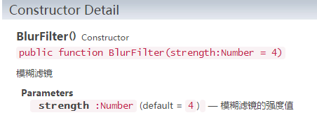

# Filter effect

> LayaAir engine provides 3 effects:  color filter, light (or shadow) filter and  blur filter. The color filter supports Canvas and WebGL mode, light filter and blur filter support only WebGL mode because of the large consumption of performance.


## 1. Set the color filter

### 1.1 Introducing Color Filter API

The color filter class ColorFilter is located in laya.filters package, change the color channel by specifying the matrix (arranged in 4 x 5 matrix).

Click   [laya.filters.ColorFilter ](http://layaair.ldc.layabox.com/api/index.html?category=Filter&class=laya.filters.ColorFilter) to view the API instructions.


### 1.2 Set color filter

If you want to set a color filter for a bitmap, you need to set a color matrix first, and then use a ColorFilter method to create a color filter, as shown in the following code:

```java
//Color matrix, set to red
var colorMatrix:Array = 
[
  1, 0, 0, 0, 0, //R
  0, 0, 0, 0, 0, //G
  0, 0, 0, 0, 0, //B
  0, 0, 0, 1, 0, //A
];

// Create a color filter
var redFilter:ColorFilter = new ColorFilter(colorMatrix)
```

Finally,through the Sprite's filters property, the color filter effect is superimposed on the bitmap. Then, we create a Main.as entry class and set it as the default application (recommended by FlashBuilder). Write the code as follows:

```java
package
{
	import laya.display.Sprite;
	import laya.filters.ColorFilter;

	public class Main
	{
		public function Main()
		{
			// Initialize the stage
			Laya.init(1334,750);                
			// Set the stage background color
			Laya.stage.bgColor  = "#ffffff";
			
			// Create a bitmap at coordinates 100, 50
			createImg(100,50);
			// Red filter
			creteRedFilter();
			// Gray filter
			createGrayFilter();
		}
		
		/** Create a red filter bitmap **/
		private function creteRedFilter():void
		{
			// Color filter matrix, set to red value
			var colorMatrix:Array = 
				[
					1, 0, 0, 0, 0, //R
					0, 0, 0, 0, 0, //G
					0, 0, 0, 0, 0, //B
					0, 0, 0, 1, 0, //A
				];
			
			// Create a red color filter
			var redFilter:ColorFilter = new ColorFilter(colorMatrix);
              
            // Create a bitmap at coordinates 280, 50
			var img:Sprite = createImg(280,50); 
			// Add a red color filter effect
			img.filters = [redFilter];
		}	
		
		
		/** Creating a gray filter bitmap **/
		private function createGrayFilter():void
		{
			// Color filter matrix,  set to gray value
			var colorMatrix:Array = 
				[
					0.3086, 0.6094, 0.0820, 0, 0,  //R
					0.3086, 0.6094, 0.0820, 0, 0, //G
					0.3086, 0.6094, 0.0820, 0, 0,  //B
					0, 0, 0, 1, 0, //A
				];
			// Create a gray color filter
			var GrayFilter:ColorFilter = new ColorFilter(colorMatrix);
          
			// Create a bitmap at coordinates 460, 50
			var img:Sprite = createImg(460,50); 	
			// Add gray color filter effect
			img.filters = [GrayFilter];
		}
		
		/** Create bitmap **/
		 private function createImg(w:int,h:int):Sprite
		{
			 var Img:Sprite = new Sprite(); 
			 
			 // Add to the stage
			 Laya.stage.addChild(Img);   
			 
			 // Load display pictures
			 Img.loadImage("res/img/monkey1.png",w,h); 
			 
			 return Img;
		}
	}
}
```

In the above code, we created a original  raw bitmap, with red filter effect bitmap and gray filter effect bitmap. Operation results shown in Figure 1:

 <br /> (Picture 1)


## 2. set the light and shadow filter

### 2.1 Introduction to the light filter API

The light filter class for GlowFilter is located in the laya.filters package, and the shading angle can also be adjusting  as a shadow filter. The parameters are shown in Figure 2. Note: This filter only works in WebGL mode.

 <br /> (Picture 2)

Click on [laya.filters. GlowFilter](http://layaair.ldc.layabox.com/api/index.html?category=Filter&class=laya.filters.GlowFilter)  to see the API instructions.


### 2.2 Set up filter and shadow filter

The light and shadow filter settings is simple, and we directly look through the code to see the example results,

first create a Main.as entry class and set it as the default application (recommended with  FlashBuilder). Write the code as follows:

```java
package
{
	import laya.display.Sprite;
	import laya.filters.GlowFilter;
	import laya.webgl.WebGL;

	public class Main
	{
		public function Main()
		{
			// Initialize the stage
			Laya.init(1334,750,WebGL);                
			// Set the stage background color
			Laya.stage.bgColor  = "#ffffff";
			
			// Original bitmap
			createImg(100,50);			
			// Glow filter
			creteGlowFilter();			
			// Shadow Filter
			createShadeFilter();
		}
		
		/**Create a glow filter bitmap**/
		private function creteGlowFilter():void
		{			
			// Create glow filters
			var glowFilter:GlowFilter = new GlowFilter("#ff0000", 15, 0, 0)
			// Create a bitmap at coordinates 280,50
			var img:Sprite = createImg(280,50); 		
			// Add light filter
			img.filters = [glowFilter];
			
		}	
		
		
		/** Creating shadow filter bitmap **/
		private function createShadeFilter():void
		{
			//Create shadow filters
			var glowFilter:GlowFilter = new GlowFilter("#000000", 8, 8, 8)
			// Create bitmaps in coordinate 460,50
			var img:Sprite = createImg(460,50);			
			// Add a shadow filter
			img.filters = [glowFilter];				
		}
		
		/**create  bitmap**/
		 private function createImg(w:int,h:int):Sprite
		{
			 var Img:Sprite = new Sprite(); 			 
			 // Added to the stage
			 Laya.stage.addChild(Img);   			 
			 // Load the display picture with coordinates at 100, 50
			 Img.loadImage("res/img/monkey1.png",w,h); 			 
			 return Img;
		}
	}
}
```

In the code above, we created a new bitmap, apply light filter effect and a shadow filter effect on it. The running effect is shown in figure 3:

 <br /> (Picture 3)


## 3、Set blur filter

### 3.1 Fuzzy filter API introducing

The BlurFilter class located in the laya.filters package. It is possible to adjust the intensity  parameter. The parameter instructions are shown in figure 4. Note: this filter only supports WebGL mode.

 <br /> (Picture 4)

Click on   [laya.filters. BlurFilter](http://layaair.ldc.layabox.com/api/index.html?category=Filter&class=laya.filters.BlurFilter)   to view the API instructions.


### 3.2 Set the blur filter

Blur filter settings are relatively simple. Create a filter instance, and then set the fuzzy strength attribute. Superimposed on the bitmap, and  see the sample effect directly through the code.

First create a Main.as entry class and set it as the default application (recommended with FlashBuilder). Write the code as follows:

```java
package
{
	import laya.display.Sprite;
	import laya.filters.BlurFilter;
	import laya.webgl.WebGL;
	
	public class Main
	{
		public function Main()
		{
			 // Initialize the stage
			Laya.init(1334,750,WebGL);                
			// Set the stage background color
			Laya.stage.bgColor  = "#ffffff";
			
			// Original bitmap
			createImg(100,50);			
			// Blur filter
			createBlurFilter();			
	
		}
		
		/** Create and paste filter bitmap **/
		private function createBlurFilter():void
		{			
			// Create a fuzzy filter instance
			var blurFilter:BlurFilter = new BlurFilter();
			// Set the blur strength
			blurFilter.strength = 5;
			// Create a bitmap at coordinates 280,50
			var img:Sprite = createImg(280,50); 		
			// Add a filter effect
			img.filters = [blurFilter];
			
		}	

		
		/** Create a bitmap **/
		private function createImg(w:int,h:int):Sprite
		{
			var Img:Sprite = new Sprite(); 			 
			// Added to the stage
			Laya.stage.addChild(Img);   			 
			// Load the display picture with coordinates parameters at w, h
			Img.loadImage("res/img/monkey1.png",w,h); 			 
			return Img;
		}
	}
}
```

In the code above, we created an raw original bitmap with blur filter effect bitmap. The running effect is shown in figure 5:

 <br /> (Picture 5)


