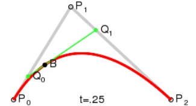
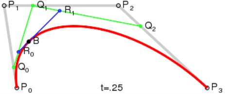

# Draw curve

> Compare to the straight line, drawing curve and coordinate relationship is more difficult to understand. Since the LayaAir engine draws the Bezier curve, this article will described Bezier curve concept, and how to implement it in engine API.
>


### **A. basis of the Bezier curve**

​        General vector graphics software which  display the curve, use most of time Bezier function with the line segment and draggable node. Line appears like a scalable rubber band. In drawing software it refers as "pen tool".

​        The Bezier curve is a mathematical curve applied in most 2D graphics application. a curve is defined by four points: a starting point, a terminating point (also called an anchor point), and two mutually separated intermediate points. Slide the two intermediate points modify shape of the Bezier curve.

​       Based on the linear, quadratic, cubic and other formulas, the Bezier curve can get different higher-order. Depending on number of intermediate points construction, the following through the animation so that we intuitively understand:


#### **1. Bezier curve concept**

​        <br/>
​   	(Picture 1) 

​        Explanation: The graph above is a continuous point from P0 to P1, describing a linear Bezier curve. The  function t passes through the curve defined by B(t) from P0 to P1. For example, when t = 0.25, B (t) is a quarter of the path from point P0 to P1. Just like a continuous t, B(t) from 0 to 1, it goes straight line from P0 to P1.

#### **2. Second-order Bezier curve**

​        <br/>
​   	(Picture 2)  

​      <br/>
​   	(Picture 3) 

​        Explanation: To construct a second-order curve, the graph is described by a continuous function  B (t) with point Q0 from P0 to P1.

#### **3. Third-order Bezier curves**

​        <br/>
​   	(Picture 4)  

​          <br/>
​   	(Picture 5)

​        Explanation: for the third-order curve, the intermediate points Q0, Q1, and Q2 described curve, constructed by points R0 and R1 which defined the quadratic  curve.

#### **4. Higher-order Bezier curve**

**Since high-order Bezier curve is not common, this article will not mentionned details implementation.**

​        <br/>
​   	(Fig. 6) four-order Bezier curves

​        <br/>
​   	(Fig. 7) five-order Bezier curves


### **B.  use the LayaAir engine API to draw the second-order Bezier curve**

​        The LayaAir engine can use second-order curve. To get further more details, please refer at "drawCurves ();" and laya.display.Graphics class in the API document.

​        <br/>
​   	(Picture 8) 

Curve drawing method. A detailed description of the method is shown below:

```javascript
package
{
    import laya.display.Sprite;
    import laya.display.Stage;
    import laya.webgl.WebGL;
      
    public class Sprite_DrawShapes
    {
        private var sp:Sprite;
          
        public function Sprite_DrawShapes()
        {
            Laya.init(500, 300, WebGL);
            drawSomething();
        }
  
        private function drawSomething():void
        {
            sp = new Sprite();
            Laya.stage.addChild(sp);
            //Draw curves
            sp.graphics.drawCurves(10, 58, [0, 0, 19, -100, 39, 0], "#ff0000", 3);
              
        }
    }
}
```

After the release, as shown in the following picture, we successfully displayed a simple curve.

​        <br/>
​   	(Picture 9)  

By increasing the parameters of the third point array collection of drawCurves, we can make the curve more details, get a look at the code belows:

```javascript
//Add into array 58, 100, 78 and 0. specifies more coordinates make curves more complex shape. 
 
sp.graphics.drawCurves(10, 58, [0, 0, 19, -100, 39, 0, 58, 100, 78, 0], "#ff0000", 3);
```

After release, display should look as following figure :

​        <br/>
​   	(Picture 10)
If you want to draw more complex curves, you can adjust the parameters of drawCurves, and then combine second-order  Bezier curve principle to understand.

Finally, remind  that with polyline, all the coordinates in the third parameter are relative coordinates, which are affected by the first and second "10, 58". Once the "10" and "58" are changed, the overall curve will be affected.


### C. Use the LayaAirIDE drag control, to draw the second-order Bezier curve

​	**1**. open our LayaAirIDE and click design mode to create a new View page

​	<br/>
​   	(Picture 11)  

**2**. Drag the curve component in the component onto the View page to automatically generate the default curve

​	<br/>
​   	(Picture 12)  

**3**. Modify (add / subtract) the value of the point in the Curves component properties, change the position for different degree of curvature

​   	<br/>
​   	(Picture 13)

​   	<br/>
​   	(Picture 14)

Here we draw the curve through the LayaAirIDE component.
