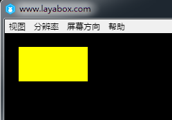
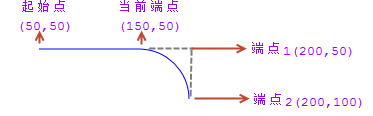
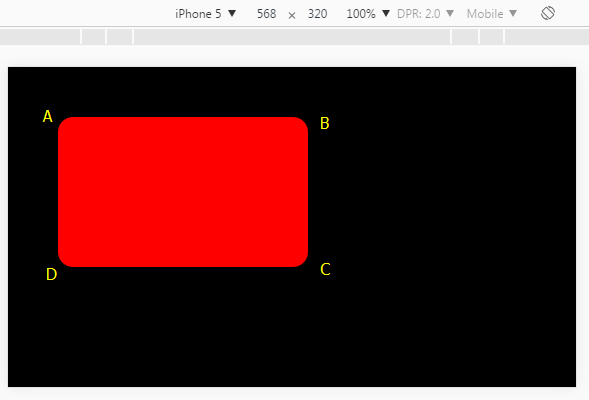

# 绘制矩形与圆角矩形


### 一、用drawRect方法绘制矩形

在API中搜索`laya.display.Graphics`类可以查看到该API的各种矢量绘图方法。其中"drawRect();"方法用于绘制矢量矩形。该方法的详细说明如下图所示：

​	<br/>
​	（图1）

下面我们用LayaAir引擎绘制矢量矩形，示例代码如下：

```java
package
{
    import laya.display.Sprite;
    import laya.display.Stage;
      
    public class Sprite_DrawShapes
    {
        private var sp:Sprite;
          
        public function Sprite_DrawShapes()
        {
            Laya.init(500, 300);
            drawSomething();
        }
  
        private function drawSomething():void
        {
            sp = new Sprite();
            Laya.stage.addChild(sp);
            //画矩形
            sp.graphics.drawRect(20, 20, 100, 50, "#ffff00");
              
        }
    }
}
```

代码运行效果：

​	<br/>
​	（图2）

示例中的“20，20”是矩形起始点坐标，100是向右的宽度，如果是负数则是向左的宽度。50是向下的高度，如果是负数则是向上的高度。大家可以在编写代码中，自行调整参数进行体验。


### 二、用drawPath绘制矩形

LayaAir引擎`laya.display.Graphics`类的绘制路径的方法"drawPath()"可以根据路径绘制矢量图形，当然也包括了矩形和圆角矩形，该方法的详细说明如下图所示：
​	<br/>
​	（图3）

drawPath方法的参数相对复杂一些。为了方便大家理解，我们先用"drawPath()"绘制一个矩形，理解路径中的部分参数。

drawPath绘制矩形的示例代码如下：

```javascript
package
{
    import laya.display.Sprite;
    import laya.display.Stage;
      
    public class Sprite_DrawShapes
    {
        private var sp:Sprite;
          
        public function Sprite_DrawShapes()
        {
            Laya.init(500, 300);
            drawSomething();
        }
  
        private function drawSomething():void
        {
            sp = new Sprite();
            Laya.stage.addChild(sp);
            //自定义路径
            var path:Array =  [
                ["moveTo", 0, 0], //画笔移到A点
                ["lineTo", 100, 0],//画到B点
                ["lineTo", 100, 50],//再画到C点
                ["lineTo", 0, 50], //继续画到D点
                ["closePath"] //闭合路径
            ];
             //绘制矩形
            sp.graphics.drawPath(20, 20, path, {fillStyle: "#ff0000"});
        }
    }
}
```

代码运行效果：

​	<br/>
​	（图4）

drawPath第一和第二位的坐标点“20,20”是控制整体位置的起始位置，第三位是路径参数。描述信息“MoveTo”是将画笔移动初始位置，此时并没有开始画。"0,0"是相对于"20,20"这个起始位置的，所以A点还是在起始位置原点。描述信息“lineto”是绘制到路径点坐标，“100，0”这个就是绘制到B点位置的坐标。C点和D点以此类推，最后通过描述信息“closePath”与MoveTo的起点位置闭合，否则是不会被闭合的。

从绘制矩形来看，drawPath方法肯定没有drawRect方法更加方便。但是大家可以通过这个示例理解相关的参数用法。至于其它非圆角的图形，大家可自行编码，通过调整参数体验。


### 三、用drawPath绘制圆角矩形

#### 3.1 用法说明

LayaAir引擎中可以使用graphics的drwaPath方法绘制圆角或弧线，具体的操作需要三步，指定绘制路径的起始点`["moveTo", x, y]`、绘制一条水平直线`["lineTo", x, y]`、绘制弧线`["arcTo", p1.x, p1.y, p2.x, p2.y, r]`。

**参数示例**：

```java
["moveTo", 50, 50],
["lineTo", 150, 50],
["arcTo", 200, 50, 200, 100, 50],
```

上述参数运行效果图如5-1所示：

 <br /> （图5-1）

通过图5-1我们可以看出，`["moveTo", 50, 50]`将画笔的起始点定位于`"50,50"`这个位置。`["lineTo", 150, 50]`绘制了一条由于起始点到当前端点（"`150, 50`"）的直线。`["arcTo", 200, 50, 200, 100, 50]`绘制了一段`r`（半径）为`50`弧线。

**弧线绘制原理**：

在制作这段弧线时，这个弧其实是利用当前端点`"150, 50"`、端点1`"200, 50"`、端点2`"200, 100"`，这三个端点所形成的夹角，制作一条半径为50px并且与两边相切的圆上的一段弧线。


如果我们已经理解了弧线的绘制原理，我们还会发现，构成弧线的核心要素为两条边和与两边形成夹角的顶点（上例中的端点1），图5-1中的端点2与端点1形成的x轴边比较好理解，那当前端点与端点1已经构成了y轴边，那与当前端点在同一个y轴的起始点是不是可以去掉呢，事实并不可以，画笔的起始点必须存在，但是绘制直线的lineTo可以去掉，如果`["lineTo", 150, 50],`被注释掉，那么arcTo绘制弧线的时候，会视起始点为当前端点，arcTo找不到lineTo绘制的直线时，会自动添加一条由起始点到弧线起点的直线，因此，绘制圆角矩形时，lineTo可以省略。


#### 3.2 绘制圆角矩形示例

下面我们绘制一个圆角弧线半径为30的圆角矩形，示例代码如下：

```java
package
{
    import laya.display.Sprite;
    import laya.display.Stage;
      
    public class Sprite_DrawShapes
    {
        private var sp:Sprite;
          
        public function Sprite_DrawShapes()
        {
            Laya.init(1136, 640);
            drawSomething();
        }
  
        private function drawSomething():void
        {
            sp = new Sprite();
            Laya.stage.addChild(sp);
            //自定义路径
            var path:Array =  [
				["moveTo", 0, 0], //画笔的起始点，
				["arcTo", 500, 0, 500, 30, 30], //p1（500,0）为夹角B，（500,30）为端点p2
				["arcTo", 500, 300, 470, 300, 30],//p1（500,300）为夹角C，（470,300）为端点p2
				["arcTo", 0, 300, 0, 270, 30], //p1(0,300)为夹角D，（0,270）为端点p2
				["arcTo", 0, 0, 30, 0, 30],//p1(0,0)为夹角A，（30,0）为端点p2
			];
             //绘制圆角矩形
            sp.graphics.drawPath(100, 100, path, {fillStyle: "#ff0000"});
        }
    }
}
```

代码运行效果：

​	<br/>
​	（图5-2）

在上面的代码里，看起来没有任何问题，其实moveTo的起始点，需要在圆弧之间的直线上，下面我们只需要在drawPath绘制时，增加一个边框线，就可以清楚的看出错误。绘制方法graphics.drawPath修改为：

```java
//绘制圆角矩形
sp.graphics.drawPath(100, 100, path, {fillStyle: "#ff0000"},{"strokeStyle":"#ffffff","lineWidth":"10"});
```

修改后运行效果如图5-3所示，由于画线的时候，从画笔的起始点`0,0`开始的，所以并不是我们想要的结果。

 <br /> (图5-3)

下面我们将示例修改为正确的代码：

```java
package
{
	import laya.display.Sprite;
	import laya.display.Stage;
	import laya.webgl.WebGL;
	
	public class Main
	{
		private var sp:Sprite;
		
		public function Main()
		{
			Laya.init(1136, 640);
			drawSomething();
		}
		
		private function drawSomething():void
		{
			sp = new Sprite();
			Laya.stage.addChild(sp);
			
			
			//自定义路径
			var path:Array =  [
				["moveTo", 30, 0], //画笔的起始点，
				["arcTo", 500, 0, 500, 30, 30], //p1（500,0）为夹角B，（500,30）为端点p2
				["arcTo", 500, 300, 470, 300, 30],//p1（500,300）为夹角C，（470,300）为端点p2
				["arcTo", 0, 300, 0, 270, 30], //p1(0,300)为夹角D，（0,270）为端点p2
				["arcTo", 0, 0, 30, 0, 30],//p1(0,0)为夹角A，（30,0）为端点p2
			];
			//绘制圆角矩形
			sp.graphics.drawPath(100, 100, path, {fillStyle: "#ff0000"},{"strokeStyle":"#ffffff","lineWidth":"10"});

		}
	}
}
```

运行效果如图5-4所示：

 （图5-4）


### 四、用LayaAirIDE拖动控件绘制矩形

​	**步骤一**：打开我们的LayaAirIDE，点击设计模式，新建一个View页面

​	<br/>
​   	（图6）  

**步骤二**：将组件中的曲线组件拖动到View页面上，就会自动生成默认的曲线

​	<br/>
​   	（图7）  

**步骤三**：修改（添加/减少）Rect组件属性中的数值，改变矩形的大小、颜色、旋转角度等等。

​   	<br/>
​   	（图8）  

​   	<br/>
​   	（图9）  

到此我们通过LayaAirIDE中的组件来绘制矩形就完成了。
