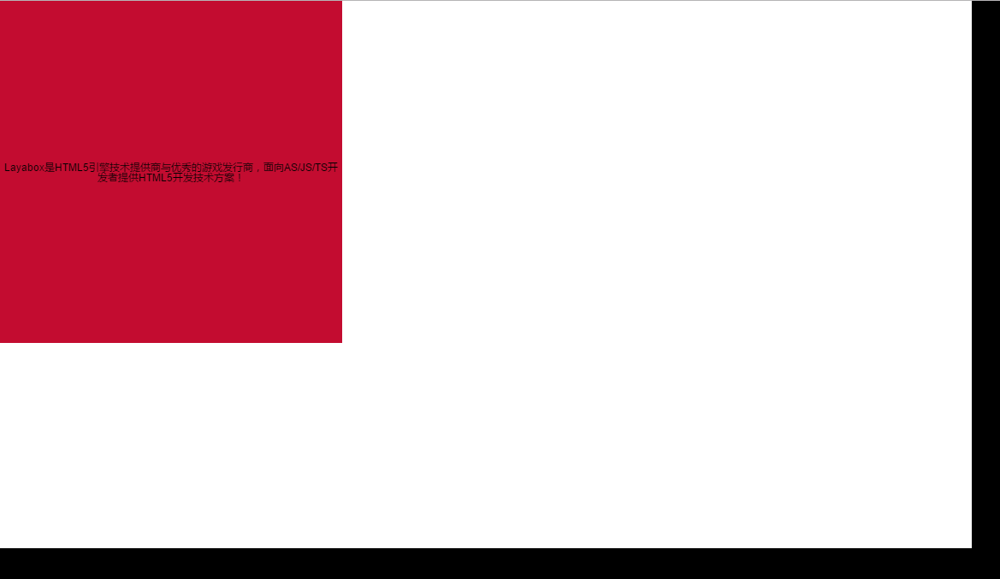

# Text alignment & auto wrap

With alignment mode, with horizontal and vertical attributes, can let text be displayed in the center of the text area. Here  we can get  a first look at the parameters from API,  through the example code as introduce. API parameters for text styles are in laya.display.text :

</br>

</br>

</br>

</br>

Set the font style in the code, define text content in  text area, and then put it horizontally and vertically centered. Horizontal and 
vertical alignment settings of text will not work without setting up directly the text areas.

```java
package
{
	import laya.display.Text;

	public class LayaSample
	{
		public function LayaSample()
		{
			// initialize engine
			Laya.init(1136,640);
			
			var txt:Text = new Text();
			// Set text content
			txt.text = "hello_world";
			// Setting text area background color
			txt.bgColor = "#c30c30";
			// Set the dimension of the text
			txt.width = 400;
			txt.height = 400;
			// Set text horizontally centered
			txt.align = "center";
			// Set text vertically centered
			txt.valign = "middle";
			Laya.stage.addChild(txt);
		}
	}
}
```

</br>

In current code, according your need, please refer to the other alignment values of the API. Which one can be more suitable in your  project.

Whether text contents dimension over the textarea one, it may not displayed in the stage content. To handle this case, you can use  automatic line break to show your entire text.

API implementation:

</br>

In following code, we will use wordwrap to deal newline case.

Set the width and height of the text area, otherwise  the text will wrap automatically according to the default text width. The code   looks like as follows:

```java
package
{
	import laya.display.Text;

	public class LayaSample
	{
		public function LayaSample()
		{
			// initialize engine
			Laya.init(1136,640);
			
			var txt:Text = new Text();
			// Set text content
			txt.text = "Layabox是HTML5引擎技术提供商与优秀的游戏发行商，面向AS/JS/TS开发者提供HTML5开发技术方案！";
			// Setting text area background color
			txt.bgColor = "#c30c30";
			// Set Text Area dimension
			txt.width = 400;
			txt.height = 400;
			// Sets the dimension of the text
			txt.align = "center";
			// Set text vertically centered
			txt.valign = "middle";
			// Set Wrap
			txt.wordWrap = true;
			Laya.stage.addChild(txt);
		}
	}
}
```

</br>

Here, you can see that our line set  automaticly break in this text area.
