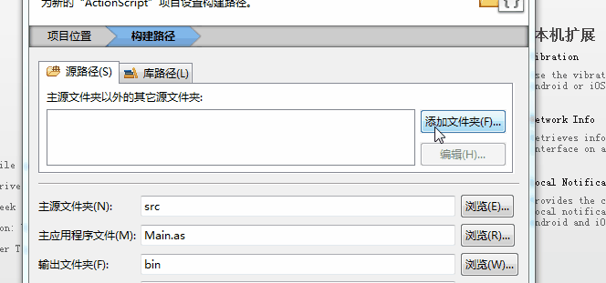

# FlashBuiler display first "Hello Layabox" program 

> **This article uses the AS3 language to display "Hello Layabox" text in the FlashBuilder environment, This is the first program tutorial with the LayaAir engine. Before you continue this article, be sure to read firstly: "Flash Builder IDE configuration"**
>
> Ensure you have read before "Create AS3 project with LayaAirIDE and directory structure explained" too.
>


## The first part focus to build a new project

**Step 1**:

Open Flash Builder. In menu bar, click "File", then select "New" , "ActionScript Project". a new window appeared to create the project as shown in Figure 1.

<br />
(Picture 1)


**Step 2**:

Enter the project name in the "Project name" input field, enter the project PATH directory in the "Folder" input field, or click "Browse" to select where your directory location. Then click "Next" to enter the "Build Path" window of the engine compilation and engine configuration as shown in picture 2

<br />
(Picture 2)


**Step 3**:

In the built path configuration "library path",  first delete the system comes with the compiled SDK  (the purpose is to avoid the error package),

Then click "add SWC" and add the "playerglobal.swc" in the engine package

If the project has released of Flash version, it requieres LayaAirFlash  which can be added with "LayaAirFlash.swc". As shown in Figure 3

 <br /> (Picture 3)


***Tips**: the glsl2agal.swc in the LayaAirFlash/flash folder in the engine package directory is also used for Flash version release , but, referencing glsl2agal.swc, you need to reference the library that publish Flash at the source path of the project. LayaAirFlash.swc integrates libraries, so there is no need to duplicate references. Need attention to import LayaAirFlash.swc or glsl2agal.swc file.


**Step 4**:

After set with swc files, it is recommended that the default output folder bin-debug rename to bin, as shown in Figure 4. Because LayaAirIDE default release project directory is used in bin directory,  which include assets content such as UI, animation depends to bin.

 <br /> (Picture 4)


**Step 5**:

Click “`Add Folder“` in the “`Source Path“` window to define the build path configuration.  Enter "directory where the engine library is located" or click "Browse" to select "directory where the engine library is located. (Note: The directory where the engine library is located is the libs folder The src file), and then click OK, that is, the completion of the engine library import. As shown in Figure 5

 <br /> (Picture 5)

If we need to release into Flash version,  the previous library path refers to `glsl2agal.swc` is necessary. Then the source path is referenced （LayaAirFlash.swc is not added）with source library located in the directory “`引擎库目录\as\LayaAirFlash\flash\src`”, As shown in Figure 5-2.

 <br /> (Picture 5-2)


**Finally, click the bottom of the finish button to end the boot of the new project.**

　　


## Second part is display text "Hello Layabox"

**Step 1**:

In menu bar, Click on "file" and select "new". Choose "ActionScript class" to open the new class file window. As shown in Figure 6

<br /> (Picture 6)


*Tips: the new ActionScript project will bring a project name with the same name of the ActionScript class, if you need to use this class, then need to remove the inside of the Sprite package. Since it is Flash original package, if you do not delete it, you will occurs some errors.*


**Step 2:**

Enter HelloLayabox in the name field and click "Finish" to create a new ActionScript class. As shown in picture 6-1

<br />
(Picture 6-1)


**Step 3**:

Set HelloLayabox.as to the default application. As shown in Figure 7

<br />
(Picture 7)


**Step 4:**

Double click to open HelloLayabox.as and start writing code. Add a "Hello Layabox" text to the stage with code follows:

```typescript
package
{
	import laya.display.Text;
	public class HelloLayabox
	{
		public function HelloLayabox()
		{
			 // Create the stage with the default black background color 
			Laya.init(600, 300);
			var txt:Text = new Text();
			// Set text content
			txt.text = "Hello Layabox";
			// Set the text color to white, the default color to black
			txt.color = '#ffffff';
			// Add text content to the stage
			Laya.stage.addChild(txt);
		}
	}
}
```


**Step 6:**

When you've finished writing the code, use the compiler you configured from previous article, click the button to start compiling, and then start compilation and run code automatically with chrome. As shown in Figure 8

 <br />

(picture 8)


The results are shown in picture 9

<br />
(picture 9)


**Part 6 :**

Although  this "Hello Layabox" has been successfully display, it is too simple. Let's add a better look with the following code :：

```typescript
package
{
	import laya.display.Text;
	public class HelloLayabox
	{
		public function HelloLayabox()
		{
			//Create the stage with the default black background color 
			Laya.init(600, 300);
			var txt:Text = new Text();
			txt.text = "Hello Layabox";
			// Set the text color 
			txt.color = '#FF0000';
			// Set the size of the text font in pixels   
			txt.fontSize = 66;
			// Set the font stroke  
			txt.stroke = 5;
			// Set it at 5 pixels
			txt.strokeColor = '#FFFFFF';
			// Set bold type
			txt.bold = true;
			// Sets the coordinate X,Y display start point of the text.
			txt.pos(60, 100);
			// Set stage background color
			Laya.stage.bgColor = '#23238E';
			// Add text content to the stage 
			Laya.stage.addChild(txt);
		}
	}
}
```


The results are shown below:

<br />
picture (10)


At this point, if you can follow this tutorial, succesfully display your program so congratulations! We have completed the first HTML5 program developed by AS3 language in LayaAirIDE,  with correct environment configuration with LayaAir. 
For more LayaAir engine development API usage, please go to the official website Layabox Developer Center to view online API and online DEMO.
