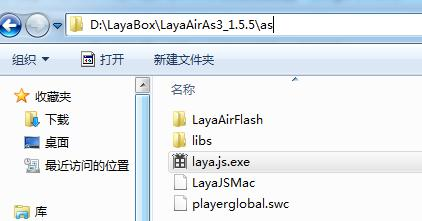
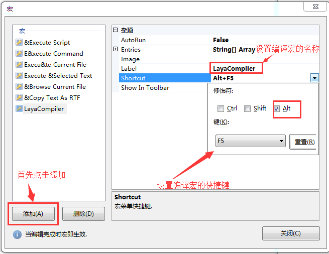

# FlashDevelop IDE configuration

### Step 1: LayaAir Engine download

#### 1.1 Engine download

​     If you use LayaAirIDE development, Download LayaAirIDE which include your own engine package. If developers use third party tools, you need to download the engine first. You can get it from the main page of the layabox official website. the link lead you to various versions of the engine from download list, choose among each version of AS3, TS, JS corresponding of your need, and directly click to download([http://new.ldc.layabox.com/download/?type=layaair-LayaAir](http://new.ldc.layabox.com/download/?type=layaair-LayaAir))。 

####  1.2 Engine package directory structure

We download the AS3 version pack. After decompressed the download archive, you can see the directory structure of the AS3 version, as shown in the following figure:

​    <br/>
​  picture(1)

- “LayaAirFlash” directory is the engine code necessary to released Flash version.

- “libs” engine code directory, contain library code in src subdirectory src.

- “laya.js.exe” is the AS3 code compiler for the Windows system, which is used to transcompile AS3 code into JS.

- “LayaJSMac” is the AS3 code compiler for the apple MAC system, which is used to transcompile AS3 code into JS.

- “playerglobal.swc” is used to replace the AS3 native compiler SDK, removing native API syntax hints, and adding engine API prompts.

  ​


### Step 2: Install Google Chrome

​    When AS3 code is compiled, Google Chrome browser is called by default to run the project. In order to debugging, you need to install it.

 

### Step 3 : Configure AS3 compilation environment in FlashDevelop

​    **A**. Open FlashDevelop, find the "macro" in the menu bar and open  "Edit Macro" panel.

​    <br/>
​  picture(2)

​    **B**. First, click "Add" to add a macro command, and then select that one. In the "Label" menu bar modify the macro command menu  and set  "LayaCompiler" as name. Finally "Shortcut" column set "Alt + F5" shorcut keys (shortcuts set for reference only, do not conflict with other shortcuts).

​    <br/>
​  picture(3)

​    **C**. In the  "Entries" column, click on the right side "..." to opens the string collection editor window.

​    <br/>
​  picture(4)

​    **D**. enter the following macro command in the string collection editor panel: 

```
SaveAllModified
RunProcessCaptured|D:\LayaBox\LayaAirAs3_1.5.5\as\laya.js.exe;"$(ProjectPath)";iflash=false;
```

​    <br/>
​  picture(5)

**Tips: “D:\LayaBox\LayaAirAs3_1.5.5\as\laya.js.exe” should be the actual path of laya.js.exe.**


​    **E**. click "OK" if you are sure that the macro command "LayaJsCompiler" is fully configured, and will be immediately effective after click on "close" button.

  

**At this point, Installation of LayaAir engine, browser, AS3 transcompiler configuration in the FlashDevelop environment are complete. Developers are encouraged to continue learning in other chapters.**

