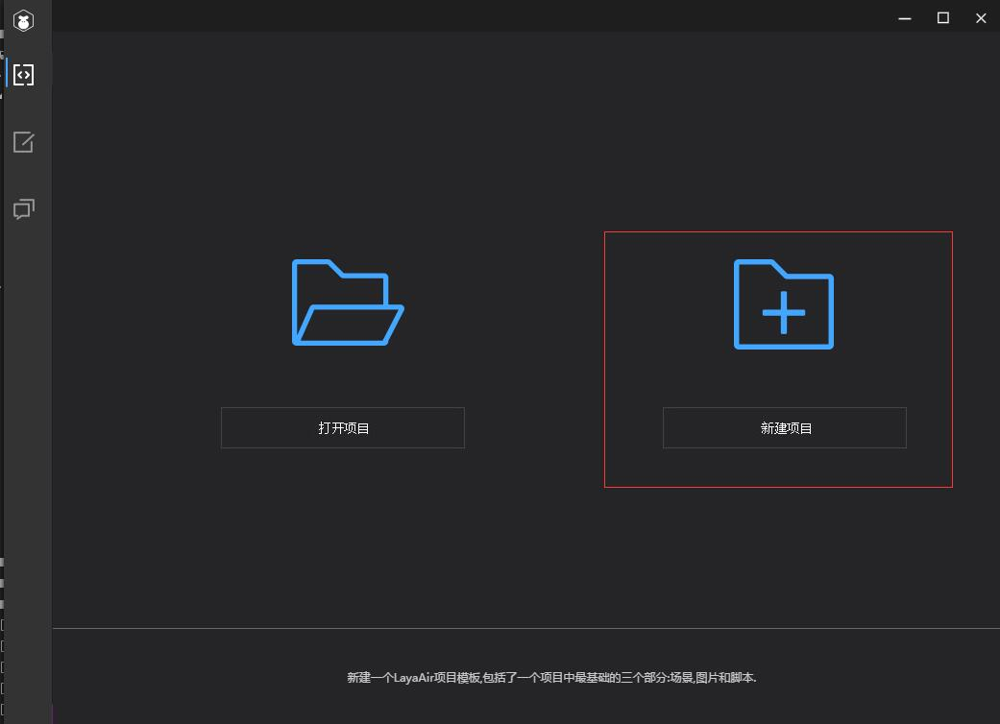
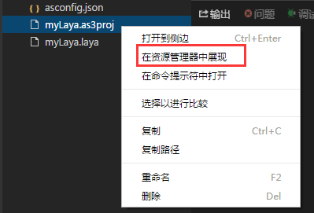

# Create AS3 project with LayaAirIDE and directory structure explained

　　Although we previously recommended FlashDevelop and FlashBuilder environments  for AS3 developer, we advice creating the project first through LayaAirIDE. Then can opening and continue edit via FlashDevelop or FlashBuilder. Building a project through LayaAirIDE will create a clear directory structure by default. Now let's start with the LayaAirIDE tool to create the AS3 empty project, leading you to introduce the structure of the project.


## A. create a AS3 project with LayaAirIDE

Step 1: Open LayaAirIDE and click the new project, as shown in Picture 1

   <br />(Picture 1)


Step 2: Select "LayaAir empty project". After setting the project name, path, type, and select the engine version, click create to generate a new empty project. As shown in figure 2.

 <br /> (Picture 2)


Step 3: after you click create, you can see the structure of the project. The folder structure of the project is shown in figure 3:

  <br />(Picture 3)


At this point we have successfully created an AS3 project, it is recommended to use FlashDevelop or Flash Builder to open the project.


## B. Introduce the AS3 project structure

**Next, the role of each directory will be introduced in conjunction with the project structure created in the previous section.**

​    

### 2.1 project configuration directory (.laya folder)

​    The.laya folder stores some of the configuration information details relative to development project, as shown in figure 4.

<br />
(Picture 4)


#### 2.1.1  `.laya/launch.json`file introduction 

 `.laya/launch.json` file saves the configuration information necessary about project debugging. Respectively, the debug is handle with LayaAirIDE and configuration with Chrome. After settings is done, Manually change may not easy since the project will affect the debugging error.

　　`configurations`： The property have layaAir and chrome debug configuration available.

　　`"name": "layaAir"` : Indicates the built-in debugging mode with LayaAirIDE.

　　`"name": "chrome调试"`   : Indicates debugging with local Chrome browser.

　　`"file": "${workspaceRoot}/bin/h5/index.html"` : Define the path directory where project's run start

　　`"runtimeExecutable": "C:/Program Files (x86)/Google/Chrome/Application/chrome.exe"`： The path directory of Chrome browser, developers set this path according to their own needs.

　　`"userDataDir": "${tmpdir}"` represent the temporary directory the chrome debug cache, default is the user's temporary directory, developers can change settings. For example, cache settings directory under the current project root path: "userDataDir": `"userDataDir": "${workspaceRoot}/cache"`。

​	

#### 2.1.2 `tasks.json`file introduction

`tasks.json` is the task configuration file. After opening, the contents are shown below:

<br />(Picture 7)

**Args parameter description:**

　　`command`The command property is the name of which file to start, and the AS project starts with the LayaCompiler transcompiler tool.

　　`args`The args property represents the passed parameter, and default transfer to ". ActionScriptProperties" file.

​	If you are configuring file from FlashDevelop, you can change it to:

```
"args": ["${workspaceRoot}/LayaUISample.as3proj;iflash=false;windowshow=false;chromerun=false"];
```

#### 2.1.3 astool content

​	`astool` is the LayaCompiler compiler to store directories, layajs is the AS3 compiler under the MAC system, and layajs.exe is the AS3 compiler under the windows system.


### 2.2 The output directory of the project (bin/h5)

​    `bin/h5` directory stores the output file for the current project. Used to store the ActionScript 3.0 files in the project, compile the generated JS and HTML5 files pages.

​    *Tips: if developers need new resources, such as running directories or files, they need to be placed in the sibling or sub directory of the bin/h5.*

 

### 2.3 UI project directory (Laya)

​    “`laya`” directory is used to store the current UI project for LayaAirIDE.

​    “`laya/assets`” directory is used to store the image assets resources required for components suomponents, particles, and so on.

​    “`laya/pages`” directory is used to store files generated by LayaAirIDE to create page layouts.

​    “`laya/.laya`” file is the LayaAirIDE UI project configuration file.

 

### 2.4 project library directory (libs)

​    “`libs`” Library directory for the project which store all libraries files used by the project.

​    “`libs/laya/src`” the LayaAir engine library file is stored in the "libs/lay /src" directory.


### 2.5 The AS3 code directory for the project (src)

​    The AS3 code file (.as extension) used in the project will be stored in the src directory by default.


## C. Introduction of project configuration file

### 3.1 LayaAirIDE project configuration file (project name.Laya)

​    `项目名.laya` name extension is the LayaAirIDE project configuration file. The project name of the current project was recorded in the file.

​    By example:

```json
{"proName":"myLaya","version":"1.5.4","proType":0}
```


### 3.2 FlashDevelop project configuration file (name project .as3proj)

​    `项目名.as3proj` name extension is the FlashDevelop project configuration file. Use Flash Develop IDE when you develop AS3 project, You can open the Explorer and open it and then double-click the file in the directory to launch it.

 <br /> (Picture 8)

Open FlashDevelop, browse from menu bar "File"->"open" and find your .as3proj project to import LayaAirIDE AS3 into the workspace you previously make.

<br />(Picture 9)


### 3.3 Flash Builder project configuration file.

​    `.settings`folder, `.actionScriptProperties` and `.project`files are FlashBuiler project configuration file. With Flash Builder, browse from menu bar "File"->"Import Flash Builder Project" to import LayaAirIDE AS3 project you previously make. Import your project from Flash Builder as shown below :

 <br /> (picture 10)

 
