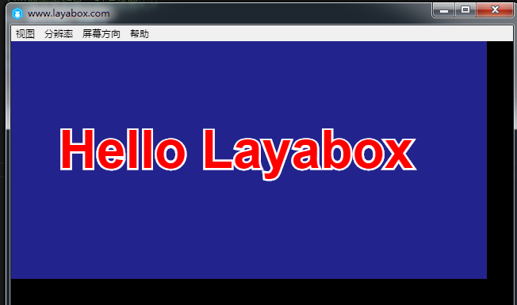

# LayaAirIDE display first "Hello Layabox" program 

> This article uses the AS3 language to display "Hello Layabox" text in the LayaAirIDE environment
>
> This is the first program tutorial with the LayaAir engine. Before you continue this article, be sure to read firstly: **Create AS3 project with LayaAirIDE and directory structure explained**
>

​   

 **Step 1**:  Open the AS3 project of LayaAirIDE. In the src directory, click "New ActionScript class file", as shown in Figure 1.

​    <br/>
​   (Picture 1)


​    **​Step 2 **: enter the class name HelloLayabox, and then click OK. It will  generate an as3 class file "HelleLayabox.as" , as shown in Figure 2.

​    <br/>
​   (Picture 2)


​    **Step 3**： set HelleLayabox.as as a document class. Click to open the FlashDevelop project file`“project name .as3proj”`（here is  `myLaya.as3proj`）， modify the `<compileTargets></compileTargets>` tag within the document compilation path, as shown in Figure 3. Modify the new main class, in this case will be HelleLayabox.as path file , specific operation as shown below:

​    <br/>
​   (Picture 3)


​    **Step 4**：: Add a `“Hello Layabox”`text to the Stage. Click to open HelleLayabox.as and add the code as follows:
​    <br/>
​   (Picture 4)


**HelleLayabox.as code:**

```javascript
package 
{
    /**
     * ...
     * @author Charley
     */
    import laya.display.Text;
    public class HelloLayabox
    {
        public function HelloLayabox()
        {
            // Create the stage with the default black background color 
            Laya.init(600, 300);
            var txt:Text = new Text();
             
            // Set text content
            txt.text = "Hello Layabox";
             
             // Set the text color to white, the default color to black
            txt.color = '#ffffff';
             
             // Add text content to the stage
            Laya.stage.addChild(txt);       
        }
    }
 
}

```

​    

**Step 4**：After the completion of the preparation of the code, use F5 shortcut keys to compile and run the results as shown below:

​    <br/>
​   picture (5)


​    **Step 5**: after the code is written, compile and run with the F5 shortcut key, as shown in the screenshots below:

​    <br/>
​   picture (6)

**HelleLayabox.as code :**

```javascript
package 
{
    /**
     * ...
     * @author Charley
     */
    import laya.display.Text;
    public class HelloLayabox
    {
        public function HelloLayabox()
        {
             //Create the stage with the default black background color 
            Laya.init(600, 300);
            var txt:Text = new Text();
            txt.text = "Hello Layabox";
             
            // Set the text color
            txt.color = '#FF0000';
            // Set the size of the text font in pixels
            txt.fontSize = 66;
             
            // Set the font stroke
            txt.stroke = 5;  // Set it at 5 pixels
            txt.strokeColor = '#FFFFFF';
             
            // Set bold type
            txt.bold = true;
             
            // Sets the coordinate X,Y display start point of the text.
            txt.pos(60, 100);
             
            // Set stage background color
            Laya.stage.bgColor = '#23238E';
             
            // Add text content to the stage
            Laya.stage.addChild(txt);
        }
    }
 
}
```

​  

  The results are shown below:

​    <br/>
​   picture (7)


At this point, if you can follow this tutorial, succesfully display your program so congratulations! We have completed the first HTML5 program developed by AS3 language in LayaAirIDE,  with correct environment configuration with LayaAir. 
For more LayaAir engine development API usage, please go to the official website Layabox Developer Center to view online API and online DEMO

