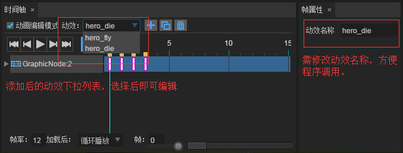

# 2. Editor visualized resource production

### Overview of Game Visualization Resources

​	In the previous lesson, we analyzed the development ideas and prepared and categorized art materials. In this lesson, do not hurry to knock the code, we make a good UI interface and animation before logical processing. LayaAirIDE is a powerful visual editing tool, the visible part of the game can be achieved in the IDE.

​       These visual elements include: various components, icons, UI pages, animations, maps, particles, and more. If students are not so familiar with the IDE components, a detailed tutorial can view the “Technical documents - LayaAir IDE articles”. Let's start with the step-by-step process of creating visual resources in the "aircraft war".

### Create a game page

​	In this example,  we set up a new start page, a game in progress page, a game end page, and a game map page in the Project Manager in this order. (Figure 1, Figure 2).

​	In order to adapt to the public mobile phone screen, the page resolution is set to 720X1280. In the game, we choose the default View type page for the map page of the game. The Dialog type brings the animation effect, so the “start” and “end” pages use this type.

 （Picture 1）

 （Picture 2）

New page corresponding description, please refer to the following table.

| game IDE visualizations  | File description              |
| ------------ | ----------------- |
| GameBg.ui    | The map of the game rolling, the View page type  |
| GameOver.ui  | Game end page, Dialog page type |
| GamePlay     | Game on page, View page type  |
| GameStart.ui | Game start interface, Dialog page type |

#### Making game process page

After creating and opening the GameStart.ui page, drag the corresponding components or resources from the resource or component manager, adjust the location through IDE tools, adjust the element level and nesting relationship with the IDE level interface (similar to the photoShop layer). The right property bar can also operate on the element wide position, rotation zoom, and finally reach the art effect diagram (Figure 3).

After the page layout is adjusted, add the variable name (var attribute) to the element that needs program modification. For example, the progress loading text box var named component txt_load, put the button box component var named btn_start.

GamePlay, GameOver page and GameStart page production basically the same way (Figure 4) (Figure 5), not much description.

 （Picture 3）

 （Picture 4）

 （Picture 5）

#### Game map background

To create and open GameBg.ui pages, we dragged two background.png from the explorer to the background editor for background use, and the upper and lower two sides were aligned continuously, and used for map continuous rolling. And set two graph variable names (VaR attributes) for BG1, BG2. The Y coordinates of BG2 are -1280.

Of course, only a longer two - party continuous graph is also available. Some games will set two layers in the background, a vision (slow rolling), a close view (fast rolling).

 （Picture 6）

At this point, the game page is completed and saved after the release (shortcut key F12). Under the “"code mode”, we can see that the UI folder is generated under the ...\src directory of the project. The folder is the 4 UI class generated by IDE, which can be loaded to the stage display after instantiation in the program.

### Button animation in the game page

Sometimes for the better effect of the interface, we can add animated effects on some buttons or interface elements. For example, at the end of the page, the "restart" button can beat up after clicking. Let's take this example to learn how to make it.

1. select the ”restart“ button in the scene editor. Then the ”animation edit mode“ in the timeline interface will be selected, and the play control button and the timeline (Figure 7) appear.

 （Picture 7）

2. Select the position of about eighth frames, move the button up to about 10 pixels, the time axis will correspond to the name of the object and the two key frames. Clicking on the left triangle of the object name, the Y attribute appears below, and there are two corresponding key frames. This is because we have changed the attributes on the Y axis of the object. Of course, if you change the other attributes to generate animations, such as X, alpha, scaleX and so on, it will also appear below the object name (Figure 8).

The control button is played over the name of the click object, and we can see the animation! If the animation is too fast or too slow, you can move the key frame around the mouse to the right place.

 （Picture 8）

3. In order to achieve more abundant animation effect, choose the first “frame properties” on the Y axis, the “whether to slow” selection will appear on the right frame property interface (Figure 8). After selecting the slow moving type is elasticOut, then the button will have a fast rebound effect. Students can also choose other activities to make an attempt.

Finally, we modify the name ani_restart for this animation to facilitate the program call.

Note: the animation editor can make a lot of cool animation. For a detailed tutorial, refer to “technical documentation - LayaAir IDE - using IDE creation”.

### Game character animation

In the project manager, the right button creates and opens the GameRole.ani role animation (shortcut key Ctrl+N), we use the role resources to create all kinds of animation resources needed by the game.

The role animation type chooses the default GraphicAnimation (Figure 9). The size of the animation page is invalid in the game, so it can be set according to the preferences, because the role of our aircraft is black and white, so we adjust the reference color to non black.

 （Picture 9）

After creating the animation file, click the role resource folder gameRole in the resource manager, which contains the resources we need to make animation, the type of resources and the animation state. According to the requirements, our role types are divided into 4 types: the protagonist hero, the enemy enemy1-3, the prop ufo1-2, and the bullet bullet1-2. The animated state is flying fly, injured hit, and dead down.

Such as resource name: hero_down1, on behalf of the hero's death state the first frame animation. Here, we can use a table to clearly explain.

| Status \ role type | Protagonist (hero)        | Enemy 1            | Enemy 2            | Enemy 3（boss）      | Prop   | Bullet        |
| ------- | ------------- | -------------- | -------------- | -------------- | ---- | --------- |
| flight      | hero_fly1 -2  | enemy1_fly1    | enemy2_fly1    | enemy3_fly1-2  | ufo1 | bullet1-2 |
| Injured      | nothing             | nothing             | enemy2_hit1    | enemy3_hit1    |      |           |
| death      | hero_down1 -4 | enemy1_down1-4 | enemy2_down1-4 | enemy3_down1-4 |      |           |

Create a character animation method and steps

1.Tick the "Animation Editing Mode" in the animation editor interface and the playback control button and timeline will appear (Figure 10).

 （Picture 10）

2.In Explorer, select a single or multiple animation resource images, drag and drop to the timeline to generate animation (Figure 11).

 Such as creating a protagonist flying animation hero_fly1, hero_fly2 two, select the picture to drag the timeline, creates the protagonist flying animation, open circular button, and then click play effect could be observed, such as animation feel too fast or slow, adjustable frame rate or the interval between the two frames.

 （Picture 11）

3. in the scene editor, adjust the animation resources from middle to the animation origin. In project program, role collision is calculated according to the role center radius, so the center of role animation needs to be adjusted to the origin point, and fewer code can be written (Figure 10).

The frame rate is the playing frequency of the animation file itself. The main frequency frame rate of the game program will not interfere with the influence. In this case, all animations do not adjust the frame interval, and the frame rate is only 12 frames.

Note: after loading, the playback status is valid only when the animation is placed directly into the UI, and the program loading animation needs to be played by the animated play () method (Figure 10).

 （Picture 10）

4. modify the name of the dynamic effect. The name of the dynamic effect in IDE is ani_0, which is not easy to use in the game program and needs to be modified into a combination name to distinguish the role type and animation state.

When you switch the animation, you use the play() method to switch the animation, for example, the name hero_fly, hero_die in the figure below, calling  hero.play(0,true,"hero_fly") to play the main character flying animation. Play hero.play(0,true,"hero_die") when playing the hero's death animation.

In this case, because of the little animation resources, all of the role animations are stored in the GameRole.ui, including the protagonist, the enemy, the bullet and the props. After clicking the “Add” button, a new empty timeline, repeat the above four steps can be made to complete all character animation. The added motion will appear in the Motion Effect drop-down list and select one of the animations for re-editing (Figure 11).

 （Picture 11）

In summary, in this lesson we produced all the game visualization material, laid the foundation for the development of the game sequence. In the project development process, UI interface changes more modified, then you can let art colleagues to learn the IDE page and animation production, improve work efficiency. After the art is completed, the program can make some simple adjustments and publish it, and perform UI logic processing.
