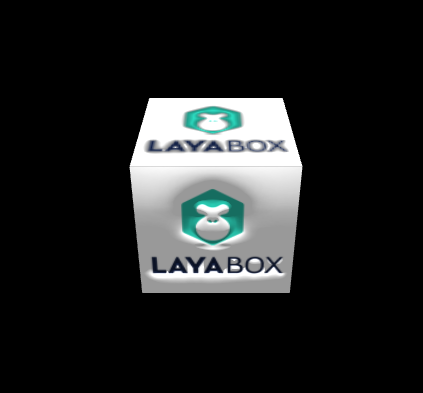

## LayaAir3D material light color and texture

### Material color and texture attributes

The standard of material properties and light color properties have similar, reflected in the diffuse, high light, color and other environmental attributes, but the material including more full, more convenient adjustment object art effects, including reflectance, diffuse color and diffuse, specular and specular color, environment and environment texture, color and reflection reflection mapping, normal map. Here we give a detailed description of these properties.


#### Albedo

Albedo(reflectivity) is the main reflection is the brightness and color of the material, the higher the value, the brighter the material.

The value of the reflectivity is a four-dimensional vector. Look at the following code. The four elements in the vector represent red, green, blue, transparent alpha, respectively.

Transparent alpha effect is defined in percentage, 0 is fully transparent, 1 is opaque, if you need to set to translucent or fully transparent display, only adjust reflectivity is not enough, also need to set the material rendering mode for mixed type to achieve the purpose (Figure 1).

Modify the code in the “Quickstart guide for 3D project” article as follows in Figure 1 effect:

```java
	//Create a standard material
	var material:StandardMaterial = new StandardMaterial();
	//Create a diffuse 2D texture map
	material.diffuseTexture = Texture2D.load("res/layabox.png"); 	

	//Transparent effects can be achieved only by setting the render mode as transparent mixed type
	//Set the material blue stained and 30% translucent
	material.albedo=new Vector4(1,1,2,0.3);
	//Rendering mode (you can also set the value, 5-13, etc. for the mixed type, you can observe the effect of change)
	material.renderMode=StandardMaterial.RENDERMODE_DEPTHREAD_TRANSPARENTDOUBLEFACE;;
	//Assign material to box model
	box.meshRender.material = material;
```

<br>（Picture 1）Reflectance staining and transparency


#### Diffuse color reflection and diffuse map

Diffuse reflectance (diffuseColor) refers to the single color of the material, the art industry can be called the object of the solid color. The diffuse reflectance map (diffuseTexture) refers to the 2D inherent texture of the material, such as wood materials need to use wood texture images, brick wall materials need to use brick wall texture pictures.

The most popular thing in the game is diffuse mapping, and the most powerful one in game art mapping is diffuse reflection, which basically reflects the basic texture of objects.

Diffuse color and texture can also mix in the LayaAir 3D engine, they will have the fusion effect, diffuse color will face light on the model of staining (backlight surface not change), a diffuse light source color similar to light, produce more overall tone (Figure 2).

Modify the code in the “Quickstart guide for 3D project” code in the course is as follows, create a blue diffuse color, by the blue side of the light, see (Figure 2) effect:

```java
	//Add directional light (light color and material color fusion, changing light color to black and white gray, and can not exposure excessive)
	var directionLight:DirectionLight = scene.addChild(new DirectionLight()) as DirectionLight;
	directionLight.ambientColor = new Vector3(0.5, 0.5, 0.5);
	directionLight.specularColor = new Vector3(0, 0, 0);
	directionLight.diffuseColor = new Vector3(1, 1, 1);
	directionLight.direction = new Vector3(0.5, -1, 0);	

	//Create a standard material
	var material:StandardMaterial = new StandardMaterial();
	//Create a diffuse color
	material.diffuseColor=new Vector3(.5,.5,2);
	//Create a diffuse 2D texture map
	material.diffuseTexture = Texture2D.load("res/layabox.png");
	//Assign the material to the box model
	box.meshRender.material = material;
```

<br>（Picture 2）Diffuse color and texture mixed blend


#### High light color and specular map

高光色（specularColor )与灯光高光色一样，是指模型物体转角处，或正对着光源处产生的高光颜色。

模型上的高光色受灯光与材质高光色同时影响，如果无灯光或灯光的高光色为黑色，那么即使材质上设置了高光色与高光贴图，模型上的高光同样不会出现。

高光贴图（specularTexture)是一张2D纹理图片，图片中的像素颜色代表着相应模型处的高光颜色和亮度，像素颜色越亮，在像素处的模型高光越亮。

当然，高光色与高光贴图可以同时使用，效果可能会更好，开发者们可以反复测试，调节出需要的效果。

修改“快速开启3D之旅”课程中的代码，在场景中加载一辆卡车，可观察一下使用了高光色、高光贴图，并与默认只使用灯光高光进行一下对比，代码如下

```java
	......
	//创建平行光 -------------------
	var light:DirectionLight = scene.addChild(new DirectionLight()) as DirectionLight;
	//修改灯光方向
	light.direction = new Vector3(0.3, -1, 0);
	//设置高光色为白色
	light.specularColor=new Vector3(1,1,1);
			
	//加载导出的卡车模型
	var role3D:Sprite3D=Sprite3D.load("LayaScene_truck/truck.lh");
	//模型与材质加载完成后回调
	role3D.on(Event.HIERARCHY_LOADED,null,function():void
	{
		//获取模型
		var meshSprite3D:MeshSprite3D=role3D.getChildAt(0).getChildAt(0) as MeshSprite3D;
		//从模型上获取共享材质
		var sharedMaterial:StandardMaterial=meshSprite3D.meshRender.sharedMaterial;
		//修改材质的高光颜色，让高光处偏红
		sharedMaterial.specularColor=new Vector4(1,0,0,1);
		//加载高光贴图（与漫反射一致，也可单独制作高光贴图）
        sharedMaterial.specularTexture=sharedMaterial.diffuseTexture;
      	//sharedMaterial.specularTexture=Texture2D.load("LayaScene_truck/Assets/texture/t0200.png");
	});
	scene.addChild(role3D);
```
编译上述代码，（图3）中使用了材质高光色与高光贴图，效果更好。（图4）中只使用了灯光的默认白色高光色，效果一般。

<br>（图3）

<br>（图4）


#### 环境色与环境贴图

环境色(ambient)与灯光环境色一样，是对材质进行颜色融合染色，使材质趋于某种颜色色调，同时还能对材质进行提亮，模拟灯箱发光效果。

环境贴图( ambientTexture)也是一张2D纹理图片，在LayaAir引擎中暂时取消了环境贴图对模型的影响，后续版本会增加自发光贴图用于替换，目前请暂时用环境色处理模型 。

修改“快速开启3D之旅”课程中的代码如下可得到（图6）效果：

```java
	//添加方向光（灯光色会与材质色融合，因此改灯光色为黑白灰色，且不能曝光过度）
	var directionLight:DirectionLight = scene.addChild(new DirectionLight()) as DirectionLight;
	directionLight.ambientColor = new Vector3(0.5, 0.5, 0.5);
	directionLight.specularColor = new Vector3(0, 0, 0);
	directionLight.diffuseColor = new Vector3(1, 1, 1);
	directionLight.direction = new Vector3(0.5, -1, 0);	

	//创建标准材质
	var material:StandardMaterial = new StandardMaterial();
	//创建漫反射二维纹理贴图
	material.diffuseTexture = Texture2D.load("res/layabox.png");
	//创建漫反射二维纹理贴图
	material.diffuseTexture = Texture2D.load("res/layabox.png");
	//设置环境色，提亮模型
	material.ambientColor =new Vector3(2,2,2);
	//为box模型赋材质
	box.meshRender.material = material;
```

<br>（图5）固定灯光下，材质未使用环境颜色

<br>（图6）固定灯光下，材质使用环境颜色提亮


#### 反射颜色与反射贴图 

反射颜色(reflectColor)类似于环境颜色，会对材质整体进行颜色融合染色。

反射贴图( reflectTexture)我们一般是采用一套盒子纹理贴图TextureCube，它会对模型进行整体包裹，模拟周边环境反映在模型上的效果。

反射贴图显示效果同时也与反射率albedo、渲染模式renderMode相关。

渲染模式必须改为双面不透明才能显示反射贴图（StandardMaterial.RENDERMODE_OPAQUEDOUBLEFACE）。

反射率albedo数值越高，反射贴图效果越小，漫反射贴图效果越强，可根据实际的模型材质效果调节，比如水面、镜面、金属面可调节不同的反射率达到需求。

 修改“快速开启3D之旅”课程中的代码如下，为了更好的观察反射效果，使用球形模型。运行后可得到（图7）效果：

```java
	//添加方向光
	var directionLight:DirectionLight = scene.addChild(new DirectionLight()) as DirectionLight;
	directionLight.ambientColor = new Vector3(0.5, 0.5, 0.5);
	directionLight.specularColor = new Vector3(0.5, 0.5, 0.5);//为球体增加高光
	directionLight.diffuseColor = new Vector3(1, 1, 1);
	directionLight.direction = new Vector3(0.5, -1, 0);	

	//添加自定义模型
	var sphere:MeshSprite3D = scene.addChild(new MeshSprite3D(new SphereMesh())) as MeshSprite3D;
	sphere.transform.rotate(new Vector3(0,45,0),false,false);
			
	//创建标准材质
	var material:StandardMaterial = new StandardMaterial();
	//创建漫反射二维纹理贴图
	material.diffuseTexture = Texture2D.load("res/layabox.png");
			
	//降低反射率，加强反射贴图反射
	material.albedo=new Vector4(0.2,0.2,0.2,0);
	//设置渲染模式为双面不透明(否者无法显示反射贴图)
	material.renderMode=StandardMaterial.RENDERMODE_OPAQUEDOUBLEFACE;
	//创建反射贴图，用立方体全视角贴图进行赋值（类似于360全景包裹）
	material.reflectTexture = TextureCube.load("skyBox/skyCube.ltc");
			
	//为球型模型赋材质
	sphere.meshRender.material = material;
```

<br>（图7）反射贴图


#### 法线凹凸贴图

法线凹凸贴图(normalTexture)在3D中有着非常重要的作用，模型表现的精细程度主要受法线贴图影响，它能模拟高精度、高面数模型的细节，大大提升游戏画面品质。当然，如果使用法线贴图，对硬件的性能要求随之提高。

法线贴图为美术设计师提供，他们靠两种方法制作，一种是在3D制作软件中模型高模烘焙出低模使用的法线贴图，工作量巨大；一种是用漫反射贴图通过一些工具转化成法线贴图，工作量小，但效果比烘焙方法稍差。法线贴图效果如（图8）所示，它是用漫反射贴图转化而成。

<br>（图8） 


如果需要使用法线贴图在开发过程中需注意以下问题：

1．法线贴图对模型数据有一定的要求，如果模型上没有切线信息将无法产生法线凹凸的效果。例如LayaAir 3D引擎中自带的各种Mesh网格类型BoxMesh、SphereMesh、CylinderMesh等是没有切线信息的，即使使用了法线贴图也不会在视图中显示出凹凸。

2．如果需要使用法线贴图，且模型是通过LayaAir的unity插件中导出，在Mesh Setting网格设置时需要注意不能勾选“忽略切线”选项，如（图8）。

<br>（图9）

3．如果需要使用法线贴图，游戏场景中必须使用灯光，否则模型上也不会产生凹凸效果。


我们从unity3D中创建一个Cube模型（unity中创建的模型带切线信息），并赋上漫反射贴图与法线贴图后用LayaAir导出插件导出数据并使用，法线贴图也会自动加载到模型上。修改“快速开启3D之旅”课程中的代码如下，编译运行后见（图10）凹凸效果。

```java
	//添加方向光
	var directionLight:DirectionLight = scene.addChild(new DirectionLight()) as DirectionLight;
	directionLight.ambientColor = new Vector3(0.5, 0.5, 0.5);
	directionLight.specularColor = new Vector3(0.5, 0.5, 0.5);//为球体增加高光
	directionLight.diffuseColor = new Vector3(1, 1, 1);
	directionLight.direction = new Vector3(0.5, -1, 0);	

	//创建unity中导出的模型
	var box:Sprite3D=Sprite3D.load("layaScene_box/box.lh");
	//也可以代码加载法线贴图
//	box.on(Event.HIERARCHY_LOADED,null,function():void
//	{
		//按角度旋转模型
//		box.transform.rotate(new Vector3(0,0,180),true,false);
		//从模型中获取meshSprite3D对像
//		var meshSprite3D:MeshSprite3D=box.getChildAt(0) as MeshSprite3D;
		//获取模型的材质实例
//		var material:StandardMaterial=meshSprite3D.meshRender.material as StandardMaterial;
		//为材质添加法线贴图
//		material.normalTexture=Texture2D.load("layaScene_box/Assets/texture/layabox_normal.png");
//	});
	//加载到场景中
	scene.addChild(box);
			
```

<br>（图10）法线贴图


### 导出的材质文件.lmat修改

经过对材质光色与贴图属性的了解，我们了解了怎么通过代码修改物体的材质属性与贴图，灵活的去控制需要达到的效果。

不过目前美术上的效果基本都是通过unity编辑器去实现，然后导出数据进行使用。因为目前LayaAir 3D引擎正在完善中，又因H5游戏引擎的特点，不能完全包括unity中所有材质类型与属性，因此在unity中的效果与在实际游戏中的效果会有所差别。

未来的版本中，我们将用插件的方式在unity中创建专用的LayaAir标准材质供开发者们使用，这样可以使在unity中制作的美术效果与游戏的效果完全一致，方便开发者们使用。

那么在等待的这个期间，我们怎么去修改并达到一些美术效果呢？在unity中每一个材质在导出时都会生成.lmat格式文件，我们可以修改材质.lmat文件方式进行调整美术效果。

例如我们通过下例代码，加载一个场景，然后先通过光照设置达到夜晚效果（图11）。

```java
		......	
		//添加3D场景
		var scene:Scene = Scene.load("LayaScene_loveScene/loveScene.ls");
		Laya.stage.addChild(scene);
			
		//创建摄像机(横纵比，近距裁剪，远距裁剪)
		var camera:Camera = new Camera( 0, 0.1, 1000);
		//加载到场景
		scene.addChild(camera);
		//移动摄像机位置
		camera.transform.position=new Vector3(-8, 4, 20);
		//旋转摄像机角度
		camera.transform.rotate(new Vector3( -8, -25, 0), true, false);
		//设置摄像机视野范围（角度） 
		camera.fieldOfView=35;
		//加入摄像机移动控制脚本
		camera.addComponent(CameraMoveScript);
			
		//创建平行光 -------------------
		var light:DirectionLight = scene.addChild(new DirectionLight()) as DirectionLight;
		//修改灯光方向
		light.direction = new Vector3(0.3, -1, 0);
		//设置为无高光
		light.specularColor=new Vector3(0,0,0);
		//设置环境光偏暗蓝
		light.ambientColor=new Vector3(0.2,0.2,1);
		//设置漫反射光偏暗
		light.diffuseColor=new Vector3(0.5,0.5,0.5);

```
<br>（图11）

根据上图所示，如果需要把“Love”形模型变为灯箱的亮度，通过代码修改相对麻烦，相对简单的方式是修改它所对应的材质文件.lmat，打开材质文件观察，可以发现材质文件中存储的就是各种光色属性与贴图（图12），我们修改盖材质的环境光颜色为"1.5,1.2,1.2"，刷新网页文件就可以看到效果，模型变亮了达到灯箱的效果（图13）。

<br>（图12）

<br>（图13）

通过以上的方法可以调节场景中的各种材质属性，使之达到美术所需效果。当然，我们更期待后续的unity中LayaAir专属材质，直接在unity中编辑与游戏中一致的最终效果。

