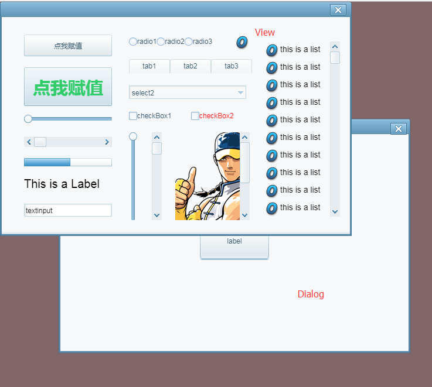

# Set the display object hierarchy on top of Dialog

在项目开发中通常都会用到弹出对话框以及对话框的拖动、模式窗口等功能；也就是Dialog组件。

开发者在使用的过程中可能会遇到一个常见问题，就是当Dialog页面弹出之后，如果想点击该页面上的某个按钮显示其它页面，这时候会发现要显示的那个页面并没有显示出来，这是为什么呢？

是因为在对话框管理器DialogManager类里边设置了dialog的默认层级为1000，所以如果想让显示对象显示在Dialog之上的话则需要**设置该显示对象的层级zOrder>1000**。否则最后要显示的页面就会被Dialog遮盖。关键代码以及效果如下所示：

```typescript
//实例化Dialog页面
var dia:TestDialogUI = new TestDialogUI();
//显示对话框（以模式窗口方式显示）
dia.popup();
//显示对话框（以非模式窗口方式显示）
//dia.show();
//点击对话框上的按钮弹出另外一个UI页面
dia.btn.on(Event.CLICK,this,onClick);
private function onClick():void
{
    // TODO Auto Generated method stub
    //实例UI界面
    var testView:TestView = new TestView();
    Laya.stage.addChild(testView);
  	//设置该页面的层级>1000
    testView.zOrder = 1001;

}
```


