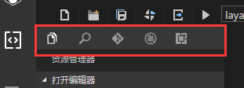

# Toolbar utilities introduction

### In this chapter, we'll introduce toolbars in code patterns:

 
​        	(Figure 1) toolbar panel

## 1. Project manager switch button

​        When you click the button on the toolbar, it switches to the project manager's function panel.

 
​        	(Figure 2) Project panel

 

## 2. Search button

  
​        	(Figure 3) search function

 　　Click the search button, you can switch to the search window, enter the keyword and then click on the right side of the search options button in the search bar. You can get all contains of file and location with the specific line, including quantity, but also the function of the view window to highlight the key. The search bar on the right side, Aa button is case sensitive search, Ab's role button is to match  non sensitive case words. the right side of the function button is to use regular expression search.

 

 

## 3. GIT button

​        When the button is clicked, the resource view window is converted to the GIT window. You can set your GIT address in the GIT window to facilitate quick submission of versions for team operations.

​          
​        	(Figure 4) GIT switch button

 

## 4. Debug button

​        The button changes the resource view window into a debug window. You can quickly view and monitor variables and functions in the debug window. At the same time you can also customize the breakpoint location based on the function name.

  
(Figure 5) Debug button

 
(Figure 6) debug the monitoring area

​         At the same time you can move the mouse to  the header row column window, will display a "+" icon, click to add a custom variable or function to be monitored.

 

## 5. Expansion button

 
(Figure 7) to search for extended function panels 

Click this button to open the VScode Extended Features panel and search for extensions and installs in the vscode app store.
