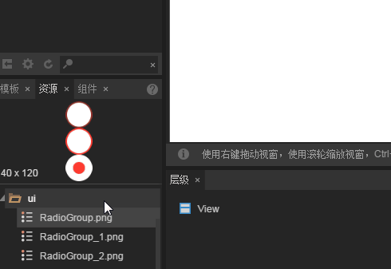

# RadioGroup component

> Because many component properties are generic, common and generic component attributes have been introduced in the `Property Setter`. Please read the 《Property Setter》 document before reading this article.

## 1. Understanding RadioGroup components

### 1.1 RadioGroup components

RadioGroup is a radio frame button group, and the component options within the button group repel each other. The user can only select a Radio component at a time. As shown in figure 1.
 （Picture 1）

### 1.2 Skin specification (skin) for RadioGroup components

The skin of the RadioGroup component is `RadioGroup` Or to `RadioGroup_` Naming the prefix, in the skin design specification, is a vertically equal two state diagram or three state diagram, as shown in figure 2.

  (Picture 2) Three state RadioGroup skin

*Tips：The skin of the RadioGroup component cannot use the nine cell attribute, so the size of the actual application should be determined when the resource is designed.*

### 1.3 Introduction of API for RadioGroup component

  RadioGroup API introduction, please refer to [ http://layaair.ldc.layabox.com/api/index.html?category=Core&class=laya.ui.RadioGroup](http://layaair.ldc.layabox.com/api/index.html?category=Core&class=laya.ui.RadioGroup)。

## 2. Creating RadioGroup components through LayaAirIDE

### 	2.1 Creating RadioGroup

​        Click on the RadioGroup component resource in the resource manager and drag it to the scene editor, which creates a RadioGroup component successfully in the page. As shown in figure 3.
​         （Picture 3）

### 2.2 Adding a radio box through labels.

​       As shown in Figure 3, there are only two radio frames in the default radio frame group. If you want to add a radio box, you just add a new tag in the labels property, and modify the label content is set in the property, as shown in figure 4-1.

​          （Picture 4-1）

### 2.3  Changing the layout direction and spacing of the radio frame group RadioGroup

 RadioGroup The default is horizontal layout（*horizontal*）, Vertical layout is achieved by changing the direction property（*vertical*）. Set spacing can be achieved by space attribute. As shown in figure 4-2.
   （Picture 4-2）

### 2.4 Set default options for setting up a radio frame group RadioGroup

The selectedIndex attribute is used to change the index value of the radio box group. When the default is not set, no options are selected. If you want to set the default check of RadioGroup, you can set the attribute value of selectedIndex, 0 for first radio frames, 1 for second radio frames...... And so on。

Suppose we set the attribute value to 0, the running effect is shown in figure 4-3.
   （Picture 4-3）

### 

## 3. Creating custom RadioGroup components

​	In this case, we use the same radio resource box and generate three sub projects by setting the labels radio button group. However, in the actual game, in the same RadioGroup component in the radio box style has different needs, then through the labels set way is unable to achieve the effect, at this time you need to use the custom RadioGroup component way.

### 3.1 Preparing art resources

​	We use two different ones `radio box` Art resources to form `Custom RadioGroup components`, The resources are shown in figure 5.

​             （Picture 5 ）

**Tips**：

Special attention should be paid to the naming rules of skin pictures. We can't use them in custom RadioGroup components `RadioGroup` or `RadioGroup_` prefix. Because the Radio radio widget is used as its child component, the name of the picture resource in this example is prefixed with `radio_` prefix.

### 3.2 Creating Radio components in IDE

The resource Explorer folder copied to the project, and then in IDE, the radio components produced by one by one from the explorer to drag the scene editor, from left to right (or down) the name property of each Radio component, in order to “item0、item1、item2.....”，(do not add name attribute by this rule, the generated RadioGroup component is invalid component, can not run normally)

After setting the text of the label attribute, the font color, size, position relationship of the label tag, and adjusting the position, the effect is shown in Figure 6 and figure 7.

​             （Picture 6）

​             （Picture 7）

​	**Tips：In the name attribute of the custom RadioGroup component, the naming rules are English characters + numbers, and the English characters cannot be underlined. The numbers should begin in order from 0.**

### 3.3 Convert to RadioGroup container

​	When the modified sub item properties, select the component into a container press Ctrl+B, select RadioGroup into the container type and determine, as shown in figure 8.

​             （Picture 8）

​	After the conversion is successful, adjust the default selection index selectedIndex is 0 (the first Radio), as shown in Figure 9, radio frame spacing space, direction direction can not adjust, in the scene editor by mouse adjustment can also.

​             （  Picture 9）

​	Through these steps, you can see that the custom RadioGroup component is successful. By default, the first checkbox is selected and switched to its third frame selection state, and the other checkbox is the unselected state of the first frame.
