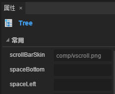

# Tree component reference


## 1. create Tree components through LayaAirIDE

​        Tree component is used to display the tree structure. Users can view hierarchical data that is arranged as scalable trees.
​        Tree script interface of component is referenced [Tree API](http://layaair.ldc.layabox.com/api/index.html?category=Core&class=laya.ui.Tree)。

 

### 1.1 Tree component consists of two parts:

- Item cell (can be Box, page View, custom page);
- Vertical scroll bar VScrollBar；


### 1.2 Tree The cell of the component usually consists of four parts

- A cell selects the state slice animationClip；
- A folded arrow slice animation Clip ；
- A file status slice animation Clip ；
- Cell Other content elements;


### 1.3 Tree Sample image resource for the component

1. Cell Selection Status Slice Animation Clip Resources:
   The number of slices is 2, and the slice index, starting from 0, in turn represents: the cell is unchecked, the cell is selected or hovered.
   ​        <br/>
   ​    （Picture）
2. Fold Arrow Slice Animation Clip Resources:
   The number of slices is 2, and the slice index is 0 in order. The folder node is in a folded state, and the folder node is expanded in a state diagram.
   ​        <br/>
   ​    （Picture ）
3. File Status Slice Animation Clip Resources:
   If the number of slices is 3, then the slice index from 0 in turn represents: folder node folding state diagram, folder node expansion state diagram, non-folder node state diagram;
   If the number of slices is 2, the slice index, starting from 0, in turn represents: a folder node state diagram, a non-folder node state diagram;
   ​        <br/>
   ​    （Picture）


### 1.4 Create the Tree component

 ####1. Edit the list of Tree components.

   The list item can be a Box type, a View type, or a custom page type. Take the Box type for example.
   a.Select a slice animation (Clip component) that draws a cell selection state from the resource panel. Set the name attribute value of the Clip component object to selectBox, and set the value of the attribute clipY to 2;
   *Note: the state of the animation slice (Clip components) name object attribute value must be set to selectBox, this program can only identify it, and display the state of the unit selection follow this Clip component object and the function change, otherwise the Clip objects will be identified for the ordinary object display unit.*

​        <br/>
​    （Picture）


   b.From the resource pane, select and drag the folding arrow slice animation (Clip component) of a cell, set the Clip component object's name attribute value to arrow, and set the value of the attribute clipY to 2;
   *Note: the name attribute value of the folding arrow slice animation (Clip component) here must be set to arrow. Only in this way can the program recognize it and click on the Clip object to open or collapse the tree node function. Otherwise, the Clip object will be recognized for the ordinary display object of the unit item.。*
​        <br/>
​    （Picture）
   c.From the resource panel, select and drag a cell's file state slice animation (Clip component), set the Clip component object's name attribute value of folder, set the attribute clipY value of 3;
   *Note: the file status animation slice (Clip components) value of the name property must be set to folder, this program can only recognize it, and realize the Clip component object display of the folding and unfolding, follow the node type unit item (whether word node) change function. Otherwise, the Clip object will be recognized for the ordinary display object of the unit item.*
​        <br/>
​    （Picture）

    d.ordinary display object dragged into this unit item.
   Here, take Label as an example, select and drag into a Label component object from the resource panel, where you set the attribute for this Label object, name value is label, which is convenient to assign to it in the script. This name attribute value can be customized. Then set the Label object to display the relevant attributes to make it look more beautiful.

​        <br/>
​    （Picture）
   e.Select all the component objects of the above edit, use the shortcut key Ctrl + B or choose **\*Menu - > Edit > into container*** options, open to convert the container settings panel, select the container type is Box, and then click the button to complete the Box container to add.
​        <br/>
​    （Picture）

​    

####2. Convert to Tree container.
   Select the list render item object and use the shortcut key Ctrl + B Or choose **Menu - > Edit - > into container** Options, open to convert the container settings panel, select the container type is Tree, and then click the button to complete the Tree container to add.
​           <br/>
   ​    （Picture）

####3. Specifies a list rendering item for the Tree component.
  Double click the Tree component object and edit it into the Tree object. Set the attribute of the list rendering item of the Tree component. The value of name is render.
   *Note: the value of the rendering item property name in this list must be render, otherwise the program will not be recognized.*
   ​        <br/>
   ​    （Picture）

####4. Adding scroll bars for Tree components.
   Select a VScrollBar component from the resource panel and set the resource address (skin attribute value) of the VScrollBar component to the value of the Tree component property scrollBarSkin.
​           <br/>
   ​    （Picture）

####5. Adjust the width of Tree.
​	Set the value of the Tree object var (global reference name) m_tree, where the name can be customized, the purpose is to script the Tree component object assignment.
​           <br/>
​       （Picture）

####6. Assigning Tree objects in code

```javascript
//Tree structured data source
var xmlString:String="<data>"+
                        "<dir label='box1' isOpen='true'>"+
                            "<file label='child1 ' isOpen='true'/>"+
                            "<file label='child2 ' isOpen='true'/>"+
                            "<file label='child3 ' isOpen='true'/>"+
                            "<file label='child4 ' isOpen='true'/>"+
                            "<file label='child5 ' isOpen='true'/>"+
                        "</dir>"+
                        "<dir label='box2' isOpen='true'>"+
                            "<file label='child1 ' isOpen='true'/>"+
                            "<file label='child2 ' isOpen='true'/>"+
                            "<file label='child3 ' isOpen='true'/>"+
                            "<file label='child4 ' isOpen='true'/>"+
                            "<file label='child5 ' isOpen='true'/>"+
                        "</dir>"+
  					"</data>";
//解析xml字符。 
var xml:* = domParser.parseFromString(xmlString, "text/xml");
//设置 m_tree 的数据源。
m_tree.xml =xml;
```
#### 7. Run the view effect in the program.

​           <br/>
   ​    （图）

### 1.5 Common attributes of Tree components

​        <br/>
​    （Picture）

 

| **Attribute**        | **Functional description**          |
| ------------- | ----------------- |
| scrollBarSkin | Scrollbar skin            |
| spaceBottom   | The distance between each item. Unit is pixel |
| spaceLeft     | Left indent distance. Unit is pixel     |


##  2. Create Tree components through code

​	When we write code, we can't control UI by code, create UI_Tree class, import `laya.ui.Tree` package in code, and set Tree related attributes by code.

**Run example effect ：**
​	<br/>
​	(Figure 5) creating Tree through code

​	Other properties of Tree can also be set up by code. The following example code demonstrates how to create Tree for different skins (styles) through code,

Interested readers can set up Tree by themselves to create folders that match their own needs.

**Sample code：**

```javascript
package
{
	import laya.display.Stage;
	import laya.ui.Tree;
	import laya.utils.Browser;
	import laya.utils.Handler;
	import laya.utils.Utils;
	import laya.webgl.WebGL;

	public class UI_Tree
	{
		public function UI_Tree()
		{
			// 不支持WebGL时自动切换至Canvas
			Laya.init(800, 600, WebGL);
			//画布垂直居中对齐
			Laya.stage.alignV = Stage.ALIGN_MIDDLE;
			//画布水平居中对齐
			Laya.stage.alignH = Stage.ALIGN_CENTER;
			//等比缩放
			Laya.stage.scaleMode = Stage.SCALE_SHOWALL;
			//背景颜色
			Laya.stage.bgColor = "#232628";
			//图像资源
			var res:Array = [
				"../../../../res/ui/vscroll.png", 
				"../../../../res/ui/vscroll$bar.png", 
				"../../../../res/ui/vscroll$down.png", 
				"../../../../res/ui/vscroll$up.png", 
				"../../../../res/ui/tree/clip_selectBox.png", 
				"../../../../res/ui/tree/clip_tree_folder.png", 
				"../../../../res/ui/tree/clip_tree_arrow.png"
			];
			//加载资源
			Laya.loader.load(res, new Handler(this, onLoadComplete));
		}
		
		/***加载资源完成***/
		private function onLoadComplete(e:*=null):void
		{
			// 组装tree的数据
			var treeData:String = "<data>";
			//外层循环为树的父节点（相当于文件夹）
			for(var i:int = 0; i < 5; ++i)
			{
				treeData += "<dir label='Directory " + (i + 1) + "' isOpen='true'>";
				//内层循环为子节点（相当于文件）
				for(var j:int = 0; j < 5; ++j)
				{
					treeData += "<file label='File " + (j + 1) + "'/>";
				}
				treeData += "</dir>";
			}
			treeData += "</data>";
			// 把数据转化成xml格式
			var xml:* = Utils.parseXMLFromString(treeData);
			//实例化树结构
			var tree:Tree = new Tree();
			//滚动条资源
			tree.scrollBarSkin = "../../../../res/ui/vscroll.png";
			//设置单元格为Item类（只能用类，不能用实例的对象）
			tree.itemRender = Item;
			
			//对树形结构赋值
			tree.xml = xml;
			//修改大小
			tree.size(300, 300);
			//修改树的位置
			tree.x = (Laya.stage.width - tree.width) / 2;
			tree.y = (Laya.stage.height - tree.height) / 2;
			//加载到舞台
			Laya.stage.addChild(tree);
		}	
	}
}


import laya.ui.Box;
import laya.ui.Clip;
import laya.ui.Label;

// IDE中生成的此类对应的json对象，在此作为参考，对应树形结构中的单元格Item类
// {"child": [{"type": "Clip", "props": {"x": "13", "y": "0", "left": "12", "height": "24", "name": "selectBox", "skin": "ui/clip_selectBox.png", "right": "0", "clipY": "2"}}, {"type": "Clip", "props": {"y": "4", "x": "14", "name": "folder", "clipX": "1", "skin": "ui/clip_tree_folder.png", "clipY": "3"}}, {"type": "Label", "props": {"y": "1", "text": "treeItem", "width": "150", "left": "33", "height": "22", "name": "label", "color": "#ffff00", "right": "0", "x": "33"}}, {"type": "Clip", "props": {"x": "0", "name": "arrow", "y": "5", "skin": "ui/clip_tree_arrow.png", "clipY": "2"}}], "type": "Box", "props": {"name": "render", "right": "0", "left": "0"}};

/****树形结构中的单元格****/
class Item extends Box
{
	public function Item()
	{
		//实例“文件夹”背景切片对象
		var selectBox:Clip = new Clip("../../../../res/ui/tree/clip_selectBox.png", 1, 2);
		//设置 selectBox 的name 为“selectBox”时，将被识别为树结构的项的背景。2帧：悬停时背景、选中时背景。	
		selectBox.name = "selectBox";
		selectBox.height = 32;
		selectBox.x = 13;
		selectBox.left = 12;
		addChild(selectBox);
		
		//实例“文件夹”图标切片对象
		var folder:Clip = new Clip("../../../../res/ui/tree/clip_tree_folder.png", 1, 3);
		//设置 folder 的name 为“folder”时，将被识别为树结构的文件夹开启状态图表。2帧：折叠状态、打开状态。
		folder.name = "folder";
		folder.x = 14;
		folder.y = 4;
		addChild(folder);
		
		//实例文件夹名字文本或子节点名字文本对象
		var label:Label = new Label();
		//设置 label 的name 为“label”时，此值将用于树结构数据赋值。
		label.name = "label";
		label.fontSize = 20;
		label.color = "#FFFFFF";
		label.padding = "6,0,0,13";
		label.width = 150;
		label.height = 30;
		label.x = 33;
		label.y = 1;
		label.left = 33;
		label.right = 0;
		addChild(label);
		
		//实例左边折叠小三角箭头对象
		var arrow:Clip = new Clip("../../../../res/ui/tree/clip_tree_arrow.png", 1, 2);
		//设置 arrow 的name 为“arrow”时，将被识别为树结构的文件夹开启状态图表。2帧：折叠状态、打开状态。
		arrow.name = "arrow";
		arrow.x = 0;
		arrow.y = 5;
		addChild(arrow);	
	}
}


```


 
