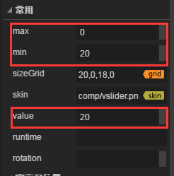

# VSlider 组件参考

## 1、了解VSlider组件

### 1.1 VSlider的作用与效果演示

​	HSlider与VSlider组件都是Slider组件的子类，它们分别表示横向滑动条与纵向滑动条。用户可以通过在滑块轨道之间移动滑块来选择值。常用于如播放器进度控制、音量大小控制，一些UI上的数值调整等。

​      VSlider 组件采用纵向排列。滑块轨道从上向下扩展，而显示数值的标签位于轨道的右边部分，可隐藏。

​       
​    （图1）

### 1.2 VSlider组件的皮肤（skin）规范

​	VSlider资源命名规以vsliser为前缀名，它的默认资源总共3个，分别为滑块资源`vslider$bar.png`、进度条资源`vslider$progress.png` 及底图资源`vsliser.png`。

​	资源至少应当有两个，一个底图资源，一个滑块资源，否则无法实现滑动功能。缺少了进度条资源组件不会报错，只是不显示进度。

 	tips：进度条资源`vslider$progress.png`可以与底图资源`vsliser.png`互换，互换后进度可以反向显示。

 
​    （图2）

### 1.3 VSlider组件的API介绍

VSlider的API介绍请参考 [http://layaair.ldc.layabox.com/api/index.html?category=Core&class=laya.ui.VSlider](http://layaair.ldc.layabox.com/api/index.html?category=Core&class=laya.ui.VSlider)。

## 2、通过LayaAirIDE创建VSlider组件

### 1.1 创建VSlider

​        点击选择资源面板里的 VSlider 组件资源，拖放到页面编辑区，即可添加 VSlider 组件到页面上。

​       VSlider 拖放到编辑器区后，设置sizeGrid九宫格属性，使之放大后不会拉伸，缩放后显示效果如下：

​         
​    （图2）

### 1.2 VSlider 组件常用属性

​        VSlider组件与HSlider组件属性全部相同，只是组件的方向上有所变化。

​	同样设置 VSlider 的属性 max 的值为 20、属性 min 的值为0、属性 value 的值为5后，显示效果如下：

​         
​    （图3）

**max：**HSlider滑块拖动到最右边时的最大值，默认数值为100；

**min：**Hslider滑块拖动到最左边时的最小值，默认为0；

**value：**滑块目前所处的数值，应当等于max或min，或是它们之间的值。

​         
​    （图4）

​        在程序中运行时，可以拖动滑块来选择值：

​         
​    （图5）

### 1.3 用VSlider制作音量控制条

在游戏开发或一些其他软件中，用VSlider制作音量控制器很常见。但是如图5所示，并不是我们所需要的效果，进度条方向和大小值全部反过来了。正常的是音量最大值应当在最上方，最小值应当为最下方，进度条也应当是由下向上变化。

其实要达到正常的效果非常简单，首先就是max与min属性可以反过来设置，例如我们设置max为0，min为20，然后value值默认设置为最大20。

​         
​    （图6）

其次是进度条的方向，把进度条资源和底图资源的命名交换一下（图7），刷新IDE并发布，编译运行后我们可以看到进度的方向就是由下而上了！也达到了我们需要的音量控制器效果。

​         
​    （图7）

​          
​    （图7）

### 1.4 VSlider 组件特殊其他属性

 通用其他属性在”属性设置器“中已有详细介绍，下列为关于HSlider组件相关的特殊属性。

| **属性**         | **功能说明**                          |
| -------------- | --------------------------------- |
| allowClickBack | 一个布尔值，指定是否允许通过点击滑动条改变 value 属性值。  |
| showLabel      | 一个布尔值，指定是否隐藏在滑块上方显示value值的标签。     |
| tick           | 滑动条的刻度值，是指滑块每次拖动的value值改变量。默认值为1。 |

 
