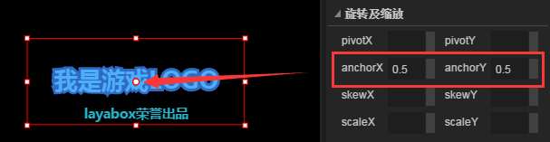

# Attribute setter

​         The attribute setter is the working area where we view and edit the component properties of the currently selected component. When you select components in the scene editor or the hierarchy manager, you will display the properties of the component in the attribute setter for query and edit.

Attribute setter panel shown in Figure 1, from top to bottom are usually: component or node name, **common** attributes, **commonly used**attributes, **width and height**, **location, rotation** , **scaling** and so on

  
​  (Figure 1) attribute panel grouping

## 1. Introduction of  `public` properties

Common attributes are usually `var`,`name`,`renderType`. As shown in Figure 2-1.

   (picture 2-1)

### 1.1 Set the global variable name

`Var` ：Creates a unique global variable name that is used to invoke this component in the code of the project.

### 1.2  Set the component identification name

`name`： the identity name of a component, which is usually used to distinguish other components in a hierarchical manager, and its parent container can also find this component by this name.

### 1.3 Set the node function type of the component

`renderType`：node function types, respectively, mask, hit, unHit, render, instance five kinds.

#### 1.3.1 Set as mask

　　When the component is set to `mask`, the component is masked, its **parent component** only mask mask area is visible, the effect shown in Figure 2-2.

　　   （Picture 2-2）

#### 1.3.2 Settings click area and non click area

　　When the component is set to `hit`, the parent component region in which the component is located can be clicked. When the component is set to `unHit`, the parent component area of the component is non-clicked area.**If the component of the point area hit is superimposed with the component of the non click area unHit**, the unHit priority is higher in the non clickable region. As shown in Figure 2-3, the non clickable region of the green circle (unHit), including a overlapping mouth area, can not be clicked. Only the red half moon area of the head can be clicked.

　　  (Picture 2-3)

#### 1.3.3  Set to List for render

　　When the component is set to `render`, the component can be rendered repeatedly for the production of List List. In the production of the list of ideas, the need to first select all components through ctrl + B Set to box container. And set the renderType property of the container to render. And then use ctrl + B to set the box as a List. As shown in Figure 2-4.

  (Picture 2-4)

#### 1.3.4 Set to single instance instance

　　When the component is set to `instance`, the component is a single instance component, and when multiple instances are reused, the singleton component will only be instantiated once. Save performance overhead.

　　

## 2. Introduction of `common` attributes

In the commonly used attributes, there are some operations are generic. Let's introduce them separately.

### 2.1 Scale grid operation (sizeGrid)

The UI is divided into 9 blocks by four straight lines. If there is a stretching operation for UI, the middle area for the calculation of the fill, and the rest of the region will maintain the original design, no matter how stretched UI will remain unchanged. It is a common function in game development.

The `sizeGrid`attribute in the commonly used attributes is the setting of the nine squares. By clicking the `grid`button on the right side of the attribute input column, you can enter the visual operation panel set up by the square lattice. As shown in figure 3-1.

   (Picture 3-1)

When you open the nine square settings, the left side is the effect preview area, the right side is the nine square visual operation area. Through the mouse drag and drop way to change the nine square filling area, immediately get preview effect, adjust click click ok. The operation is shown in figure 3-2.

   (Picture 3-2)

### 2.2 Skin Settings

`skin` property can be set to change the skin of the component. In addition to manually in the path attribute column enter the `skin`, also from the Explorer drive directly to the skin property of resource input field, fast switching of the `skin`. In addition, click the skin button on the right of the property input bar, which can quickly locate the current resource from a large number of resources. The operation is shown in figure 3-3.

   (Picture 3-3)

### 2.3 skin state cutting (stateNum)

在Button、checkBox等组件的使用中，组件的皮肤资源是多态竖向排列组成，如图3-4所示。

   (Picture 3-4)

#### The way of skin cutting:

The three state is the skin pictures in the vertical direction to the geometric segmentation form is divided into 3 parts, as shown in Figure 3-4,**from top to bottom up** or `leave the state`of skin,  `, through the state`, ` press and select`（*Keep pressed*）state skin,  three state commonly used in the PC browser.

On mobile devices, usually by only two states, geometric picture was cut into two parts in the vertical direction, the upper part is `up or leave the state` of the skin,  the following part is  `after and press and select the state`（*press down*） skin

Single state without cutting the picture, no matter what state, the skin is only one, remain unchanged.

#### Specified skin with stateNum by several states:

For components that have status differences, the attribute values of stateNum determine the way to cut skin resources pictures. The default stateNum attribute value is 3, that is to say, the default is cut by the 3 State button, and the geometric segmentation is divided into 3 parts. If it is a two state button, you need to set the attribute value of stateNum to 2, and cut it into 2 parts. The single button is set to 1, not cut.
  

　It should be noted that, specify the button state, need to correspond to the button skin. If it is a tri-state button skin, stateNum is set to 2, as shown in Figure 3-5 after cutting, is wrong.

   (Picture 3-5)

### 2.4 Powerful runtime properties

`runtime`is a very powerful component extension in the Property Manager. By setting the logical class in the runtime property, the instance is no longer the visual class of the component, but the logical class specified in the runtime property. This attribute needs to specify the full path of the logical class, such as “game.user.player”。

### 2.5 Visualize color settings

The color property is set, you can manually enter the color value, can also click on the right side of the color settings button in the color settings specify the color panel, then click on the outer panel of arbitrary region can complete the visual color settings, such as shown in figure 3-6.

  （Picture 3-6）

### 2.6 Digital drag adjustment

If the attribute value is numeric, there is a drag adjustment panel on the edge of the input box. Many developers are not aware of this trick by adjusting panel click the left mouse button, and then drag up or down, you can fine tune the number of components corresponding to the scene editor will produce instant visual changes. As shown in figure 3-7.

   (Picture 3-7)

### 

## 3、宽高及位置属性

宽高及位置属性在UI制作中有着很重要的作用。主要用于调整位置及UI屏幕适配（图4）。

 （图4）

### 3.1 x、y属性

x与y属性是组件在场景编辑器中的x与y轴坐标。

场景编辑器的左上角为坐标原点`（0, 0）`。 以原点为中心，x轴向右延伸为正坐标增加，y轴向下为正坐标增加。

在`场景编辑器`中选中组件后按住鼠标可以移动修改x与y轴位置，也可以在属性输入框中设置固定值。

### 3.2  width、height宽高属性

在不改变组件大小的情况下，组件的宽高虽会自动计算，但在属性面板中并不会显示出来。当通过约束框或固定值设置对组件进行了缩放重置后，宽高属性会显示出来，同时也可以进行数字的拖拉调节。

不选择任意组件时，当前宽高为页面宽高。

*Tips：部分组件只改能改变约束框大小，实际组件并不会放大，但鼠标点击区域会缩放到约束框的大小，例如CheckBox。*

### 3.3  UI适配属性

`left、right、top、bottom`四个属性主要用于组件与页面边缘距离位置适配。

`centerX、centerY`两个属性主要用于组件与页面中心位置适配。

在游戏开发中，我们不可能把所有屏幕分辨率全部考虑到，有的分辨率高，有的分辨率低。如果游戏项目代码中使用了全屏适配，组件又固定了位置，在不同分辨率的屏幕下就会造成UI组件错位现象。我们需要按以下方式进行调整。

#### 3.3.1 边距位置适配

**设计目标**：在游戏右上角放一个头像，始终保持屏幕上边缘和右边缘50px。

**错误的实现效果**：

如果我们按某一种屏幕分辨率为组件的x与y设置固定值，则会出现动图5-1的效果。与设计目标不符。

  
 (动图5-1) 为组件的x与y设置固定值时，不同屏幕分辨率效果。

**正确的实现效果**：

`left、right、top、bottom`四个属性分别基于父容器的左边缘、右边缘、上边缘、下边缘。所以要实现在不同屏幕分辨率下的相同居右效果，需要设置right与top的属性值，我们把它都设置成50像素。设置后的运行效果如动图5-2所示。

  (动图5-2)

**屏幕适配对边距设置的影响**：

这里特别要注意的是，`left、right、top、bottom`的属性效果是基于父容器（页面）的各个边缘，而不是屏幕的各个边缘。父容器（页面）的分辨率一定要与项目中Laya.init()设置的分辨率相同，如果没有设置成相同，那么并不能实现动图5-2的运行效果。

#### 3.3.2 边距的拉伸适配

除了居于某一个边缘的适配作用外，同时设置left、right、top、bottom的属性值，还可以根据不同屏幕对组件进行拉伸适配。例如我们将left、right、top、bottom的属性值都设置为100，运行后如动图5-3所示。

   (动图5-3)

*Tips：拉伸适配的边距设置方式通常需要结合九宫格来实现。*

#### 3.3.3 中心位置适配

中心适配常用于基于屏幕中间的游戏启动LOGO，弹出提示框等。我们可以通过centerX、centerY进行位置居中设置，如图6-1、6-2所示。

 （图6-1）

 （图6-2）

## 4、旋转及缩放属性

旋转及缩放属性在游戏UI中，特别是在IDE制作动画时经常用到。

#### 4.1 修改轴心点

“轴心点”：组件的旋转或缩放中心点，默认在组件中的原点`（0,0）`点位置。

pivotX、pivotY、anchorX、anchorY四个属性都是用于修改轴心点位置。

pivotX、pivotY（轴心点）是通过改变组件轴心点XY坐标的固定值来修改轴心点位置。

anchorX、anchorY（锚点）是通过X与Y轴的组件宽或高的百分比计算出轴心点坐标位置，如图7所示，宽与高的50%计算出的坐标正好是中心点坐标位置。

 （图7）

**Tips**：*通过锚点是一种非常方便快捷的设置轴心点方式。但是锚点方式只能对UI组件设置轴心点，对于Graphics组件以及Sprite等2D基础组件的轴心点只能通过设置`pivotX与pivotY`的方式实现。*

#### 4.2 修改倾斜角度

skewX、skewY是以轴心点为中心进行水平、垂直角度倾斜，修改属性值效果如动图8所示。

 （动图8） 

#### 4.3 修改组件缩放大小

scaleX、scaleY是以轴心点为中心进行水平、垂直大小缩放。

默认为1，不缩放；正数值越大，缩放尺寸越大。

缩放到0，不可见；

`-1`为**镜像**，效果如动图9所示 。负数值越大，镜像后缩放尺寸越大。

 （动图9） 

**Tips**：*如果轴心点在中心，可以原地镜像，比如角色两个方向可以使用同一个资源实现。*

## 5、其他通用属性介绍

LayaAirIDE提供了大量的组件，它们都有一些相同的其他通用属性，因为它们大都继承于Component组件基类。在这里我们主要介绍一下其他属性中的通用部分，组件本身的特殊属性，我们将在每个单独组件介绍时讲解。

通用属性包括以下几类

显示相关属性：alpha、visible

缓存相关属性：cacheAs、staticCache

鼠标操作相关属性：disabled、gray、htTestPrior、mouseEnabled、mouseThrough

label相关属性：labelAlign、labelColors、labelBold、labelFont、labelPadding、labelSize、labelStroke、labelStrokeColor、strokeColor

### 5.1 显示相关属性

显示相关属性相对比较容易理解，显示对象都具有alpha和visible属性。

`alpha`调整显示对象透明度，数值在0-1之间，0为全部透明，1为不透明，区间内属于不同程度半透明。

**Tips**：显示对象alpha数值无论为多少，如果加了鼠标监听，那么它都支持鼠标事件，哪怕alpha为0的情况下，鼠标事件也会发生。

`visible`控制组件的是否显示，该属性为布尔值，默认值为true，正常显示。当值为false时，组件不显示出来，并且鼠标事件无效果。

*Tips：visible为false时不显示是指在浏览器中运行时不显示，在IDE中设置为false不会即时产生隐藏变化。*

### 5.2 缓存相关属性

关于缓存优化方面的属性，cacheAs、staticCache建议单个组件不要使用，不经常变化的复杂页面时再使用。

**当游戏中有大量的UI，并且一个UI有多个节点，变化较小时，我们推荐使用cacheAs（大部分UI都可以使用）。**

例如我们使用的LayaAirIDE软件，软件中的很多面板，例如属性设置器、资源管理器、项目管理器等，它们的节点子对象很多，但不是很频繁的改动，因此我们都使用了cacheAs进行缓存，提高了渲染效率。

**对于经常变化的复杂UI，可以把UI分成两层，较少变化的一层使用cacheAs，经常变化的层不使用。**例如有“倒计时”显示的UI，我们也可以把它分成倒计时部分和其他部分，其他部分进行cacheAs，倒计时部分不进行cacheAs。

开发时使用cacheAs需认真学习理解，错误的理解和使用缓存机制反而会降低性能。下列是两个主要属性的详细说明：

**cacheAs：**

缓存组件，是否缓存为静态图像，合理作用能提高性能 。它有"none"，"normal"和"bitmap"三个值可选。

**"none选项"：**表示不做任何缓存。

**"normal选项"：**

​	canvas模式下进行画布缓存 ：它相当于把由多个子对象组成的UI缓存成一张位图，游戏每帧渲染时，只是渲染缓存的位图，而不是把所有子对象全部渲染一次，因此节省了渲染开销，提高了性能。

​	webgl模式下进行命令缓存：它相当于只缓存了子对象遍历过程及程序命令组织，未缓存成一张位图，在游戏每帧渲染时，不用再次去遍历子对象，而是直接把子对象按照遍历好的层级进行显卡渲染，它不会减少drawcall，不会增加内存损耗，渲染性能中等。

**Tips**: *cacheAsBitmap属性功能等同cacheAs属性的normal模式，cacheAsBitmap属性为兼容旧版本IDE而保留，当前如果有相关需求，建议使用cacheAs的normal进行设置。*

**"bitmap选项"**：

​	canvas模式下依然是画布缓存。

​	webgl模式下进行renderTarget缓存：它相当于把多个子对象组成的UI 缓存成一张位图并提交给显卡进行每帧渲染，减少了drawcall，渲染性能最高。需注意的是缓存的位图会额外增加一部分内存开销，缓存的位图越大，内存开销越大。且缓存位图大小不能超过2048。这种模式在不断重绘时也会增加CPU的开销。

**Tips**：*当cacheAs选择"normal"和"bitmap"时，子对象发生变化，会自动重新缓存，同时也可以手动调用reCache方法更新缓存。* 

**staticCache：**

设置cacheAs为非"none"时此值才有效，staticCache=true时，子对象变化时不会自动更新缓存，只能通过调用reCache方法手动刷新。

例如一些数据较多的UI，当UI打开在读取数据时，可能会不停的更新UI显示，这时可以设置staticCache为true，当数据读完后，再通过reCache方法一次性把数据读取并刷新。

具体实例请和数据分析请参考“技术文档—2D进阶篇—cacheAs性能优化”

### 5.3 鼠标操作相关属性

鼠标操作相关属性说明及演示效果如下

| **其他属性**     | **功能说明**                                 |
| ------------ | ---------------------------------------- |
| mouseEnabled | 是否接受鼠标事件。 默认为false，如果监听鼠标事件，则会自动设置本对象及父节点的属性 mouseEnable 的值都为 true（如果父节点手动设置为false，则不会更改）。 |
| disabled     | 是否禁用，禁用后变灰，且不接收鼠标事件。                     |
| gray         | 是否变灰，变灰后仍能接受鼠标事件。                        |

 （动图10） 

**mouseThrough：**

组件mouseEnabled=true鼠标可用时，是否可穿透。默认值为false，如果设置为true，则点击空白区域可以穿透过去，只针对自身有效。

**hitTestPrior：**

是否优先检测自己。默认为false， 鼠标碰撞检测是优先检测子对象，然后冒泡到父对象，如果hitTestPrior=true 鼠标碰撞优先检测本对象，本对象被击中后，才进一步检测子对象。 对于已知大小的容器（特别是根容器），默认为false，设置此值为true，能减少节点碰撞，提高性能。

例如一个较复杂的Box，内部有多个子对象，但我们只需要对Box本身进行鼠标监听，因此可以设置hitTestPrior为true，鼠标点击的时候，省去了从子对象冒泡到Box的过程，直接触发了鼠标事件，从而提高了性能。

*Tips：UI的View组件hitTestPrior默认属性值为true。*

### 5.4 label相关属性

很多组件的内部包含了label标签，比如Button、CheckBox、Tab等。它们的其他属性中也有相同的label属性设置，功能说明请看下表

| **属性名**          | **功能说明**                                 |
| ---------------- | ---------------------------------------- |
| labelAlign       | 标签对齐模式，默认为居中对齐。注：在CheckBox中无效            |
| labelColors      | 表示标签各个状态下的文本颜色。 格式: "upColor,overColor,downColor,disableColor"。默认为“蓝色，绿色”。 |
| labelBold        | 表示标签文本标签是否为粗体字。                          |
| labelFont        | 表示文本标签的字体名称，以字符串形式表示。IDE中可选择。            |
| labelPadding     | 表示文本标签的边距。 格式："上边距,右边距,下边距,左边距"。         |
| labelSize        | 表示文本标签的字体大小。                             |
| labelStroke      | 文字描边宽度（以像素为单位）。 默认值0，表示不描边。              |
| labelStrokeColor | 文字描边颜色，以字符串表示。 默认值为 "#000000"（黑色）;       |
| strokeColor      | 表示各个状态下的描边颜色。 格式: "upColor,overColor,downColor,disableColor"。 |

*Tips：以上表格的属性在label组件中不含label，但作用完全一致，比如`labelAlign`属性与label组件的`align`属性完全一致。*
