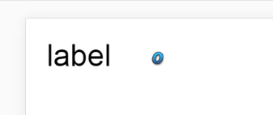

## 3、为组件动态赋值

一般固定的值，我们在IDE的属性设置器中，就给组件设置好了，但是很多时候，比如列表（List）组件，必需要为组件动态赋值。下面我们开始介绍如何动态修改组件的属性值。

dataSource 是 Component 组件类定义的组件基本属性之一，所有由 Component 类派生的组件类都实现了这个属性，我们要实现动态赋值全靠他。dataSource有默认属性的赋值模式与指定属性的赋值模式两种，下面分别通过示例进行介绍。

### 3.1 创建一个简单的UI DEMO

**编辑UI**

先创建一个`ComponentDemo.ui`的UI页面并打开。然后我们从`资源管理器`中，将一个`label`组件和一个`clip`组件拖入`场景编辑器`中，最后需要设置初始属性。

`var`是必须要设置的，要想在项目代码中对组件进行动态赋值，需要通过`var`设置的全局变量。这里，我们将`label`组件的var设置为`lab`，`clip`组件的var设置为`numb`。

由于默认的`label`字体较小，这里为了便于演示，我们将`label`组件的`fontSize`属性值设为`50`。

IDE自带的`clip`切片组件是由`0-9`共十个数字组成，所以我们还要将位图切片的X轴数量（`clipX`）设置为`10`，

设置完初始始属性后，IDE中的效果如图4所示。

 <br /> (图4)

**编写代码**

使用快捷键F12导出UI后，我们切换到项目编码模式，创建一个ComponentDemo.as的入口类（设置为默认应用程序）。然后编码如下：

```java
package
{
	import laya.ui.Image;
	import laya.utils.Handler;
	import laya.webgl.WebGL;	
	import ui.ComponentDemoUI;

	public class ComponentDemo
	{
		public function ComponentDemo()
		{
			Laya.init(1334,750, WebGL);
			Laya.stage.bgColor = "#ffffff";
			//加载图集成功后，执行onLoad回调方法
			Laya.loader.load("res/atlas/comp.atlas", Handler.create(this, onLoaded));
		}
		
		private function onLoaded():void {
			//创建一个UI实例
			var comp:ComponentDemoUI = new ComponentDemoUI();

			//添加到舞台上显示
			Laya.stage.addChild(comp);
		}
	}
}
```

在页面中运行效果与IDE中一至，如图5所示：

 <br />(图5)


#### 3.1.2  用默认属性赋值方式为组件赋值

IDE自带的基础组件内会有一个默认的属性，通过dataSource直接赋值给组件的默认属性，不需要再指定组件的属性名，如果仅仅需要动态修改组件的默认属性，那们采用该赋值方式会更加方便。

下面我们将图5中的默认组件进行赋值。修改后的代码如下：

```java
package
{
	import laya.ui.Image;
	import laya.utils.Handler;
	import laya.webgl.WebGL;	
	import ui.ComponentDemoUI;

	public class ComponentDemo
	{
		public function ComponentDemo()
		{
			Laya.init(1334,750, WebGL);
			Laya.stage.bgColor = "#ffffff";
			//加载图集成功后，执行onLoad回调方法
			Laya.loader.load("./res/atlas/comp.atlas", Handler.create(this, onLoaded));
		}
		
		private function onLoaded():void {
			//创建一个UI实例
			var comp:ComponentDemoUI = new ComponentDemoUI();
			
			//为label组件设置组件默认属性值
			comp.lab.dataSource = "LayaAir";
			
			//为clip组件设置组件默认属性值
			comp.numb.dataSource = 6;
			
			//添加到舞台上显示
			Laya.stage.addChild(comp);
		}
	}
}
```

在页面中运行效果如图6所示：

 <br /> (图6)

通过代码的注释，我们看到仅需简单的代码，就完成了对组件进行赋值。但是，如果我们细心对比一下，很容易发现label组件的默认属性是text，clip组件的默认属性是index。那么问题来了，其它的组件默认属性是什么呢？

下面我们提供了一份组件默认属性的列表

| 组件名         | 默认属性          |
| ----------- | ------------- |
| Button      | label         |
| LinkButton  | label         |
| RadioButton | label         |
| Label       | text          |
| TextInput   | text          |
| TextArea    | text          |
| ComboBox    | selectedIndex |
| Tab         | selectedIndex |
| RadioGroup  | selectedIndex |
| ViewStack   | selectedIndex |
| List        | selectedIndex |
| Clip        | index         |
| ProgressBar | value         |
| Scroll      | value         |
| Slider      | value         |
| CheckBox    | selected      |
| Image       | skin          |


### 3.1.3 指定属性为组件赋值