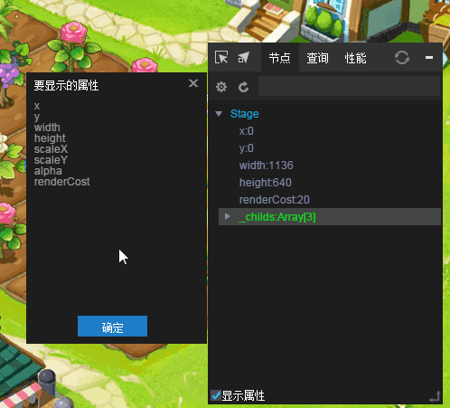
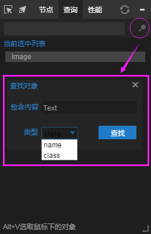

# LayaAir DebugTool调试工具

### 1、启用DebugTool调试面板

DebugPanel debugging panel is Div debug window based on the debug panel `DebugPanel.init()` method in the `laya.debugtool.js` file, the JS file in index.html can be `Laya.init in the initialization stage (method), increase the use of arbitrary code after the introduction of index.html, the JS file is shown in the following code:

```javascript
<script type="text/javascript" src="libs/laya.debugtool.js"></script>
```

使用方式例如下面代码所示：

入口类Main.as

```java
//初始化舞台
Laya.init(1334, 750);
//调用DebugTool调试面板
Laya.DebugTool.init();
//设置舞台背景色
Laya.stage.bgColor = "#ffffff";
var Img = new Laya.Sprite();
//添加到舞台
Laya.stage.addChild(Img);
Img.loadImage("res/img/monkey1.png",200);
```

When the debug panel is enabled successfully, as shown in figure 1.

  

（Picture 1）


### 2. Node selection function

Click on the first `select` button icon at the top of the debug panel.

Then slide in the node of the game page, will display the border of the node.

Click the mouse to select the node. At the same time, the node attribute information of the node will be displayed in the node classification of the debug panel. The effect is shown in figure 2.

 

(Picture 2)


### 3. Setting display properties

Click on the gear icon in the second row of the debug panel to set `the attribute to be displayed`.

In the new pop-up display property settings panel, you can add and delete attribute information to be displayed in the node. The related operations are shown in Fig. 3.

  

（Picture 3）


### 4. Drag selection

Left-click the second `drag select` button icon at the top, and then hold and drag to the display object node you want to view, you can view the attribute information of this node in the debug panel. For example, Figure 4 shows.


  

（Picture 4）


### 5. Quick search function

#### 5.1 Use shortcuts to get the node object in the page

The method of selecting the page node object by pressing the shortcut key `Alt+V` and selecting the mouse at the same time. You can get the node object in the page to right-click or query the property of the object quickly, as shown in figure 5-1.

  

（Picture 5-1）

#### 5.2 Getting the list of node objects in the page by keyword query

Relative to the shortcut key to obtain accurate positioning, you can through the `Object Query`button （*magnifier icon*）to get the list of objects.

When you click the magnifier icon, a new object query panel pops up, and you can find the objects that contain keywords in name or class. As shown in figure 5-2.

 

（Picture 5-2）

#### 5.3 Quickly query attribute contents in objects

Whether through shortcuts or keyword positioning of the object, you can quickly query attribute values through the attribute query function.

The operation mode is: `enter` one or more **attribute names** in ` attribute query input box` (multiple attributes need to be separated by English comma), and then click the `Enter` key to get the attribute content. The operation mode is shown in figure 5-3.

  

（Picture 5-3）


### 6. Performance statistics

#### 6.1 Object creation statistics

Click on the `Objects`Button, you can get the statistics created by the object, the content of the information are the `object name, the number of objects created by the current operation, and the number of objects currently running since the last operation`. Figure 6-1 shows the statistics.

   

（Picture 6-1）

#### 6.2 Object creation statistics details and increment details

In the list of statistics created by the object, the right mouse button can click on the details of the query statistics and the details of incremental creation, as shown in figure 6-2.

   

（Picture 6-2）

#### 6.3  Rendering time statistics

Rendering time statistics is used to query the time consumed by the current game rendering, and the unit is milliseconds (ms). Click `Render` the button allows you to get the statistics of the render time of the current game, as shown in figure 6-3.

   

（Picture 6-3）


#### 6.4 Cache redraw statistics

Click `Redraw`button, you can query the cache redraw data ranking, redraw a large number of objects at the forefront. The effect is shown in figure 6-4.

   

（Picture 6-4）


#### 6.5 Resource cache statistics

Click the `resource` button, and you can see the **list of resource caches**, as shown in figure 6-5.

   

（Picture 6-5）


### 7. Right-click menu

In the debug panel, the right button pops up the corresponding function menu, as shown in figure 7. In particular, the node, query and rendering performance statistics right-click menu, you need to have a good understanding and mastery.

 

(Picture 7)


The function in the right key is easier to understand. Developers can experience it one by one. Here you can focus on the **node tool**. Tool can be selected for the node display / hide operation, can show the current node of the mouseEnable relationship chain, can display the selected node of the Size relationship chain, and so on! More practical and commonly used.

  

(Picture 8)


