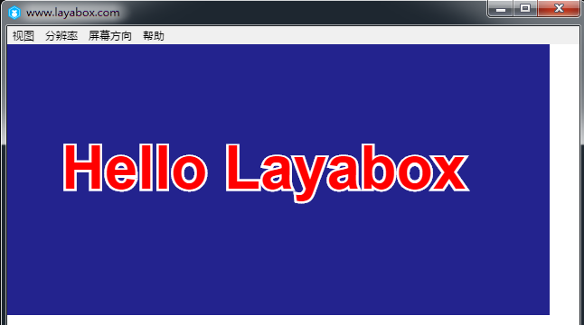

# The first program: display “Hello Layabox” text

 **[Note] before reading this article, you must read the "JS project and detailed the directory structure".**


Step 1：select the SRC right click, then left-click “New File”, and set up a HelloLayabox.js file in the src directory.

​	<br/>


Step 2: Click open HelloLayabox.js src directory, began to write the following code:

```javascript
//创建舞台，默认背景色是黑色的
Laya.init(600, 300); 
var txt = new Laya.Text(); 
//设置文本内容
txt.text = "Hello Layabox";  
//设置文本颜色为白色，默认颜色为黑色
txt.color = "#ffffff";  
//将文本内容添加到舞台 
Laya.stage.addChild(txt);
```


Step 3：After encoding, press F5 to compile, in the page that pops up, we can see the running result of the code, as the following figure shows:
​	<br/>


​ Step 4：After the display is successful, close the display window. We continue to write code to make the text look beautiful. Continue to improve the code is as follows:

```java
//创建舞台，默认背景色是黑色的
Laya.init(600, 300); 
var txt = new Laya.Text(); 
//设置文本内容
txt.text = "Hello Layabox";  
//设置文本颜色
txt.color = "#FF0000";
//设置文本字体大小，单位是像素
txt.fontSize    = 66;  
//设置字体描边
txt.stroke = 5;//描边为5像素
txt.strokeColor = "#FFFFFF";  
//设置为粗体
txt.bold = true;  
//设置文本的显示起点位置X,Y
txt.pos(60,100);  
//设置舞台背景色
Laya.stage.bgColor  = '#23238E';  
//将文本内容添加到舞台 
Laya.stage.addChild(txt);
```


Step five： After the writing is completed, it is compiled again by F5, and the result of the beautification is as shown in the following figure.
​	<br/>


　　At this point, if you can follow this introductory tutorial and finish the display above, congratulations on your successful entry, we have completed the first LayaAir engine HTML5 program developed in JavaScript language. For more API use developed by the LayaAir engine, go to the Layabox Developer Center of the official website to see the tutorial.