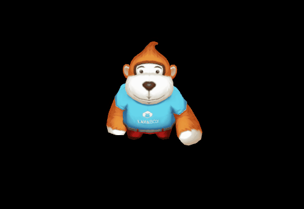

# LayaAir3D之动画一

目前LayaAir3D引擎针对动画部分作了大量的调整，虽对老版本动画进行了保留，但建议开发者们使用新的动画组件方式。新版动画Animator组件整合了老版动画的几种类型，不用分类去创建，节省了开发时间，它包括了骨骼动画、材质动画、刚体动画、摄像机动画等。

Animator动画组件支持unity导出的动画，骨骼动画模型在导入unity后可以进行整合编辑，材质动画、刚体动画可直接在unity中编辑，然后导出使用。

### 角色骨骼动画

游戏角色蒙皮骨骼动画在3D游戏中有大量的运用，可将角色动画模型导入unity中编辑，然后导出到LayaAir中使用。

#### unity中动画编辑步骤

1、导入模型。在unity资源管理器中，右键导入（Import New Assets）FBX格式模型资源、贴图资源，并将模型拖拽至场景中，调整好材质贴图并保存，本例中保存场景名为“monkey”。

2、创建动画控制器。在unity资源管理器中，右键点开菜单创建（Create）动画控制器（Animator Controller）,并根据动画取名，本例中取名为”monkeyAction”。

3、编辑动画控制器。双击打开动画控制器，视图区会出现动画控制器编辑界面；点开导入的模型右侧“小三角”，其中“播放标志”文件为模型的动画文件，默认名为“Take 001”，拖拽它至动画控制器编辑界面（图1），保存完成。

(图1)</br>

4、绑定动画控制器。选择场景中的角色模型，将角色动画控制器赋予到选中模型的动画组件上（图2），如无动画组件，需增加，否则导出的动画不能播放。

(图2)</br>

经过以上步骤，我们完成了角色动画在unity中的编辑，点击unity中运行按钮，这时我们就可以看到动画播放了。如果动画播放没有问题，就可以按之前“unity插件工具使用”教程方法导出LayaAir所需资源。

**Tips：其他的动画在unity中处理方式也一致，都需要以下步骤：场景模型上添加动画组件——创建动画控制器——将动画加入动画控制器中——动画控制器添加入模型的动画组件中。**

#### LayaAir中角色动画的实现

导出后的资源拷贝到项目bin目录下，通过代码加载角色资源，创建后将自动播放动画并循环（图3），参考代码如下：

```typescript
var LayaAir3D = (function () {
    function LayaAir3D() {

        //初始化引擎
        Laya3D.init(0, 0, true);

        //适配模式
        Laya.stage.scaleMode = Laya.Stage.SCALE_FULL;
        Laya.stage.screenMode = Laya.Stage.SCREEN_NONE;

        //开启统计信息
        Laya.Stat.show();

        Laya.loader.create("monkey/monkey.lh",Laya.Handler.create(this,onModelOK),null,Laya.Sprite3D);
    }
    function onModelOK(){
        //添加3D场景
        var scene = new Laya.Scene();
        Laya.stage.addChild(scene);
        //创建摄像机（纵横比，近距裁剪，远距裁剪）
        var camera = new Laya.Camera(0,0.1,1000);
        //加载到场景
        scene.addChild(camera);
        //旋转摄像机角度
        camera.transform.rotate(new Laya.Vector3(-25,0,0),false,false);
        //移动摄像机位置
        camera.transform.position = new Laya.Vector3(0,5,10);
        //加入摄像机移动控制脚本
        camera.addComponent(CameraMoveScript);

        //添加蒙皮动画角色模型
        var role3D = Laya.loader.getRes("monkey/monkey.lh");
        //加载到场景
        scene.addChild(role3D);
    }
    return LayaAir3D;
} ());

LayaAir3D();
```

(图3)</br>


#### 角色动画的控制与分解

**获取动画组件**

通过上面的示例，我们看到动画自动播放了，动画包括了几个动作，那么怎么控制动画的播放呢？首先需要获取模型上的动画组件，然后才能通过它控制播放、停止等。

LayaAir 3D引擎的3D模型Sprite3D类提供了getComponentByType()方法来获取模型上的组件。带动画的模型在加载创建时引擎默认赋予了Animator动画组件，因此我们可以获取它，参考以下代码。

打开.lh文件查看，动画组件绑定在模型的子对象上，因此使用了”getChildAt(0)”，通过它获取子对象模型。然后通过getComponentByType(Animator)方法获取动画组件

```typescript
//获取角色动画组件
var ani=role3D.getChildAt(0).getComponentByType(Laya.Animator);
```

**Tips：有时候在.lh或.ls文件中，存在着多个父子层级关系，动画组件不可能都在第一层级上，可能是每二层，可能是第三层。因此在获取动画组件之前，可以打开.ls或.lh查看有动画组件模型的层级关系，然后通过getChildAt()、或getChildByName()等方法获取模型后，再获取动画组件。否则程序会报错！！**

**播放控制**

有了动画组件后，怎么只播放其中一个动作呢？有两种方法实现对动作的控制与切换。


#### 1.代码定义动画剪辑播放

上例中，在unity中并未对动画进行拆分，我们使用了模型的默认动画Take 001，插件只导出了一个.lani格式的动画解析文件。

因此控制播放其中某段动画，需要在代码中增加自定义动画剪辑，在动画剪辑中设置开始与结束帧率方式实现。

查看Animator动画组件中play()方法，具体方法参数如下：

**Tips：1.7.10版后，play()方法取消了loop是否循环、开始帧率、结束帧率参数。动画是否循环请在unity编辑器动画属性中进行勾选设置，导出后引擎将遵循其设置进行动画播放。见图5、6中loop Time选择框！**

```java
/**
* 播放动画。
* @param	name 如果为null则播放默认动画，否则按名字播放动画片段。
* @param	playbackRate 播放速率。
*/
play(name:String=null,playbackRate:Number=1.0)
```


**如需播放动画的某一帧到某一帧，可在原有动画的基础上创建增加动画剪辑（片断）AnimationClip，最新Animator类提供了addClip()实例方法，可以允许开发者创建动画剪辑并定义名称，然后通过play(动画剪辑名称)方法播放。**

```java
/**
* 添加动画片段。
* @param	clip 动画片段。
* @param	playName 动画片段播放名称，如果为null,则使用clip.name作为播放名称。
* @param   开始帧率。
* @param   结束帧率。
*/
public function addClip(clip:AnimationClip, playName:String = null, startFrame:int = 0, endFrame:int = 4294967295
```

修改示例中的代码如下：

```typescript
//添加蒙皮动画角色模型
var role3D=Laya.loader.getRes("monkey/monkey.lh");
//加载到场景
scene.addChild(role3D);
//获取角色动画组件
var ani = role3D.getChildAt(0).getComponentByType(Laya.Animator);

//加载一个动画文件创建动画剪辑（可以是已有的动画，也可以是此角色需增加的新动画文件）
//var clip =Laya.AnimationClip.load("monkey/Assets/monkey-Take_001.lani");
//从现有的动画中获取动画剪辑（默认根据.lani文件创建的动画剪辑）
var clip =ani.clip;

//增加一个动画剪辑引用，从clip中的0-34帧创建名为stand的动画剪辑
ani.addClip(clip,"stand",0,34);
//增加一个动画剪辑引用，从clip中的40-70帧创建名为move的新动画剪辑
ani.addClip(clip,"move",40,70);

//播放某个动画剪辑
ani.play("move");
//可获取动画剪辑总数
console.log("当前动画剪辑总数为："+ani.getClipCount());
```

编译运行后效果如下，只循环播放了0-34帧的站立动画。

(图4)</br>


#### 2.Unity中定义动画剪辑播放

unity中可以对动画进行分段，并对剪辑的片段取名。 导出的资源在控制时，可通过名称进行动画切换，方便开发者们使用。（这种方式在资源导出时增加了动画解析文件，以致增加Http访问次数，使用哪种方式开发者们可根据情况自行考虑）

unity中动画片段分段方法如下：

1)、在“资源管理器”中选择模型文件，在右侧inspector界面中选择Animations，出现了默认的动画Take 001，可点击编辑自定义名称，点击加号增加动画片段，及修改片段的起始与结束帧（图5）。

Tips：如需在游戏中动画循环播放，请勾选下图中“Loop Time”选项。

(图5)</br>

在本示例中一攻个动作，根据美术提供的动画帧数，修改增加成4个动画片段（图6）。

(图6)</br>

2)、修改完成后在资源管理器模型中也会增加相应的动画文件，因此还需修改动画控制器，将新生成的动画片段加入动画控制器中，否则无法导出完整的动画资源解析文件（图7）。

(图7)</br>

完成上列步骤后，重新导出，导出的资源里也生成了4个.lani动画解析文件。

修改示例代码，运用播放动画名方式，效果如（图8）。

```typescript
......
//添加蒙皮动画角色模型
var role3D = Laya.loader.getRes("monkey/monkey.lh");
//加载到场景
scene.addChild(role3D);
//获取角色动画组件
this.ani = role3D.getChildAt(0).getComponentByType(Laya.Animator);            
//监听默认动画完成后播放站立动画
this.ani.on(Laya.Event.COMPLETE,this,onAniComplete);
//播放攻击动画
this.ani.play("attack");
/***当前动画播放完成后回调***/
function onAniComplete()
{
  //切换站立动画
  this.ani.play("stand");
}
```

(图8)</br>