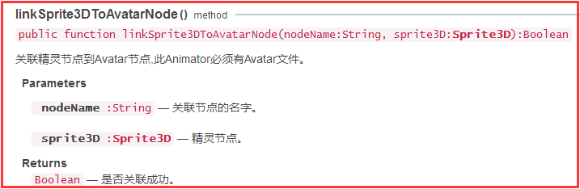

## LayaAir3D skeletal bone point

### Skeletal bone point overview

Skeletal bone points are commonly used in the binding of 3D models to bones. For example, the weapon moves with the movement of the hand, so we can bind the weapon to the skeleton of the hand as the sub level of the hand skeleton.

The binding 3D model can also be used to remove the binding or replace the 3D model by code, which also implements the reloading function of weapons or equipment.


### Setting up skeletal bone points in Unity

Bone hanging points are very convenient to set up in Unity, which can be operated directly in the resource level of the scene. The following diagram (Figure 1)

The object needs to be bound can be a 3D container, or just a 3D model, adjust their position, put them into the designated as a sub level skeleton hanging point binding is successful, the animation, we can find that it follows the change of skeletal animation.

Sometimes, we need no weapons in the beginning, in order to prepare for the future for weapons for customize or upgrade characters, we can also add an empty container node GameObject in the bone, and then when you need to add different 3D models or multiple models.

<br>（Figure 1）

**Tips: when our skeleton hang points are set up, skeletons and hanging objects will be automatically exported to.Ls or.Lh files. We can get them through getChildByName () method. But you have to pay special attention: if the skeleton hanging point only when bound to the empty container object, used after dynamically add sub object, then it can't check the GameObject Setting Null Game Objects Ignore ignore empty node set in the export plug-in, otherwise empty container hanging point object will not be exported to.Ls or.Lh.**  


### Implement bone hanging point in code

In general, we all add bone hanging points in Unity. But the LayaAir engine also provides the way to hang the code to add and remove the bones of the skeleton flexibly.

The Animator animation component class provides two instance methods **linkSprite3DToAvatarNode()** and **unLinkSprite3DToAvatarNode()** to enable attachment and removal of hanging points (Figure 2, Figure 3).

Tips：Before the code is added to the skeleton animation, you need to provide the name of the bone node that needs to be associated with the skeleton.

<br>（figure 2）

<br>（figure  3）

The specific code reference is as follows:

Get a Skeletal Animation Model from a Scene - Get a Model's Animation Component - Create a Drop Point Object - bind the skeleton and the point object through the animation component.

```javascript
//从场景中获取动画模型
var monkey = this.scene.getChildByName("monkey");
//获取动画模型中动画组件
var monkeyAni = monkey.getComponentByType(Laya.Animator);
//需要挂点的3D对象
var box = new Laya.MeshSprite3D(new Laya.BoxMesh(1,1,1));
//将3D对象加载到scene中（一定要加入到场景）
this.scene.addChild(box);
//将挂点物品添加到某个骨骼上（美术提供骨骼的名称）
monkeyAni.linkSprite3DToAvatarNode("RHand",box);
//将挂点物品从骨骼上移除（美术提供骨骼的名称）
//monkeyAni.unLinkSprite3DToAvatarNode("RHand",box);
```


### Example of application of bone hanging point

Let's demonstrate the use of bone hangs for you with a simple example of a magic attack (Figure 4).

<br>（Picture 4）

First of all, as shown in Figure 1, in Unity, we set the magic node of the child node level of the right-handed skeleton in the Unity, change the name of the right-handed skeleton to “RHand”, the magic aperture is “weapon”, and export it into the.Ls resource file. After exporting, we can find that the hand skeleton and the aperture appear in the sublevel file of the model (Figure 5), wwhich can be retrieved by name when needed.

<br>（figure 5）

Magic attack in accordance with Figure 4 effect can be achieved through two classes, one is the main class Laya3D_BonePoint.as, used to achieve the animation player and generate magic weapon, the program is: in the attack animation to 36 frames or so, cloned a The same new magic weapon hanging point weapons, and add a weapon script for flight, the original point of hanging weapons temporarily hidden, the animated playback is complete and then re-display, to produce magic and throw magic effect.

WeaponScript WeaponScript.js Magic flying and destruction. All the code is as follows:

```javascript
//初始化引擎
Laya3D.init(1280, 720, true);
//适配模式
Laya.stage.scaleMode = Laya.Stage.SCALE_FULL;
Laya.stage.screenMode = Laya.Stage.SCREEN_NONE;
//开启统计信息
Laya.Stat.show();
this.weaponIsClone = false;
//加载3D资源
Laya.loader.create("LayaScene_monkey/monkey.ls", Laya.Handler.create(this, onComplete));

//资源加载完成回调
function onComplete() {
    //创建场景
    this.scene = Laya.loader.getRes("LayaScene_monkey/monkey.ls");
    Laya.stage.addChild(this.scene);
    //从场景中获取动画模型
    var monkey = this.scene.getChildByName("monkey");
    //获取动画模型中动画组件
    this.monkeyAni = monkey.getComponentByType(Laya.Animator);
    //获取挂点骨骼(Unity中设置的挂点骨胳会被导出，可获取)
    var handBip = monkey.getChildByName("RHand");
    //获取挂点的武器模型
    this.weapon = handBip.getChildByName("weapon");
    //监听动画完成事件
    this.monkeyAni.on(Laya.Event.COMPLETE, this, onAniComplete);
    //帧循环，用于监控动画播放的当前帧
    Laya.timer.frameLoop(1, this, onFrame);
}
function onAniComplete() {
    //动画播放完成后武器激活显示
    this.weapon.active = true;
    //动画播放完成后，设置为未克隆，方便下次克隆新武器
    this.weaponIsClone = false;
}
//在攻击动画播放到一定帧时，克隆一个新武器特效
function onFrame() {
    //在动画35-37帧之间时克隆一个飞出的武器
    //（不能用==35帧方式，帧率不满时可能跳帧，导致克隆失败。后期版本将支持帧标签事件，可解决此问题）
    if (this.monkeyAni.currentFrameIndex >= 35 && this.monkeyAni.currentFrameIndex <= 37) {
        //确保在35-37帧之间只克隆一次
        if (this.weaponIsClone) return;
        //克隆新武器（模型、位置、矩阵等全被克隆）
        var weaponClone = Laya.Sprite3D.instantiate(this.weapon);
        //为武器特效添加脚本
        weaponClone.addComponent(WeaponScript);
        //将克隆武器放入场景中
        this.scene.addChild(weaponClone);
        //设置为已克隆
        this.weaponIsClone = true;
        //隐藏原始武器
        this.weapon.active = false;
    }
}      
```


```javascript
var WeaponScript = (function(_super){
    function WeaponScript(){
        WeaponScript.super(this);
        /**武器生命周期**/
        this.lifeTime = 100;
    }
    Laya.class(WeaponScript,"WeaponScript",_super);
    WeaponScript.prototype._load = function(owner){
        this.weapon = owner;
    }
    WeaponScript.prototype._update = function(state){
        //武器旋转更新
        this.weapon.transform.rotate(new Laya.Vector3(2,2,0),true,false);
        //武器移动更新
        this.weapon.transform.translate(new Laya.Vector3(0,0,0.2),false);
        //生命周期递减
        this.lifeTime--;
        if(this.lifeTime<0)
        {
            this.lifeTime=100;
            //直接销毁脚本绑定对象会报错（对象销毁后脚本还会更新一次，报找不到绑定对象错误），
            //因此延迟一帧以销毁
            Laya.timer.frameOnce(1,this,function(){this.weapon.destroy();});
        }
    }
    return WeaponScript;
})(Laya.Script);
```