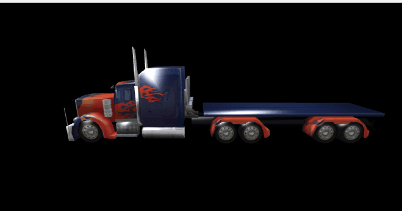

## LayaAir3D Model

### Model overview

3D model refers to the 3D object formed by 3D software modeling according to object structure. Currently two types of model display are included in LayaAir 3D engine, one is the general model **MeshSprite3D**, and the other is the skin animation model **SkinnedMeshSprite3D**。

The difference is that the skinning animation model refers to the model of skinning and skeletal animation, which is often used in animation. The ordinary model refers to the scene without animation, such as landscape or static model.

Both include mesh and the material data.

**Mesh:**

Mesh is a three-dimensional data composed of points, lines and triangles. In the LayaAir engine, there is a special Mesh grid data class, which is given to the 3D model to display objects MeshSprite3D or SkinnedMeshSprite3D, and then can be displayed in the scene.

Now 3D production software is more popular, and the most mainstream are 3ds Max and Maya software. 3D model data format more spread are FBX, 3DS, OBJ.

The LayaAir engine provides model export tools FBXTools and unity3D export plug-ins, which are used to generate 3D data formats needed for layaAir. It is recommended to use the unity export plug-in, and the FBXTools will not be updated in the future.

**Material:**

Material Description we will be introduced in a separate article, and will not be described here.


### Creating the basic model of the engine

 We've used the BoxMesh model previously in quickStart guide article, and in this lesson we'll cover the other SphereMesh, CylinderMesh base model data provided by the LayaAir engine. We create in turn and move their position through the transform property, Specific code is as follows :

When you create, you need to pay attention to, the engine is loaded into the scene with the model, the axis point in the center of the model, so we are based on the center point of the model for reference, move, rotate, zoom. When loaded into the scene, the model defaults to the world coordinate origin of the scene, similar to 2D.

```typescript
// 程序入口
class LayaAir3D {
    constructor() {
        //初始化引擎
        Laya3D.init(0, 0, true);

        //适配模式
        Laya.stage.scaleMode = Laya.Stage.SCALE_FULL;
        Laya.stage.screenMode = Laya.Stage.SCREEN_NONE;

        //开启统计信息
        Laya.Stat.show();

        //添加3D场景-----------------------
        var scene:Laya.Scene = new Laya.Scene();
        Laya.stage.addChild(scene);
        //创建摄像机(横纵比，近距裁剪，远距裁剪)-----
        var camera:Laya.Camera = new Laya.Camera( 0, 0.1, 1000);
        //加载到场景
        scene.addChild(camera);
        //移动摄像机位置
        camera.transform.position=new Laya.Vector3(0, 3, 10);
        //旋转摄像机角度
        camera.transform.rotate(new Laya.Vector3( -17, 0, 0), true, false);
        //加入摄像机移动控制脚本
        camera.addComponent(CameraMoveScript);
        //创建方向光 ------------------------
        var light:Laya.DirectionLight = scene.addChild(new Laya.DirectionLight()) as Laya.DirectionLight;
        //移动灯光位置
        light.transform.translate(new Laya.Vector3(0,2,5));
        //调整灯光方向
        light.direction = new Laya.Vector3(0.5, -1, 0);
        //设置灯光环境色
        light.ambientColor = new Laya.Vector3(1, 1, 1); 
        //设置灯光漫反射颜色
        light.diffuseColor = new Laya.Vector3(0.3, 0.3, 0.3);
        //创建模型-------------------------------
        //创建盒子模型(参数为：长、宽、高，单位：米)
        var boxMesh:Laya.BoxMesh=new Laya.BoxMesh(2,2,2);
        //创建模型显示对象
        var box3D:Laya.MeshSprite3D=new Laya.MeshSprite3D(boxMesh);
        scene.addChild(box3D);
        //创建球体模型(参数为：半径、水平层数、垂直层数)
        var sphereMesh:Laya.SphereMesh=new Laya.SphereMesh(1,8,8);
        //创建模型显示对象
        var sphere3D:Laya.MeshSprite3D=new Laya.MeshSprite3D(sphereMesh);
        //x轴上移动-3米（世界座标 向左）
        sphere3D.transform.translate(new Laya.Vector3(-3,0,0),false);
        scene.addChild(sphere3D);
        //创建圆柱体模型(参数为：半径、高、圆截面线段数)
        var cylinderMesh:Laya.CylinderMesh=new Laya.CylinderMesh(1,2,8);
        //创建模型显示对象
        var cylinder3D:Laya.MeshSprite3D=new Laya.MeshSprite3D(cylinderMesh);
        //x轴上移动3米（世界座标 向右）
        cylinder3D.transform.translate(new Laya.Vector3(3,0,0),false);
        scene.addChild(cylinder3D);
        //创建材质----------------------------------
        var material:Laya.StandardMaterial = new Laya.StandardMaterial();
        //为模型赋材质（单个材质可赋给多个模型）
        box3D.meshRender.material = material;

    }
}
new LayaAir3D();
```

In the code above, cameras and lights are created, and three basic geometry models are added. They use the most basic default material. The display effect is shown in figure 1.

<br>（Picture 1）


### Create a 3D software-generated model

These three basic models are mainly used for developer learning tests. Most of the models in the game are three-dimensional software, after the introduction of unity editor edit splicing, and then use the layaAir export tool transformation generation, and then through the 3D scene or model display class loading use.

Here, let's explain again the exported resource class and how the file is used.

Export folder contains more resources (Figure 2), there are scenes, 3D model container, 3D model, 3D material and other analytical files, as well as light maps, texture maps and other data files.

<br>（Picture 2）

**loveScene文件夹** The folder created after creating the lighting map in untiy is the same as the scene name created in untiy, and the illumination map has been introduced in the scene Scene.

**Materials文件夹** When you import the FBX model in unity, you create the folder of the material ball, and the exported resource is the corresponding LayaAir material data parsing file. The file is stored in the rendering mode of material, the path of mapping resources, and the various light and color attributes of material.

**Texture文件夹** Is created in the unity store map folder, which is the material resources mapping file, is a series of picture files in the LayaAir engine we use JPG or PNG format, can be used to export other format images automatically transformed into JPG or PNG, please developers must pay attention to.


#### *.ls format Scene data file

Export scenario Scene type data file, we have already explained in the previous courses, but not much explanation.


#### *.lh format Sprite3D data file

The exported 3D display object container Spirte3D type data file, JSON format code, is the layaAir export plug-in in unity3D select export ”Sprite3D“ category generation, internal storage less than the *.ls format, less light map, the other all the same.

“*.lh” Format loading is similar to scenario loading, which is loaded by asynchronous loading Sprite3D.load() or pre loaded Laya.loader.create() method, and reference code:

```javascript
......
//添加3D场景-----------------------
this.scene = new Laya.Scene();
Laya.stage.addChild(this.scene);

//方法一：直接异步加载
var sprite3D:Laya.Sprite3D = Laya.Sprite3D.load("res/room.lh");

//方法二：预加载，创建为Sprite3D类型
Laya.loader.create("res/room.lh",Laya.Handler.create(this,this.onCreateComplete));
//预加载完成后回调
private onCreateComplete():void{
  //实例化加载并创建好的3D对象
  var sprite3D:Laya.Sprite3D = Laya.loader.getRes("res/room.lh");
  this.scene.addChild(sprite3D);
}
```


#### *.lm Formatted data file

Whether it is derived from ”Scene“ file or file type ”Sprite3D“ a series of *.lm format files are included in the derived Resources folder, FBX storage model for unity developers built the model folder in the project folder, as shown in Figure 2, created the corresponding folder and.Lm resource file when exporting.

<br>（picture 3）

"*.lm" The file is the model data file, which can generate the grid data Mesh of MeshSprite3D or SkinnedMeshSprite3D type display object, including the vertex position, normal line, vertex color, vertex UV and other information of the model grid.

Load asynchronously by MeshSprite.load() or pre loading Laya.loader.create() method. The reference code is as follows:

```typescript
......
//添加3D场景-----------------------
this.scene = new Laya.Scene();
Laya.stage.addChild(this.scene);

//方法一：直接异步加载
// var mesh:Laya.Mesh = Laya.Mesh.load("LayaScene_01/Assets/model/loveScene_jianzhu.lm");
// var meshSprite3D:Laya.MeshSprite3D = new Laya.MeshSprite3D(mesh);

//方法二：预加载，创建为Sprite3D类型
Laya.loader.create("LayaScene_01/Assets/model/loveScene_jianzhu.lm",Laya.Handler.create(this,this.onCreateComplete));
//预加载完成后回调
private onCreateComplete():void
{ 
  //创建预加载的模型网格 
  var mesh:Laya.Mesh = Laya.loader.getRes("LayaScene_01/Assets/model/loveScene_jianzhu.lm");
  //创建3D模型
  var meshSprite3D:Laya.MeshSprite3D = new Laya.MeshSprite3D(mesh);
  this.scene.addChild(meshSprite3D);
}
```

With the three methods mentioned above, the model can be displayed in the game screen, and the material map engine will automatically load onto the model. In the project, we can use the above three methods according to the situation, fixed scene, we can use .ls format to load, and active items can be loaded by .ls或 or lm mode. 


### Obtain child object model and mesh properties

The 3D model is sometimes composed of multiple sub model objects, such as the scene model .ls, which is basically made up of multiple object models and materials. The outer layer is a Sprite3D container, and the inside is the real model MeshSprite3D or SkinnedMeshSprite3D. And there may be multiple levels nested.

#### Get child object model

When writing game logic, some models need to be modified, or to switch and delete the model, add components, or to obtain the animation components of the model and the material of the modified model. We all need to get the child object from the loaded model, and we can get the child object by the **getChildAt(), getChildByName()** method, which is the same as the 2D engine getting the child object method.

Let's load a.lh file of the truck model, and then get its child object. Before getting a child object, it is recommended to open the.lh file to see the parent-child hierarchy of the model, because we cannot determine how many sub object models are formed and their naming rules when making the model.

Tips: when modeling in 3ds max, it is recommended to name the sub objects of the model, and to formulate the resource naming rules of the project, instead of using the default model name.

The following example loads the truck.lh truck exported from unity. After opening it, you can see through the JSON structure that the outer layer is a Sprite3D container (the equivalent of unity scene) and inside is a Sprite3D container (equivalent to the truck in the unity). In the truck container are two sub-object models MeshSprite3D (front and body models). So we need call twice getChildAt () method to get the model MeshSprite3D.

```javascript
......
//加载导出的卡车模型
this.truck3D = Laya.Sprite3D.load("LayaScene_truck/truck.lh");
//模型与材质加载完成事件监听
this.truck3D.on(Laya.Event.HIERARCHY_LOADED,this,this.onLoded);
this.scene.addChild(this.truck3D);
//模型与材质加载完成后回调
private onLoded():void
{ 
  console.log(this.truck3D);
  //获取模型（查看.lh文件，有两个子对象模型，一为车头“head”，一为车身“body”，暂取其中一个模型）
  var meshSprite3D:Laya.MeshSprite3D = this.truck3D.getChildAt(0).getChildAt(0) as Laya.MeshSprite3D;
  //输出模型的名字(输出“body”)
  console.log(meshSprite3D.name);
}
```

Compile the sample code, we can see the model is displayed (Figure 4), open the console by pressing F12 in the browser, we can see that the model name is output “body”, indicating that the model was successful.

<br>（Picture 4） 


#### Get Mesh properties

In the game, we often create the character dressup system, sometimes for the model, sometimes for the map, and sometimes both change. Because the material texture part will be explained in the following chapters, we only introduce the method of replacing the model mesh in this chapter.

The model MeshSprite3D or SkinnedMeshSprite3D has a **meshFilter** property, which is a grid filter class instance. The **sharedMesh** in this property is the mesh of the model, which can be recreated, replaced, and destroyed.

See the example below. After loading the truck model for 2 seconds, we create a new car head mesh object to replace the original body mesh, and the effect is as follows (Figure 4).

```javascript
......
//加载导出的卡车模型
this.truck3D = Laya.Sprite3D.load("LayaScene_truck/truck.lh");
this.scene.addChild(this.truck3D);
//模型与材质加载完成事件监听
this.truck3D.on(Laya.Event.HIERARCHY_LOADED,this,this.onLoaded);
//模型与材质加载完成后回调
private onLoaded():void
{ 
  console.log(this.truck3D);
  //获取模型（查看.lh文件，有两个子对象模型，一为车头“head”，一为车身“body”，暂取其中一个模型）
  this.meshSprite3D = this.truck3D.getChildAt(0).getChildAt(0) as Laya.MeshSprite3D;
  //输出模型的名字(输出“body”)
  console.log(this.meshSprite3D.name);
  //2秒后更换模型网格
  Laya.timer.once(2000,this,this.onTimerOnce);
}
private onTimerOnce():void{
  //创建模型网格并更换原始网格
  this.meshSprite3D.meshFilter.sharedMesh = Laya.Mesh.load("LayaScene_truck/Assets/truck-head.lm");
  //因使用了卡车头网格，位置会冲个，所以进行位置移动
  this.meshSprite3D.transform.translate(new Laya.Vector3(0,0,-8));
}
```

<br>（Picture 5） 