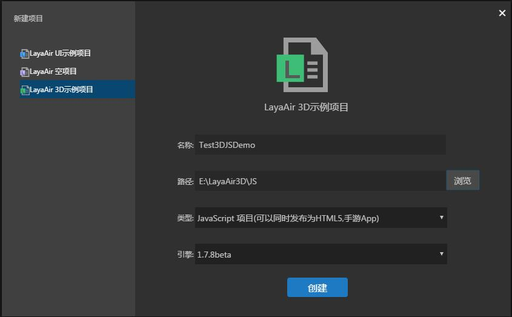
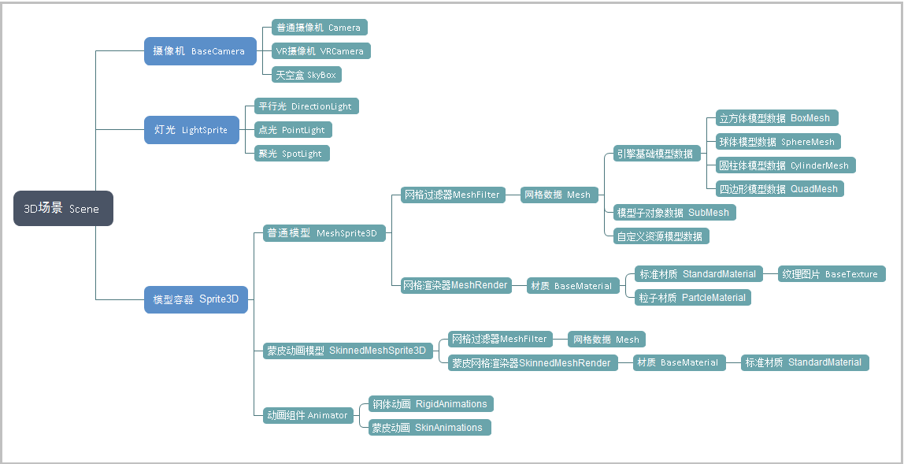

## QuickStart guide for 3D project 

We will start a 3D project quickly with LayaAir engine, and use AS language as a tutorial, simply demonstrate the implementation of a basic 3D application with engine code.

### IDE creates a 3D sample project

Download LayaAirIDE, start the new project, select the 3D project, as shown in the figure.<br>（Picture 1）

Here we choose the Actionscript3.0 language. Created and we found that ide created a template for 3D for us. About the structure of the project, developers can refer to the 2D novice tutorial. This is not going to go into details

We directly F5 (the MAC system user may want cmd+F5) or click the run button, and we can see that the debug window creates a cube.<br>（Picture 2）

LayaAir3D.as this startup class for us to build a 3D world. And add a few elements necessary for a simple 3D world (scene, camera, light source, 3D model, material). We will introduce these concepts in detail, and gradually lead you to learn 3D knowledge.

For this simple point of demo, we find that this cube is static, and can't bring us the stereoscopic vision of what we see, that's what we get, then we add a few lines of code to 3D. Move it. First find the start class LayaAir3D.as, modified into the following class. Developers can paste directly into their own projects.

```javascript
var LayaAir3D = (function () {
    function LayaAir3D() {

        //初始化引擎
        Laya3D.init(0, 0, true);

        //适配模式
        Laya.stage.scaleMode = Laya.Stage.SCALE_FULL;
        Laya.stage.screenMode = Laya.Stage.SCREEN_NONE;

        //开启统计信息
        Laya.Stat.show();

        //添加3D场景
        var scene = Laya.stage.addChild(new Laya.Scene());

        //添加照相机
        var camera = (scene.addChild(new Laya.Camera(0, 0.1, 100)));
        camera.transform.translate(new Laya.Vector3(0, 3, 3));
        camera.transform.rotate(new Laya.Vector3(-30, 0, 0), true, false);
        camera.clearColor = null;

        //添加方向光
        var directionLight = scene.addChild(new Laya.DirectionLight());
        directionLight.ambientColor = new Laya.Vector3(0.6, 0.6, 0.6);
        directionLight.specularColor = new Laya.Vector3(0.6, 0.6, 0.6);
        directionLight.diffuseColor = new Laya.Vector3(1.6, 1.6, 1.6);
        directionLight.direction = new Laya.Vector3(1, -1, 0);

        //添加自定义模型
        var box = scene.addChild(new Laya.MeshSprite3D(new Laya.BoxMesh(1, 1, 1)));
        box.transform.rotate(new Laya.Vector3(0, 45, 0), false, false);
        var material = new Laya.StandardMaterial();
        material.diffuseTexture = Laya.Texture2D.load("res/layabox.png");
        box.meshRender.material = material;

        //这里我们添加转动的逻辑-----------------------------
        //旋转方向与角度设置
        var vect = new Laya.Vector3(1,1,0);
        //每10毫秒旋转一次
        Laya.timer.loop(10,null,function(){
            box.transform.rotate(vect,true,false);
        });

    }
    return LayaAir3D;
} ());

LayaAir3D();
```

<br>（Picture 3）

Here we use a timer, every 10ms drive this cube rotation under a specific explanation please developers to read the related tutorials and API,  where we are just a simple demo, a simple code as follows:

```javascript
var vect = new Laya.Vector3(1,1,0);
//每10毫秒旋转一次
Laya.timer.loop(10,null,function(){
  box.transform.rotate(vect,true,false);
});
```

So we've been able to run through a simple example and drive the cube to rotate (Figure 3).


### The basic structure of LayaAir 3D world

Through the code example above, we can see that a basic 3D world was made. Of course, the code is relatively simple, to make a colorful game world, we also need to understand more functions of the engine.

Figure 4 is the world visible factor view of LayaAir 3D. In addition to 3D scenes, cameras, lights, and models, animation is also one of the elements that can be displayed. We will introduce you later in the course.

（Picture 4）


### 3D world transformation and vector simple use

In this example, create a display of several elements module, but we also saw use of the vector Vector3 or Vector4 in the camera, lighting, model, use them to object position,  orientation, color assignment.

#### Coordinate system and position, rotation modification

In the 2D engine, we directly adjust the X and Y coordinates to control the position and rotation direction of the display object. The display object in the 3D engine is more complex, and the Z axis is added, so we use the Vector3 3D vector uses its values to represent x, y, and Z respectively.

However, the definitions of coordinates in different 3D engines and 3D model animation software are different, so beginners need to master the differences between them.

LayaAir 3D engine coordinates rules into **`right-hand coordinate system`**（Figure 5）, simply the right side of the screen is the positive X-axis direction, the top is the Y-axis direction, the direction of the screen to the observer is positive Z-axis. Some 3D engine belongs to the left-handed coordinate system, this is not for introduction, interested beginners can research on Internet.

<br>（Picture 5）right hand coordinate system


The engine is also divided into a world coordinate system and a local coordinate system. The world coordinate system is the coordinate of a 3D scene, and the three-axis direction is always unchanged (Figure 5). The local coordinates are the coordinates of the model itself and can change as the model's orientation changes. However, we can identify the direction of the coordinates by using the right hand gesture (Figure 6). The hand model in the figure below is rotated by -90 degrees along the y-axis 3D model of the right-hand coordinate system local coordinates, the thumb is always the local coordinate of the positive X-axis direction.

<br>（picture 6）

Understand the above coordinate system, then you can change them through the 3D transform, in the sample code, transform is a 3D transform object (Transform3D), it is very important in the 3D world, the code for a lot of changes in the logic of the display object will control Use it.

In code, we use the translation and the rotation method in the 3D transform, and represent the values of X, y and Z with 3D vectors. At the same time, the two methods can be set in the parameter space, whether it is local mobile rotation, beginners can be set in the program, observe the movement and rotation of what is different.

```javascript
//移动摄像机位置
camera.transform.translate(new Laya.Vector3(0, 3, 3));
//旋转摄像机方向（角度）
camera.transform.rotate(new Laya.Vector3(-30, 0, 0), true, false);
```

<br>（Picture 7）

Above Transform3D API mobile, rotation method description, of course, transform the object there are many properties and methods, we will explain in the future examples.


#### The use of vectors

Vectors are used very often in the LayaAir 3D engine, and they are visible everywhere from 2D vectors to 4D vectors. The most basic usage is used in this example for assignment.

3D objects in the code of the movement, rotation, scaling and other transformation with three-dimensional vector as its x, y, z axis coordinate assignment.

So in a variety of colors of light on the attribute assignment, the value of three-dimensional vector representing the R, G, B in three colors, namely red, green and blue. In LayaAir 3D engine,  the maximum value of three color is 1, is set up according to the percentage of the whole way, the greater the value, the more color the color is bright, dark, if the value exceeds 1 will produce exposure effect.

As for the red, green and blue can be combined into what kind of color, beginners can learn from the game art designers advice, such as red and green to yellow, red and blue to purple and so on, generally in the process of project development. In order to test the effect, programmers need to adjust the color values repeatedly.

The following code in the example uses a vector as a color assignment:

```javascript
//灯光的环境色
directionLight.ambientColor = new Laya.Vector3(0.6, 0.6, 0.6);
//灯光的高光色
directionLight.specularColor = new Laya.Vector3(0.6, 0.6, 0.6);
//灯光的漫反射颜色
directionLight.diffuseColor = new Laya.Vector3(1.6, 1.6, 1.6);
```

In the project, there are many more complicated usage, need to use the vector to make some math operation, this course is regarded as introductory course, do not introduce much at this moment.

