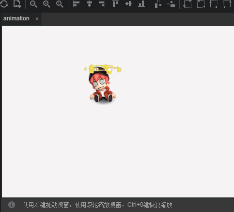

# Animation Component reference
> CheckBox component explains that because many component properties are generic, common and generic component have been introduced in the `Property Setter` document. Please read the 《Property Setter》document before reading this article.

## 1、Primary cognitive Animation component

The Animation component is an animation component that makes it easy to create atlas animations or use LayaAirIDE to create ani animations. As shown in figure 1.

 

（Picture 1）

Animation API introduction, please refer to [https://layaair.ldc.layabox.com/api/?category=Core&class=laya.display.Animation](https://layaair.ldc.layabox.com/api/?category=Core&class=laya.display.Animation)

## 2. Create Animation components through LayaAirIDE

### 2.1 Make Animation

Animation is not a common UI component, nor is it a container component. So when you create the Animation component, you need to drag directly from the `Component library` Drag directly into the Animation component to the IDE `scene editor`. As shown in figure 2.

 

（Picture 2）

### 2.2 Receive the animation data source through the source attribute

After creating the Animation component in LayaAirIDE, you must use the source property to receive the animation data source before you can use it. Source attributes can receive three sets of picture sets (multiple pictures, usually sequence frame), Atlas file (.atlas or.json suffix), animation file (.ani suffix).

#### 2.2.1 Creating sequence frame images

Open `Resource Manager`, we will multiple art resources  `Simultaneous selection`，` drag` to `source`attribute bar, and then select the scene just created Animation animation, press the `enter` key, you can preview the effect of animation. As shown in figure 3.

 

（Picture 3）

**Tips**：Animations created with this type will not be cached in the animation template cache pool. If you need to cache, use the loadImages () method.

#### 2.2.2 Creating an atlas file

If we put the atlas file into the `resource manager` directory, you can directly `drag` the atlas file to the `source` attribute bar, and then select the Animation animation just created in the scene, and press the `Enter` key to preview the effect of the animation. As shown in figure 4.

 

（Picture 4）

**Tips**：The animation template created with this type will not be cached in the animation template cache pool. If you need to cache or create a callback, use the loadAtlas () method.

#### 2.2.3 Using animation files to create

Create a timeline animation file (suffix.Ani) can also be used as a Animation animation component data source, such as shown in Figure 5, direct  `drag` of the `source` the Animation animation just created in the scene, according to the `enter` key, you can preview the animation playback effect.

 

(Picture 5) 

### 2.3 Controlling the playback mode of animation（wrapMode）

The animation mode attribute wrapMode has three values selectable, the default value is 0, and the positive sequence play. 1 when played backwards. When choosing 2, pingpong (ping pong) mode, some straightforward is to play back and forth. Next, we choose a sequence of resources to demonstrate the playback differences in different modes.

#### 2.3.1 Positive sequence mode play

If the wrapMode attribute is not set by default or the wrapMode attribute value is set to 0, it is the positive sequence play mode. That is, the sequence diagram is played from the previous to the latter.

As shown in Figure 6, it is sequentially played from sequence phoenix0001 to phoenix0025. After playback, start again from phoenix0001 to phoenix0025, cycle playback.

 

(Picture 6)

#### 2.3.2 Reverse playback mode

The wrapMode property value is set to 1, to reverse the playback mode. That is, the sequence diagram is played back to the previous order. Contrary to the positive sequence broadcast mode.

As shown in Figure 7, it is sequentially played from sequence phoenix0025 to phoenix0001. After playback, start again from phoenix0025 to phoenix0001, cycle playback.

 

(Picture 7)

#### 2.3.3 pingpong mode play

Careful observation, can be found, not positive or reverse, the Phoenix group action is not smooth. The reason is that when designing this set of pictures, the art only designed wings flying up and down, so the lack of action frame led to the movement does not look smooth.

The wrapMode attribute value is set to 2 when the pingpong mode, just can solve this problem, the same set of actions, positive sequence from phoenix0001 to phoenix0025 finished playing, and not directly back to the phoenix0001 start playing, but from phoenix0024 to phoenix0001 played backwards. So that the action is more smooth and complete. Therefore, the pingpong model is also one of the frequently used patterns in the game, under the premise of the protection effect, but also can greatly reduce the amount of art resources. The effect is shown in figure 8.

 

(Picture 8)

#### 2.4  Frame interval time for animation

`interval` Property can set the frame interval time (unit: ms) for animation playback, and the default value is 50 milliseconds. For example, we're going to slow down the Phoenix animation just now, set it to 100 milliseconds. The effect is shown in figure 9.

 

(Picure 9)

**Tips**：*If the animation is playing, the frame will be reset after the start time of the cycle timer is the current time, that is, if you set the interval frequently, it will lead to the animation frame update interval will be slower than expected, or even not updated.*

#### 2.5 Set autoPlay

The autoPlay property can be set automatically. The default is false. It does not play automatically. If set to true, the animation is created and added to the stage to play automatically. This property setting cannot be previewed in IDE immediately. You need to see the attribute setting effect at the publishing run.

#### 2.6 autoAnimation (Play automatically) by pressing the name of effect

In the LayaAir IDE created in time axis animation file (.ani suffix), there may be a set of multiple animation assembly, through the autoAnimation attribute, you can choose one of the animation name for playback.

**Tips**：

- In LayaAirIDE, the `autoAnimation`property can only be set to the data `source`  attribute for the time axis animation file (.ani suffix).
- `AutoAnimation` attribute value to correspond the name set `timeline frame` editing. `Frame properties` panel `function name`.

#### 2.7 Set the playback start position (index)

index attribute can specify the frame index of the animation, the default index is 0, can be set to any frame in the animation. After setting, it will jump to the set animation frame.

Tips：This property is only used for static assignments, such as manually switching animation frames by code or click event. If set to autoplay, it will still be played from frame 0, regardless of the index setting.

#### 2.8 Set the blending mode（blendMode）

Mixed mode `blendMode` property is not enabled by default, set to lighter option is turned on mixed mode. After the opening effect as shown in Figure 10.

  

(Picture 10)

**Tips**：*The background of the blend mode must be in the stage canvas. For example, setting Laya.stage.bgColor alone will not work in mixed mode. Figure 10 uses the rectangle of Graphics*

