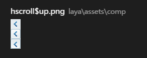
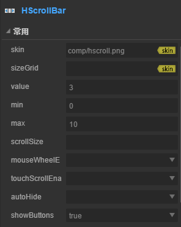

# HScrollBar Component


##  1. create HScrollBar components through LayaAirIDE

###         1.1 Creating HscrollBar

​	The HScrollBar component is a horizontal scroll bar component.
​        When the data is too large to display, the end user can use the HScrollBar component to control the displayed data part.
​        The scroll bar consists of four parts: a track map, a slider button and two arrow buttons.
​        Click on the HScrollBar component in the resource panel, drag and drop to the page edit area, and then add the HScrollBar component to the page.
​        Please refer to the script interface of the HScrollBar component [HScrollBar API](http://layaair.ldc.layabox.com/api/index.html?category=Core&class=laya.ui.HScrollBar)。
​        An example of image resource for HScrollBar component:

​        <br/>
​    （Picture 1）

​        <br/>
​    （Picture 2）

​        <br/>
​    （Picture 3）

​        <br/>
​    （Picture 4）

​        HScrollBar Drag into the editor area to show the effect:：

​        <br/>
​    （Picture 5）

​        The value of setting HScrollBar attribute Max is 10, the value of attribute min is 0, and the value of attribute value is 3, the display effect is as follows:

​        <br/>
​    （Picture 6）

​        When you run the program, you can drag the slider or click the arrow button to control the value of the progress bar:

​        <br/>
​    （Picture 7）

​        The display effect of setting HScrollBar attribute showButtons when the value is false:

​        <br/>
​    （Picture 8）

​        Common attributes of components:

​        <br/>
​    （Picture 9）

 

### 1.2 Common attributes of HScrollBar components

​        <br/>
​    （Picture 10）

 

| **Attributes**            | **Functional description**                            |
| ----------------- | ----------------------------------- |
| skin              | The image resource address of the scroll bar                         |
| sizeGrid          | Efficient scaling of grid data on a scroll bar track map resource.          |
| value             | The number that represents the current scroll position.                        |
| min               | The number that represents the minimum rolling position.                        |
| max               | The number that represents the highest rolling position.                       |
| scrollSize        | The increment of page scrolling when the scroll bar is pressed.                |
| mouseWheelEnable  | A Boolean value that specifies whether or not the pulley is rolled. The default value is true.            |
| touchScrollEnable | A Boolean value that specifies whether to open the touch. The default value is true.            |
| autoHide          | A Boolean value that specifies whether to scroll the scrollbar automatically (without scrolling) and defaults to false. |
| showButton        | A Boolean value that specifies whether to display the up and down buttons with the default value of true.       |

 

## 2. Create HScrollBar components through code

​	When we write code, we can't control UI by code, create  `UI_ScrollBar` class, import `laya.ui.HScrollBar`package in code, and set HScrollBar related attributes by code.

**Run example effect:**
​	<br/>
​	(Picture 11)Create code HScrollBar

​	Other properties of HScrollBar can also be set up by code. The following example demonstrates how to create HScrollBar by code, and the interested readers can set up HScrollBar by themselves to create HScrollBar that meets their own needs.

**Sample code ：**

```javascript
package
{
	import laya.display.Stage;
	import laya.display.Text;
	import laya.ui.HScrollBar;
	import laya.ui.ScrollBar;
	import laya.ui.VScrollBar;
	import laya.utils.Handler;
	import laya.webgl.WebGL;

	public class UI_ScrollBar
	{
		/***水平滚动条资源**/
		private var skins:Array=["../../../../res/ui/hscroll.png", 
							 	 "../../../../res/ui/hscroll$bar.png", 
								 "../../../../res/ui/hscroll$down.png",
								 "../../../../res/ui/hscroll$up.png"];

		/***提示信息文本框**/
		private var promptText:Text;		
		/****水平滚动条****/
		private var hScrollBar:HScrollBar;		
		
		public function UI_ScrollBar()
		{
			// 不支持WebGL时自动切换至Canvas
			Laya.init(800, 600, WebGL);
			//画布垂直居中对齐
			Laya.stage.alignV = Stage.ALIGN_MIDDLE;
			//画布水平居中对齐
			Laya.stage.alignH = Stage.ALIGN_CENTER;
			//等比缩放
			Laya.stage.scaleMode = Stage.SCALE_SHOWALL;
			//背景颜色
			Laya.stage.bgColor = "#232628";
			
			//加载资源
			Laya.loader.load(skins, Handler.create(this, onSkinLoadComplete));
		}

		/***加载资源完成***/
		private function onSkinLoadComplete(e:*=null):void
		{
			//创建水平滚动条
			createHScroller();
		}
		
		/***创建水平滚动条***/
		private function createHScroller():void 
		{
			//实例化垂直滚动条
			hScrollBar= new HScrollBar();
			//加载皮肤资源（其他资源根据规范命名后，会自动加载）
			hScrollBar.skin = "../../../../res/ui/hscroll.png";
			//设置宽度
			hScrollBar.width = 400;
			//设置位置
			hScrollBar.pos(150, 170);
			//最低滚动位置数字
			hScrollBar.min = 0;
			//最高滚动位置数字
			hScrollBar.max = 100;
			//滚动变化事件回调
			hScrollBar.changeHandler = new Handler(this, onChange);
			//加载到舞台
			Laya.stage.addChild(hScrollBar);
			
			//创建提示信息
			createPromptText(hScrollBar)
		}		
		
		/***创建提示信息***/
		private function createPromptText(scrollBar:ScrollBar):void
		{
			//实例化提示信息
			promptText=new Text();
			//提示框字体
			promptText.font="黑体";
			//提示框字体大小
			promptText.fontSize=26;
			//提示框字体颜色
			promptText.color="#FFFFFF";
			//提示框初始文本
			promptText.text="您的选择是： ";
			//加载到舞台
			Laya.stage.addChild(promptText);
			//设置提示框位置
			promptText.pos(scrollBar.x,scrollBar.y-50);
		}
		
		/***滚动条位置变化回调***/
		private function onChange(value:Number):void 
		{
			promptText.text= "滚动条的位置： value=" + value;
		}
	}
}
```

