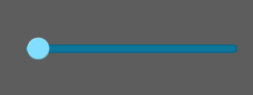

# HSlider Component reference

## 1. Understanding HSlider components

### 1.1 The function and effect demonstration of HSlider

​	HSlider and VSlider components are subclasses of Slider components, which represent horizontal slip bars and longitudinal sliders respectively. The user can select the value by moving the slider between the slider tracks. Often used in player progress control, volume size control, some UI numerical adjustment, etc..

​      The HSlider component adopts horizontal direction. The slider track extends from left to right, and the tag indicating the position of the slider is located at the upper part of the track, which can be hidden.

​       
​    （Picture 1）

### 1.2 Skin specification for HSlider components

​	HSlider resource naming convention prefixed by hsliser, the default resources it a total of 3, respectively, the progress of slider resource `hslider$bar.png`,resource base `hslider$progress.png` and `hsliser.png`。

​	There should be at least two resources, a resource base, a slider sliding function of resources, otherwise unattainable. Without the progress bar, the resource component does not report errors, but it does not display the schedule.

 	tips：The progress of  `vslider$progress.png` resources can be interchanged with the map resource `vsliser.png`, after the exchange of progress can reverse display.

 
​    （Picture 2）

### 1.3 Introduction of API for HSlider component

HSlider API introduction, please refer to [http://layaair.ldc.layabox.com/api/index.html?category=Core&class=laya.ui.HSlider](http://layaair.ldc.layabox.com/api/index.html?category=Core&class=laya.ui.HSlider)。

## 2. Creating HSlider components through LayaAirIDE

### 1.1 Creating HSlider

​        Click on the HSlider component resource in the resource panel, drag and drop to the page edit area, and then add the HSlider component to the page.

​       HSlider drag and drop to the editor area, set the sizeGrid attributes, so that it will not be stretched after zooming, zoom display effect is as follows:

​         
​    （Picture 2）

### 1.2 HSlider Common attributes of components

​        The value of setting HSlider attribute Max is 20, the value of attribute min is 0, and the value of attribute value is 5, the display effect is as follows:

​         
​    （Picture 3）

**max：**HSlider maximum value when the slider is dragged to the rightmost. The default value is 100;

**min：**Hslider minimum value when the slider drags to the leftmost side, defaults to 0;

**value：** current value of the slider should be equal to max or min, or the value between them.

​         
​    （Picture 4）

​        After compiling and running, the display effect is as follows, you can drag the slider to select the value:

​         
​    （Picture 5）

### 1.3 HSlider Component specific other attributes

 Generic other properties are described in detail in the attribute setter, and the following are special attributes related to the HSlider component.

| **attribute**         | **Functional description**                          |
| -------------- | --------------------------------- |
| allowClickBack | A Boolean value that specifies whether to change the value attribute value by clicking the slider。  |
| showLabel      | A Boolean value specifying whether or not to hide a tag that displays the value value above the slider.     |
| tick           | The scale value of the slider is the change in the value value of each slide. The default value is 1. |

 
