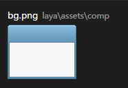
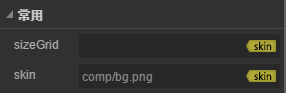

# Image Component


## 1. Creating Image components through LayaAirIDE

###        1.1 Creating image

​	Image is the most common component of display image in UI, which is used to display bitmap images. You can set the skin property of the Image component to change the image rendered by the Image component. The Image component supports the data setting of the nine squares, which is used to realize the undistorted effect of the image after the image is magnified.

​        Click on the Image component in the resource panel, drag and drop to the page edit area, and then add the Image component to the page. Click Image to set the value of the common attributes of Image in the property pane.
​        Image script interface of component is referenced [Image API](http://layaair.ldc.layabox.com/api/index.html?category=Core&class=laya.ui.Image)。

​        **Image example of resource for components ：**

​        <br/>
​    （Picture 1）

​         **Image Component drag and drop to edit area display effect ：**

​        <br/>
​    （Picture 2）

### 1.2 Image Common attributes of components

​        <br/>
​    （Picture 3）

| **attribute**   | **Functional description**            |
| -------- | ------------------- |
| sizeGrid | Effective scaling of grid data (bitmap data) |
| skin     | Bitmap resources              |

 

​        After adding the Image component, you can modify the display resource image of the Image component by dragging the picture resources from the resource panel to the skin property box of the Image.

## 2. Create Image components through code

​	When we write code, we can't control UI by code, create  `UI_Image` class, import `laya.ui.Image` package in code, and set Image related attributes by code.

**Run example effect:**
​	<br/>
​	(Picture5) Creating Image through code

​	Other properties of Image can also be set up by code. The following example code demonstrates how to create Image for different skins (styles) through code,

Interested readers can set their own image code, to create a picture that meets their needs.

**Example code：**

```javascript
package
 {
	import laya.display.Stage;
	import laya.ui.Image;
	import laya.webgl.WebGL;
	
	public class UI_Image
	{
		public function UI_Image()
		{
			// 不支持WebGL时自动切换至Canvas
			Laya.init(800, 600, WebGL);
			//画布垂直居中对齐
			Laya.stage.alignV = Stage.ALIGN_MIDDLE;
			//画布水平居中对齐
			Laya.stage.alignH = Stage.ALIGN_CENTER;
			//等比缩放
			Laya.stage.scaleMode = Stage.SCALE_SHOWALL;
			//背景颜色
			Laya.stage.bgColor = "#232628";

			//创建图片
			createImage();			
		}

		/***创建图片***/
		private function createImage():void
		{
			//实例化图片
			var img:Image = new Image("../../../../res/ui/dialog (3).png");
			//设置位置
			img.pos(165, 62.5);
			//加载到舞台
			Laya.stage.addChild(img);
		}
	}
 }
```

