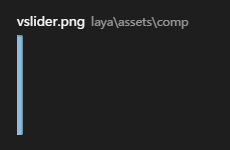
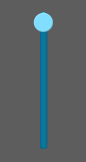

# VSlider Component Reference

## 1. Understand VSlider components

### 1.1 The function and effect demonstration of VSlider

​	HSlider and VSlider components are subclasses of Slider components, which represent horizontal slip bars and longitudinal sliders respectively. The user can select the value by moving the slider between the slider tracks. Often used in player progress control, volume size control, some UI numerical adjustment, etc..

​      VSlider components are arranged vertically. The slider track expands from top to bottom, with the label showing the value on the right part of the track, hidden.

​       
​    （Picture 1）

### 1.2 Skin specification (skin) for VSlider components

​	VSlider resource naming convention prefixed by vsliser, the default resources it a total of 3, respectively, the progress of slider resource  `vslider$bar.png`, resource base `vslider$progress.png` and `vslider.png`.

​	There should be at least two resources, a resource base, a slider sliding function of resources, otherwise unattainable. Without the progress bar, the resource component does not report errors, but it does not display the schedule.

 	tips：The progress of `vslider$progress.png` resources can be interchanged with the map resource `vsliser.png`, after the exchange of progress can reverse display.

 
​    （Picture 2）

### 1.3 Introduction of API for VSlider component

VSlider API introduction, please refer to [http://layaair.ldc.layabox.com/api/index.html?category=Core&class=laya.ui.VSlider](http://layaair.ldc.layabox.com/api/index.html?category=Core&class=laya.ui.VSlider)。

## 2. Creating VSlider components through LayaAirIDE

### 1.1 Creating VSlider

​        Click on the VSlider component resource in the resource panel, drag and drop to the page edit area, and then add the VSlider component to the page.

​       VSlider drag and drop to the editor area, set the sizeGrid nine square attributes, so that it will not be stretched after zooming, zoom display effect is as follows:

​         
​    （Picture 2）

### 1.2 VSlider Common attributes of components

​        The VSlider component and the HSlider component property are all the same, but the component is changed in the direction.

​	Similarly, the attribute max of VSlider is 20, the value of attribute min is 0, and the value of attribute value is 5, the display effect is as follows:

​         
​    （Picture 3）

**max：**HSlider maximum value of the HSlider slider to the rightmost. The default value is 100;

**min：**Hslider minimum value of the Hslider slider dragged to the left, defaults to 0;

**value：**滑块目前所处的数值，应当等于max或min，或是它们之间的值。

​         
​    （Picture 4）

​        When you run the program, you can drag the slider to select values:

​         
​    （Picture 5）

### 1.3 Making volume control strip with VSlider

In game development or some other software, making volume controllers with VSlider is very common. But, as shown in Figure 5, it's not the effect we need, and the direction and size of the progress bar all go back. Normal is the maximum volume should be at the top, the minimum should be the bottom, the progress bar should also be from bottom to top changes.

In fact, to achieve the normal effect is very simple, first of all, Max and min attributes can be set in turn, for example, we set Max is 0, min is 20, and then the default value of value is set to the maximum 20

​         
​    （Picture 6）

The second is the direction of the progress bar, progress bar named resources and resource base exchange (Figure 7), refresh IDE and publish, compile and run after we can see the progress of the direction is from the bottom to the top! We also have the effect of the volume controller that we need.

​         
​    （Picture 7）

​          
​    （Picture 7）

### 1.4 VSlider Component specific other attributes

 Generic other properties are described in detail in the attribute setter, and the following are special attributes related to the HSlider component.

| **Attribute**         | **Functional description**                          |
| -------------- | --------------------------------- |
| allowClickBack | A Boolean value that specifies whether to change the value attribute value by clicking the slider  |
| showLabel      | A Boolean value specifying whether or not to hide a tag that displays the value value above the slider.     |
| tick           | The scale value of the slider is the change in the value value of each slide. The default value is 1 |

 
